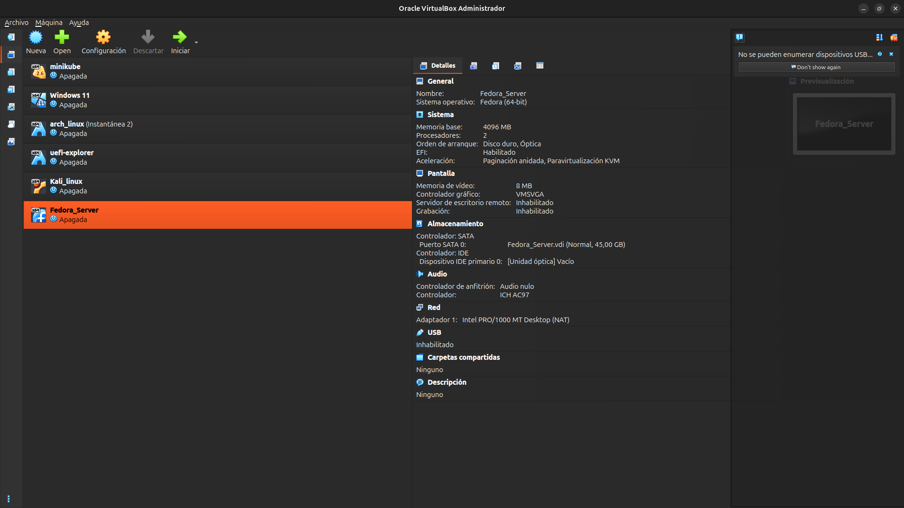
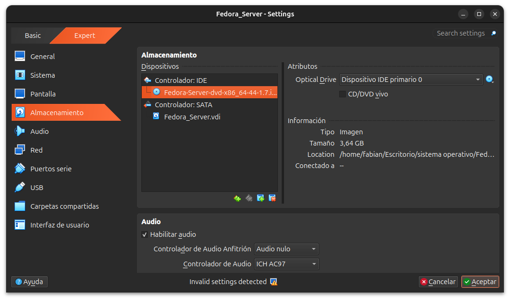
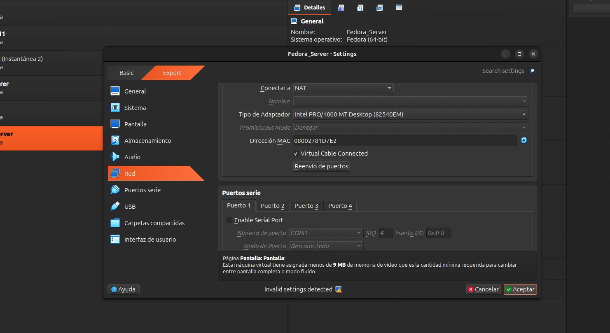
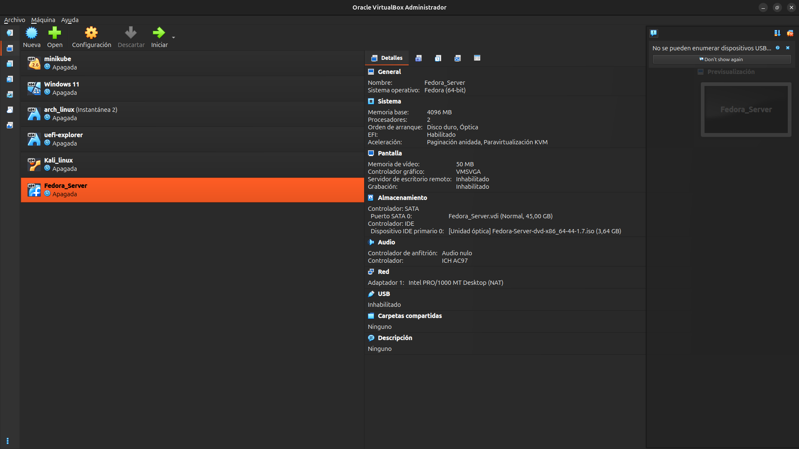

# Módulo 00 — Preparación de VirtualBox en Ubuntu

- Estado: Completado
- Fecha: 2026-09-25
- Versión de Fedora objetivo: Fedora Server 44 (DVD, x86_64)
- Objetivo diferencial frente a Arch: en los cursos de Arch, la VM se creaba
  siempre pensando en escritorio o en un servidor genérico. Acá el objetivo
  es una VM mínima orientada a **Cockpit + administración remota**, sin GUI.

## Concepto diferencial

Fedora Server no es "Fedora sin GNOME": es una edición con su propio rol de
instalación (`server-product-environment` en Anaconda), sin entorno gráfico
por defecto, con Cockpit habilitado desde el primer arranque. Esto cambia
cómo se prepara la VM desde el principio: no hace falta 3D/VMSVGA con
aceleración, pero sí conviene reenvío de puertos planificado desde ya para
Cockpit (9090) y SSH (22), porque en NAT el host **no puede** iniciar
conexiones hacia la IP interna de la VM sin reglas explícitas.

## Verificaciones previas (host: Ubuntu 24.04.5 LTS)

- Virtualización por hardware activa: `egrep -c '(vmx|svm)' /proc/cpuinfo` → 12
- KVM cargado (`kvm_amd`) y VirtualBox coexistiendo sin conflicto —
  `effparavirtprovider="kvm"` en la VM confirma que VirtualBox usa la
  interfaz KVM en vez de pisarla.
- VirtualBox 7.2.18 ya instalado (`VBoxManage --version`).
- Espacio libre: 96 GB en `/` antes de crear el disco de 45 GB.
- RAM total del anfitrión: 14 GB (el curso asumía 8 GB — hay margen extra).
- ISO verificada: `Fedora-Server-dvd-x86_64-44-1.7.iso`, SHA256
  `85837793bfa36db6bc709b4cecd2ec116951b87d9c53c3d95eb2fac8dcf7cf1f`
  (coincide con el checksum oficial de Fedora).

## Práctica guiada

Creación de la VM por línea de comandos (`VBoxManage`), en vez de la GUI,
para que quede documentado exactamente qué se configuró:

```bash
VBoxManage createvm --name "Fedora_Server" --ostype "Fedora_64" --register

VBoxManage modifyvm "Fedora_Server" \
  --memory 4096 \
  --cpus 2 \
  --firmware efi \
  --nic1 nat \
  --audio-driver none \
  --graphicscontroller vmsvga \
  --boot1 disk --boot2 dvd --boot3 none --boot4 none

VBoxManage createmedium disk \
  --filename "/home/fabian/VirtualBox VMs/Fedora_Server/Fedora_Server.vdi" \
  --size 46080 --format VDI --variant Standard

VBoxManage storagectl "Fedora_Server" --name "SATA" --add sata --controller IntelAhci --portcount 2 --bootable on
VBoxManage storageattach "Fedora_Server" --storagectl "SATA" --port 0 --device 0 --type hdd \
  --medium "/home/fabian/VirtualBox VMs/Fedora_Server/Fedora_Server.vdi"

VBoxManage storagectl "Fedora_Server" --name "IDE" --add ide
VBoxManage storageattach "Fedora_Server" --storagectl "IDE" --port 0 --device 0 --type dvddrive --medium emptydrive
```

Luego, ya en la GUI de VirtualBox, se montó la ISO verificada en la unidad
óptica (Configuración → Almacenamiento → Controlador IDE → elegir archivo
de disco) y se ajustó la memoria de vídeo.

## Hallazgo real (no era un error intencional planeado)

Al abrir "Configuración" en la GUI, VirtualBox marcó **"Invalid settings
detected"**. La causa: la VM se creó con solo 8 MB de memoria de vídeo
(el valor que asigna `VBoxManage` por defecto para `vmsvga` sin tocar ese
parámetro), y VirtualBox exige un mínimo de 9 MB para ciertos modos de
pantalla. Se corrigió subiendo la memoria de vídeo a 50 MB desde la
pestaña "Pantalla". No bloqueaba el arranque, pero sí generaba el aviso.

**Lección:** crear la VM 100% por `VBoxManage` sin pasar por la GUI al
menos una vez no garantiza que todos los valores por defecto sean
"óptimos" — conviene revisar la pestaña de Pantalla aunque sea un
servidor headless.

## Validación

- `VBoxManage showvminfo "Fedora_Server" --machinereadable` confirma:
  `memory=4096`, `cpus=2`, `firmware="EFI"`, `nic1="nat"`,
  disco de 45 GB en SATA, unidad óptica en IDE.
- Sin VMs previas (`arch_linux`, `Kali_linux`, `Windows 11`, `minikube`,
  `uefi-explorer`) corriendo al mismo tiempo — cumple la regla de una
  sola VM pesada encendida a la vez.

## Reto autónomo

Pendiente: crear una segunda VM liviana (para Silverblue o CoreOS, Fase 6)
usando únicamente `VBoxManage`, sin tocar la GUI en ningún punto, y
verificar por línea de comandos que no queden advertencias de
configuración inválida.

## Evidencias

**01 — VM creada con configuración base (4 GB RAM, 2 CPU, EFI, NAT, disco 45 GB)**
Panel de detalles de VirtualBox confirmando todo lo aplicado por `VBoxManage`: firmware EFI habilitado, paravirtualización KVM, disco de 45 GB en SATA, unidad óptica vacía en IDE.



**02 — ISO montada, VirtualBox marca "Invalid settings detected"**
La ISO de Fedora Server ya aparece en el controlador IDE, pero el diálogo de Configuración señala un ajuste inválido antes de poder aceptar.



**03 — Causa real de la advertencia: memoria de vídeo insuficiente**
La pestaña Pantalla revela el mensaje exacto: "menos de 9 MB de memoria de vídeo", heredado del valor por defecto que asigna `VBoxManage` para `vmsvga` sin tocar ese parámetro.



**04 — Configuración final sin advertencias (50 MB de vídeo)**
Tras subir la memoria de vídeo a 50 MB, el panel de detalles no muestra ningún aviso: RAM, CPU, EFI, disco, red NAT y unidad óptica con la ISO, todo consistente.



## Pendientes

- Ninguno para este módulo.
