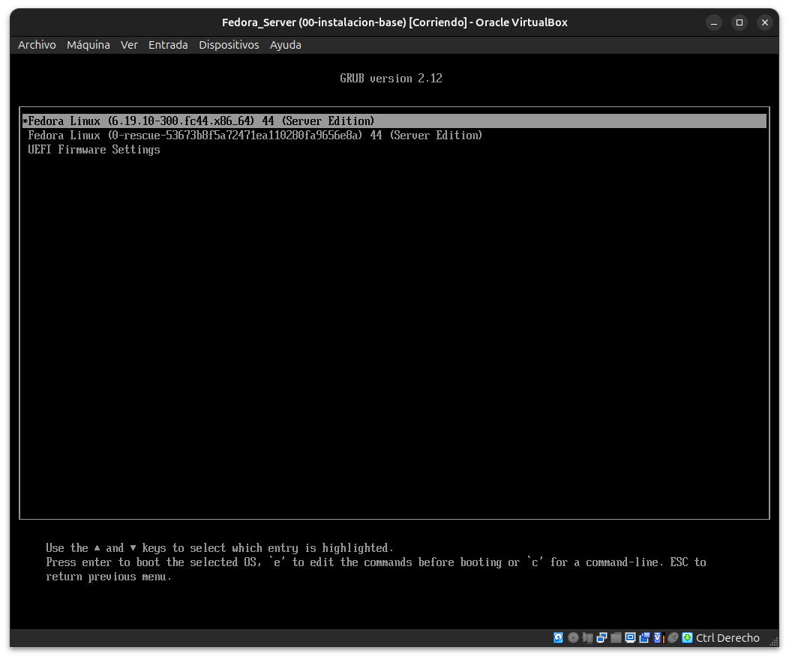
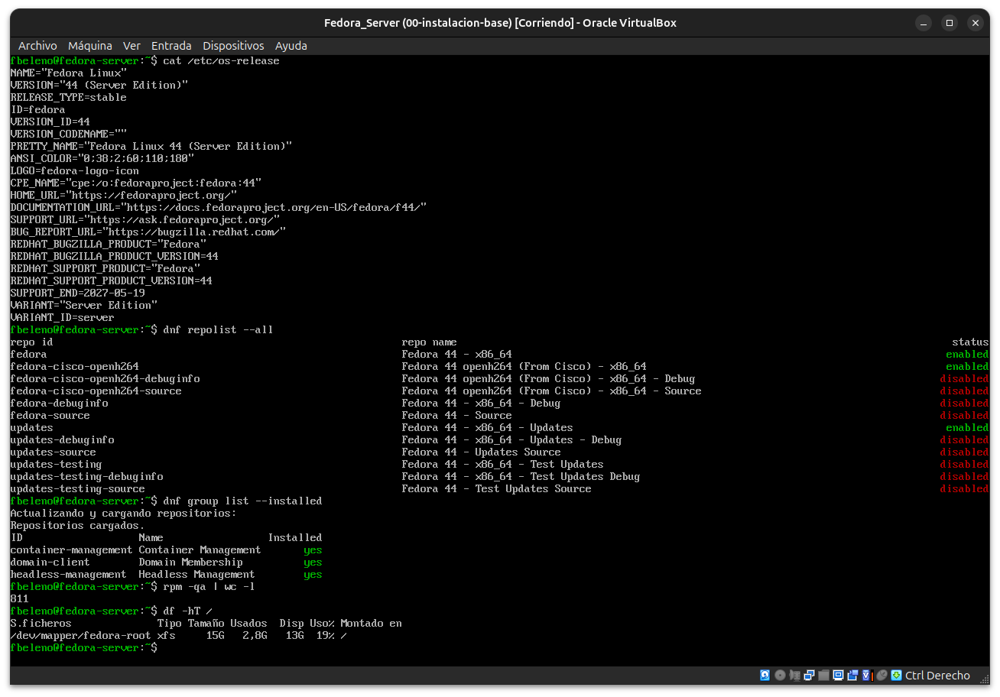
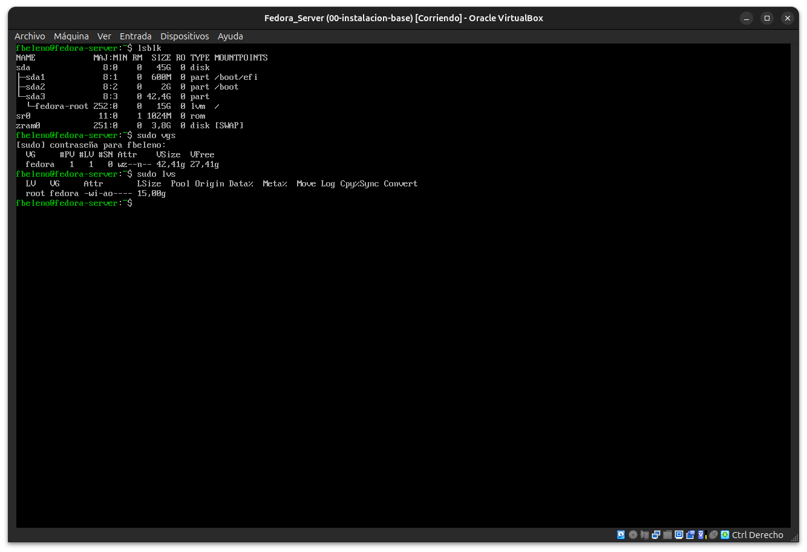

# Módulo 02 — Anatomía de Fedora Server

- Estado: Completado
- Fecha: 2026-09-25
- Versión de Fedora: Fedora Linux 44 (Server Edition)
- Objetivo diferencial frente a Arch: entender qué decisiones de empaquetado
  y repositorios son propias de la **edición** Fedora Server, antes de
  meterse con RPM/DNF a fondo (Fase 2).

## Concepto diferencial

Fedora no es una sola distro con "perfiles" opcionales como podría pensarse
viniendo de Arch (donde instalás lo que querés, punto). Fedora publica
**ediciones** completas y separadas (Workstation, Server, IoT, CoreOS,
Silverblue...), cada una con:

- Su propio ISO y flujo de instalación (Anaconda con un rol de instalación
  distinto, `server-product-environment` en este caso).
- Su propio conjunto de paquetes base y servicios habilitados por defecto
  (ya vimos que Cockpit viene activo en Server, y no lo estaría en una
  instalación mínima genérica).
- Repos separados por función: `fedora` (paquetes de la release, fijos),
  `updates` (parches posteriores al lanzamiento) y `updates-testing`
  (candidatos a `updates`, deshabilitado por defecto). Arch en cambio
  combina todo en `core`+`extra`, sin distinguir "base de la release" de
  "actualizaciones" como conceptos separados — cada paquete simplemente
  tiene la versión más nueva disponible, sin ISOs de rastreo por versión.

También existe el concepto de **grupo de instalación** (`dnf group list
--installed`), un conjunto de paquetes con nombre propio que la base de
datos de RPM/DNF recuerda como unidad. En Arch, algo como `base` es solo
un metapaquete con dependencias normales — no hay un objeto "grupo" con
estado propio en la base de datos de pacman.

## Práctica guiada

```bash
cat /etc/os-release
dnf repolist --all
dnf group list --installed
rpm -qa | wc -l
df -hT /
lsblk
sudo vgs
sudo lvs
```

## Hallazgos reales

1. **Repo `fedora-cisco-openh264` (deshabilitado por defecto)** — no estaba
   en mi hipótesis inicial. Es un repo aparte, mantenido por Cisco, que
   distribuye un binario compilado del códec H.264 con patentes. Fedora no
   puede incluir códecs con licencias propietarias en sus repos oficiales
   (`fedora`/`updates`), así que Cisco lo publica por separado y lo paga
   ellos. Es más estricto que Arch, donde códecs así suelen estar
   directamente en `extra` o en el AUR sin esta separación legal.
2. **Grupos de instalación reales** (mi hipótesis de "Server Product Core"
   era incorrecta): `dnf group list --installed` mostró
   `container-management`, `domain-client`, `headless-management` — tres
   grupos funcionales, no un grupo monolítico "core" con nombre de
   producto.
3. **811 paquetes instalados** (`rpm -qa | wc -l`) — número base para
   comparar más adelante con Silverblue/CoreOS (Fase 6), donde se espera
   una base bootstrap mucho menor gracias a rpm-ostree.
4. **Particionado automático de Anaconda es conservador con LVM**:
   - `sda1` (600M) → `/boot/efi`, `sda2` (2G) → `/boot`, `sda3` (42.4G) → PV
     de LVM.
   - VG `fedora`: 42.41G totales, pero la LV `fedora-root` (`/`, XFS) solo
     recibió **15G** — quedan **27.41G libres sin asignar** en el VG, sin
     usarlos ni en `/` ni en un `/home` separado.
   - **Sin partición de swap tradicional**: el intercambio lo maneja
     `zram0` (3.8G, RAM comprimida) — mismo mecanismo visto en
     `arch-linux-desktop`, pero acá es el comportamiento por defecto de
     Fedora Server, no algo configurado a mano.
   - Diferencia de filosofía frente a `archinstall`/particionado manual en
     Arch: ahí se decide el tamaño exacto de cada partición y no queda
     nada "flotando"; Anaconda automático calcula lo que cree necesario
     para la raíz y deja el resto sin tocar en el VG.

## Evidencias

**01 — Incidente resuelto: arranque correcto tras corregir el montaje persistente de la ISO**
Al retomar la VM tras un cierre/apagado, había vuelto a arrancar desde la ISO de instalación (`Dispositivos > Eliminar disco` en caliente no se guarda en la configuración persistente). Se diagnosticó desde el host (`VBoxManage showvminfo` mostró `IDE-0-0` todavía apuntando al `.iso`), se apagó la VM, se desmontó la ISO con `VBoxManage storageattach ... --medium emptydrive` con la VM apagada, y esta captura confirma el GRUB arrancando ya solo con las entradas del disco instalado.



**02 — `/etc/os-release`, `dnf repolist --all`, grupos instalados, conteo de paquetes y uso de disco**
Confirma edición Server, repos reales habilitados/deshabilitados (incluyendo `fedora-cisco-openh264`, no anticipado), los 3 grupos de instalación reales, 811 paquetes y el filesystem `xfs` de 15G en `/`.



**03 — `lsblk`, `vgs`, `lvs`: particionado LVM completo**
Confirma la causa raíz del hallazgo 4: VG `fedora` con 27.41G libres sin asignar, LV `fedora-root` de solo 15G, swap manejado por `zram0` sin partición dedicada.



## Pendientes

- Extender la LV `fedora-root` (o crear un `/home` separado) usando los
  27.41G libres del VG — se hace en el módulo 05 (Almacenamiento desde
  Cockpit), con la herramienta gráfica en vez de la terminal, para poder
  comparar ambos flujos.

