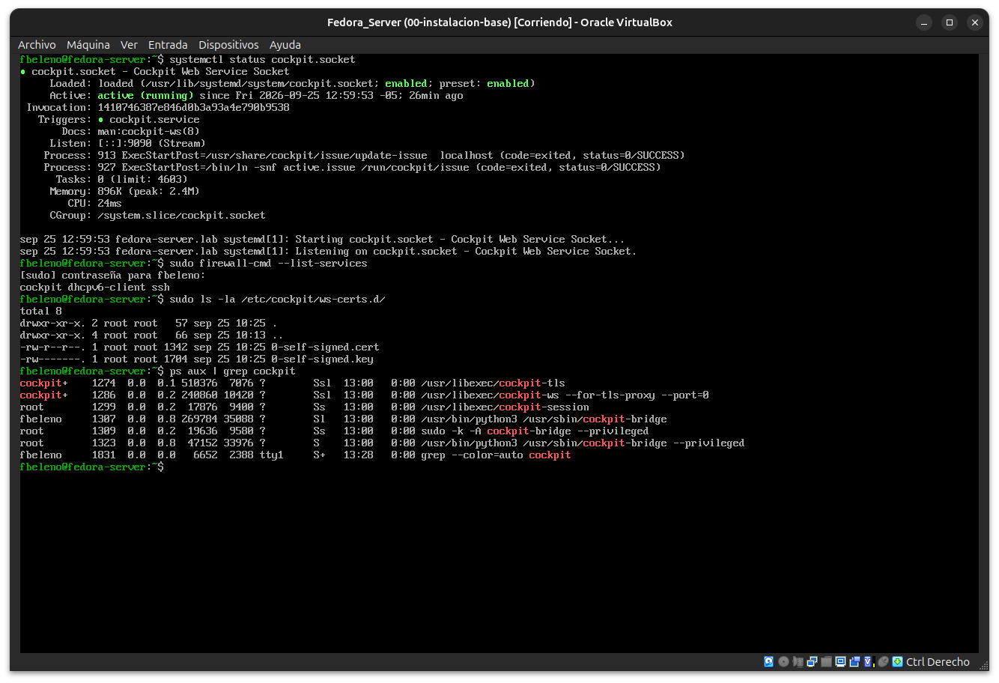
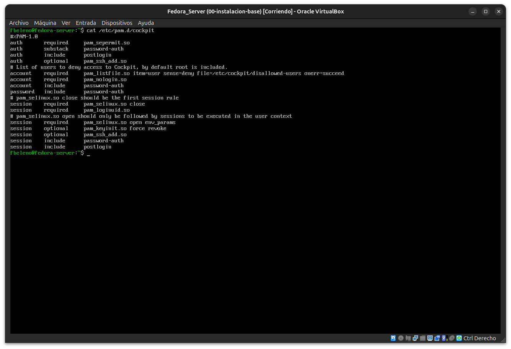

# Módulo 03 — Primer acceso a Cockpit

- Estado: Completado
- Fecha: 2026-09-25
- Versión de Fedora: Fedora Linux 44 (Server Edition)
- Objetivo diferencial frente a Arch: formalizar el mecanismo detrás de
  Cockpit (activación, autenticación, certificado, firewall) — ya lo
  usamos "a lo bruto" en el módulo 01 sin entender el porqué de cada
  paso.

## Concepto diferencial

Cockpit no es un panel de administración con su propia base de usuarios
o su propio demonio siempre corriendo. Tres cosas concretas:

1. **Activación por socket**: lo que systemd habilita por defecto es
   `cockpit.socket`, no `cockpit.service`. El proceso real (`cockpit-ws`)
   recién arranca cuando llega la primera conexión a 9090 — mismo patrón
   de activación diferida que otros sockets de systemd vistos en
   `arch-linux-mastery` (módulo 09), aplicado acá a una interfaz web.
2. **Autenticación vía PAM**: Cockpit no tiene su propia tabla de
   usuarios/contraseñas. Usa el mismo stack PAM que `sshd`/`login` — la
   contraseña que cambiás con `passwd` es la misma para SSH, consola y
   Cockpit, sin sincronización manual porque en realidad es un solo
   origen de verdad.
3. **Certificado autofirmado autogenerado**: en el primer arranque,
   Cockpit genera su propio certificado TLS si no encuentra ninguno en
   `/etc/cockpit/ws-certs.d/`. La advertencia de "conexión no segura" que
   aceptamos en el módulo 01 viene de acá — no es un error, es el
   comportamiento esperado sin una PKI propia configurada.

## Práctica guiada

```bash
systemctl status cockpit.socket
sudo firewall-cmd --list-services
sudo ls -la /etc/cockpit/ws-certs.d/
ps aux | grep cockpit
```

```bash
cat /etc/pam.d/cockpit
```

## Hallazgos reales

1. **Activación por socket confirmada**: `cockpit.socket` activo,
   `Listen: [::]:9090 (Stream)`, dispara `cockpit.service` recién al
   llegar la primera conexión.
2. **firewalld**: `firewall-cmd --list-services` → `cockpit dhcpv6-client
   ssh` — el servicio `cockpit` está explícitamente permitido, no es un
   puerto abierto "a mano".
3. **Certificado autofirmado con fecha exacta**: `0-self-signed.cert` /
   `0-self-signed.key` en `/etc/cockpit/ws-certs.d/`, fechados
   `sep 25 10:25` — coincide exactamente con el primer acceso real desde
   el navegador en el módulo 01. Confirma que el certificado se genera en
   el **primer uso**, no en la instalación ni en el primer arranque del
   servicio.
4. **Arquitectura de procesos más rica de lo esperado** (`ps aux | grep
   cockpit`):
   - `cockpit-tls` + `cockpit-ws --for-tls-proxy` (usuario `cockpit`, sin
     privilegios) — terminan TLS y hablan el protocolo web.
   - `cockpit-session` (root) — puente hacia una sesión de login real.
   - `cockpit-bridge` corriendo como **`fbeleno`** — el backend que
     ejecuta lo que se ve en la interfaz, con tu usuario real, no una
     cuenta de servicio genérica.
   - Un segundo `cockpit-bridge --privileged` vía `sudo -A` — esto es lo
     que se disparó al clickear "Acceso administrativo" en el módulo 01.
   Conclusión: Cockpit no es un dashboard que consulta una API — genera
   una sesión de usuario real en el sistema.
5. **PAM confirmado, con dos sorpresas**:
   - `auth/account/password/session include password-auth` — mismo
     archivo base que usa `sshd`, confirma la autenticación compartida.
   - `pam_listfile.so item=user sense=deny file=/etc/cockpit/disallowed-users`
     con el comentario *"by default root is included"* — Cockpit
     **bloquea explícitamente el login de root**, incluso si la cuenta
     estuviera habilitada. No es solo que root esté inhabilitado (módulo
     01): Cockpit lo rechazaría de todas formas.
   - `pam_sepermit.so` ya aparece en el stack de autenticación — primer
     contacto con SELinux, antes de la Fase 3 formal del curso.

## Evidencias

**01 — `cockpit.socket`, firewalld, certificado autofirmado y árbol de procesos**
Confirma activación por socket, servicio `cockpit` permitido en firewalld, certificado fechado exactamente en el primer acceso del módulo 01, y la arquitectura real de procesos (`cockpit-tls`, `cockpit-ws`, `cockpit-session`, `cockpit-bridge` corriendo como `fbeleno`).



**02 — `/etc/pam.d/cockpit`: autenticación compartida con SSH y bloqueo explícito de root**
`include password-auth` en los 4 stacks PAM, más `pam_listfile.so` denegando explícitamente a root y `pam_sepermit.so` como primer módulo de `auth`.



## Pendientes
