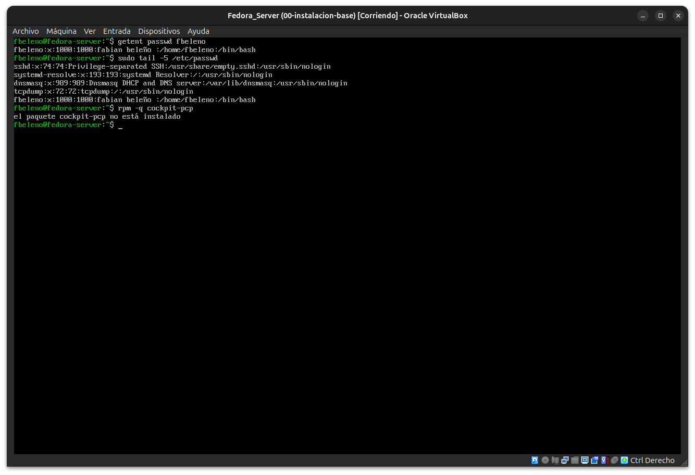
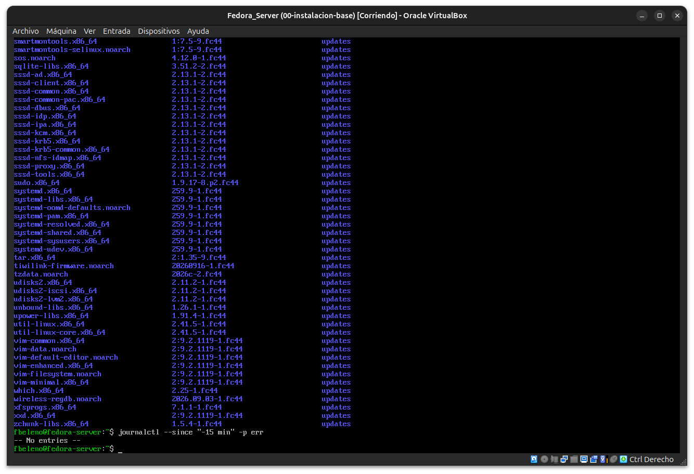
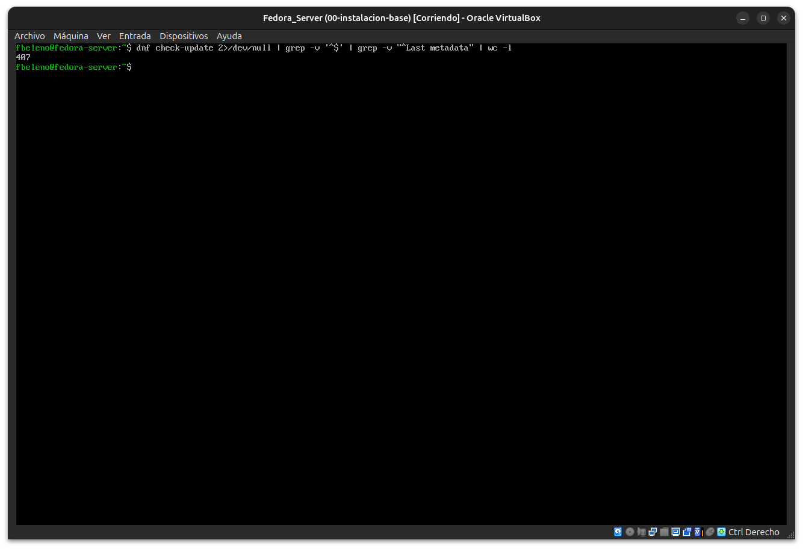
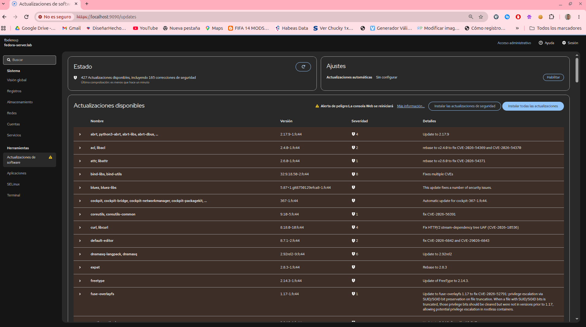
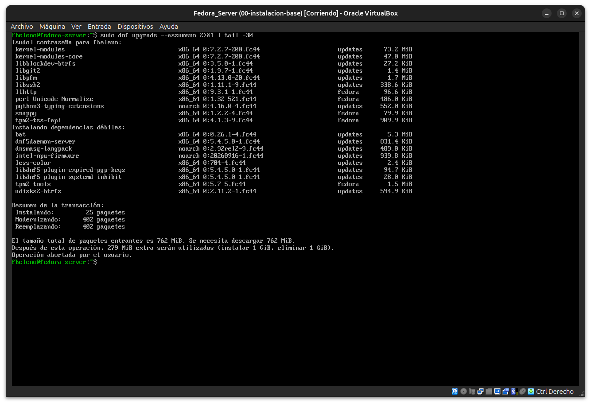

# Módulo 04 — Administración desde Cockpit

- Estado: Completado
- Fecha: 2026-09-25
- Versión de Fedora: Fedora Linux 44 (Server Edition)
- Objetivo diferencial frente a Arch: comparar cada panel de Cockpit
  (cuentas, registros, recursos, actualizaciones) contra su comando de
  terminal equivalente, para no aprender Cockpit como caja negra.

## Concepto diferencial

Cockpit no reemplaza los mecanismos del sistema, los expone visualmente:

- **Cuentas**: sin almacén propio — lee/escribe `/etc/passwd`/`/etc/shadow`
  directamente. Crear un usuario desde la UI es el mismo efecto que
  `useradd`/`passwd` por CLI.
- **Registros**: interfaz visual sobre `journalctl` — cada filtro de la UI
  (servicio, prioridad, rango de tiempo) tiene un flag equivalente.
- **Recursos** (histórico de CPU/memoria/red): depende de **`cockpit-pcp`**
  (Performance Co-Pilot). Sin ese paquete, Cockpit solo muestra el
  snapshot instantáneo — antes de asumir un bug, hay que verificar si el
  paquete está instalado.
- **Actualizaciones**: capa visual sobre `dnf check-update`/`dnf upgrade`.
  El aviso "Actualizaciones de seguridad disponibles" que vimos desde el
  módulo 01 tiene que poder cruzarse con la salida real de `dnf`.

## Práctica guiada

```bash
getent passwd fbeleno
sudo tail -5 /etc/passwd
rpm -q cockpit-pcp
sudo dnf check-update
journalctl --since "-15 min" -p err
```

```bash
dnf check-update 2>/dev/null | grep -v '^$' | grep -v "^Last metadata" | wc -l
sudo dnf upgrade --assumeno 2>&1 | tail -30
```

## Hallazgos reales

1. **`getent passwd fbeleno`** confirma lectura directa de `/etc/passwd` —
   mismo origen que el panel "Cuentas" de Cockpit. `sudo tail -5
   /etc/passwd` de paso mostró usuarios de sistema no anticipados
   (`dnsmasq`, `tcpdump`) instalados junto con el sistema base.
2. **`cockpit-pcp` no está instalado** — confirma por qué el histórico de
   "Recursos" en Cockpit no muestra gráficos de series de tiempo, solo el
   snapshot instantáneo. No es un bug, es un paquete opcional ausente.
3. **`journalctl --since "-15 min" -p err"` → sin entradas** — logs
   limpios, consistente con haber resuelto `mcelog` en el módulo 01.
4. **Discrepancia real entre CLI y Cockpit en el conteo de actualizaciones**,
   diagnosticada en vivo:
   - `dnf check-update` (filtrado): **407** líneas.
   - Cockpit → "Actualizaciones de software": **427** actualizaciones
     (165 de seguridad).
   - `sudo dnf upgrade --assumeno` (simulación real de la transacción
     completa): `Instalando: 25 paquetes` + `Modernizando: 402 paquetes`
     = **427** — coincide exacto con Cockpit.
   - **Causa raíz**: `dnf check-update` solo lista paquetes ya instalados
     con versión más nueva disponible. Cockpit usa PackageKit, que
     calcula la transacción completa de `dnf upgrade`, incluyendo
     paquetes **nuevos** que se suman como dependencias débiles (`bat`,
     `dnf5daemon-server`, `tpm2-tools`, `udisks2-btrfs`, etc.) — esos no
     son "una versión más nueva de algo instalado", son instalaciones
     nuevas, y por eso `check-update` no los cuenta pero la simulación de
     `upgrade` sí.
5. **Cockpit se actualiza a sí mismo**: la lista de actualizaciones
   incluye `cockpit, cockpit-bridge, cockpit-networkmanager,
   cockpit-packagekit` — de ahí el aviso "Alerta de peligro: La consola
   Web se reiniciará".

## Evidencias

**01 — Cuentas vía `/etc/passwd`, `cockpit-pcp` no instalado**
`getent passwd fbeleno` y `tail -5 /etc/passwd` confirman el origen compartido con el panel "Cuentas"; `rpm -q cockpit-pcp` confirma la ausencia del paquete de métricas históricas.



**02 — Lista completa de `dnf check-update` y `journalctl` sin errores**
El scroll completo de paquetes con actualización pendiente, seguido de `journalctl --since "-15 min" -p err` → sin entradas.



**03 — Conteo por CLI: 407**
`dnf check-update` filtrado y contado — la base de comparación contra Cockpit.



**04 — Cockpit: 427 actualizaciones, 165 de seguridad**
Incluye la fila `cockpit, cockpit-bridge, cockpit-networkmanager, cockpit-packagekit` y la alerta de que la consola web se reiniciará al actualizar.



**05 — Causa raíz confirmada: `dnf upgrade --assumeno` = 25 + 402 = 427**
La simulación completa de la transacción reproduce exacto el número de Cockpit, incluyendo los 25 paquetes nuevos instalados como dependencias débiles que `check-update` no cuenta.



## Pendientes
