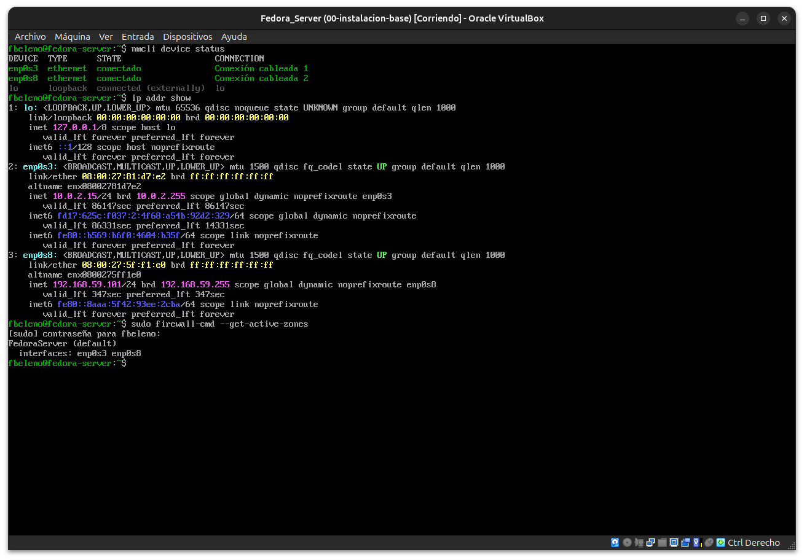
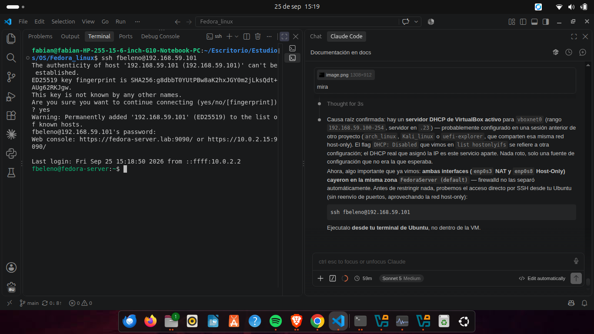
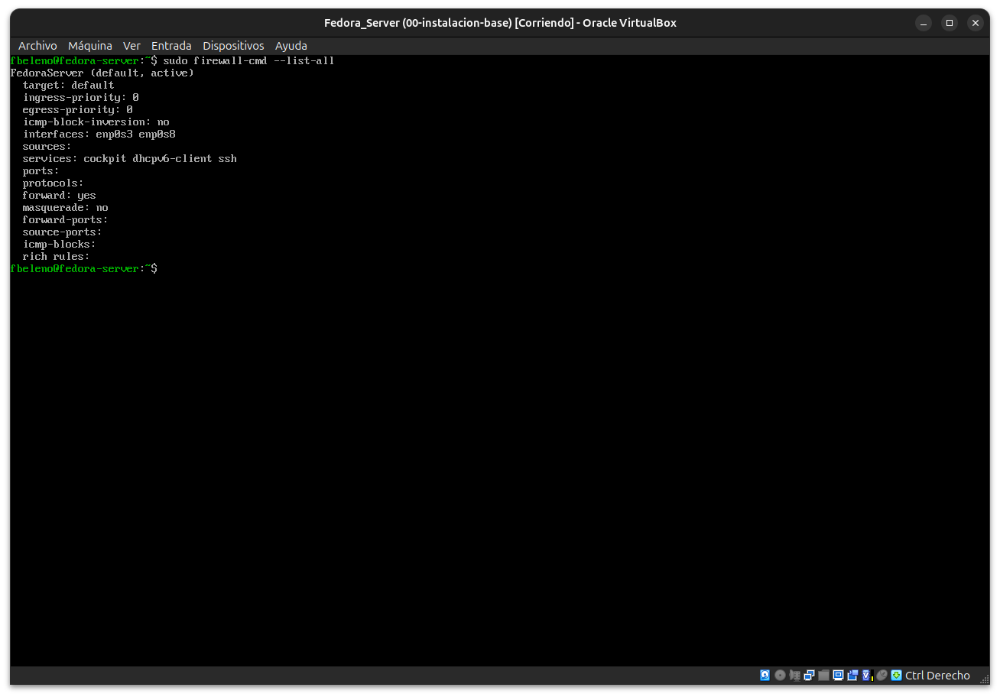
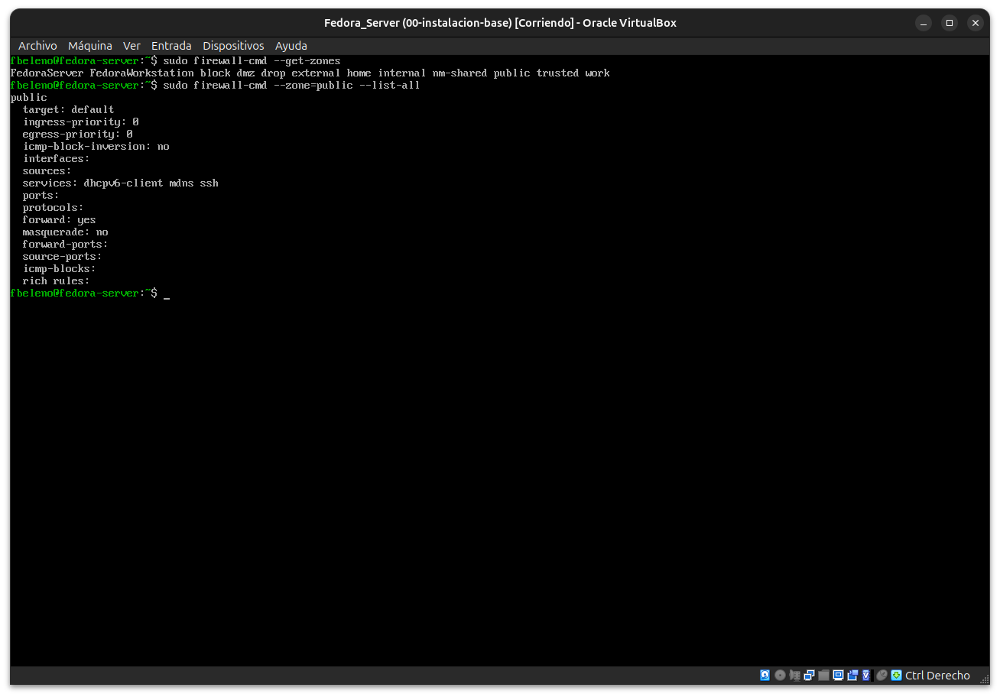
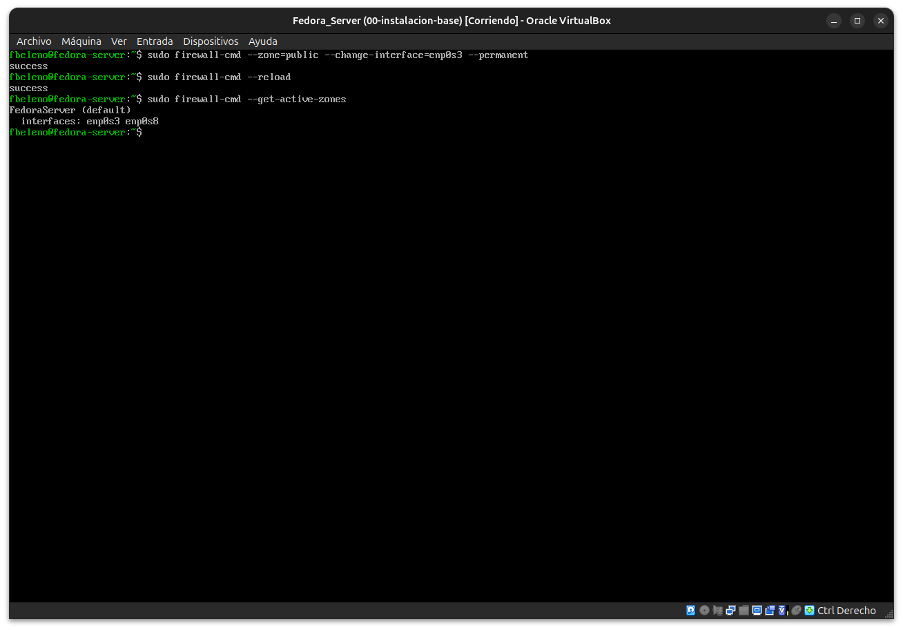
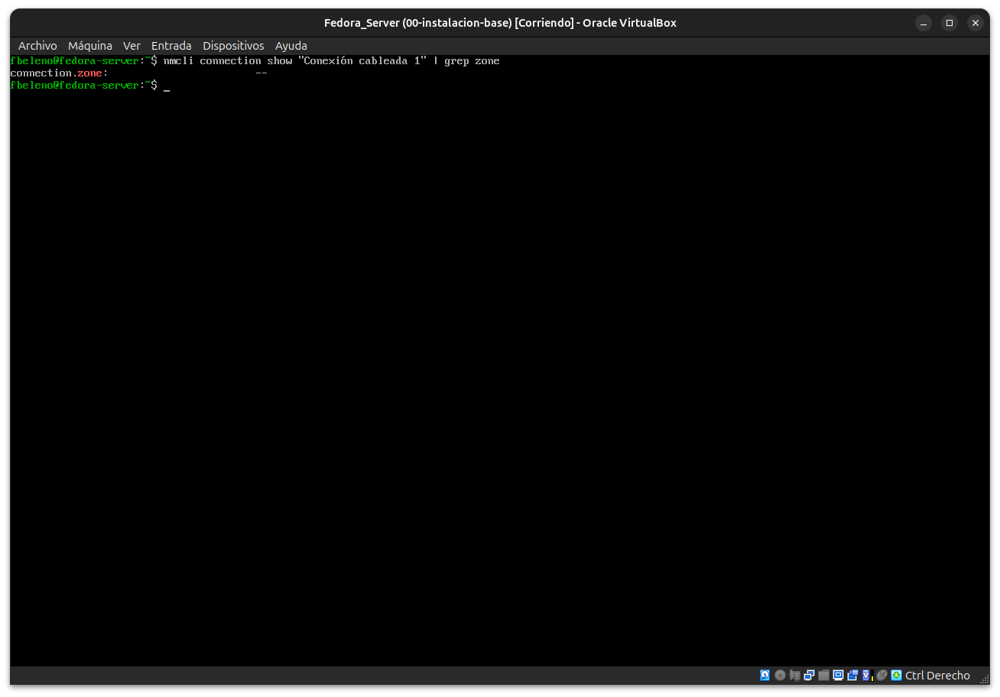
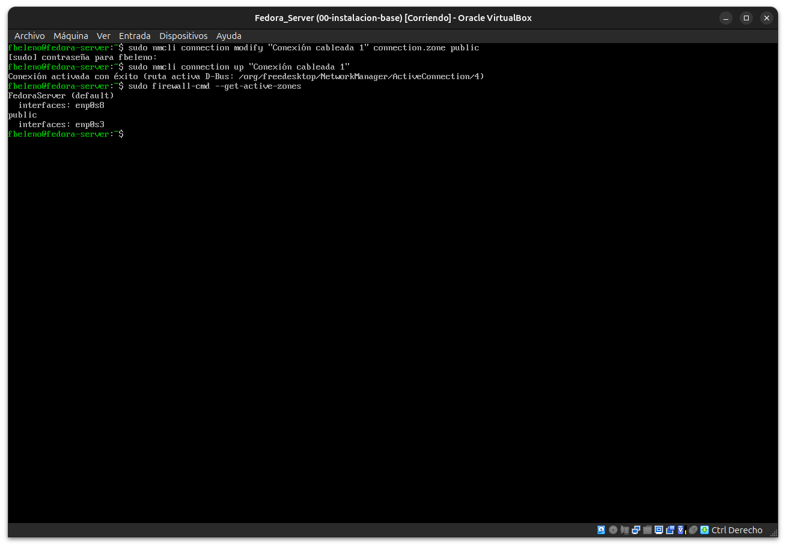
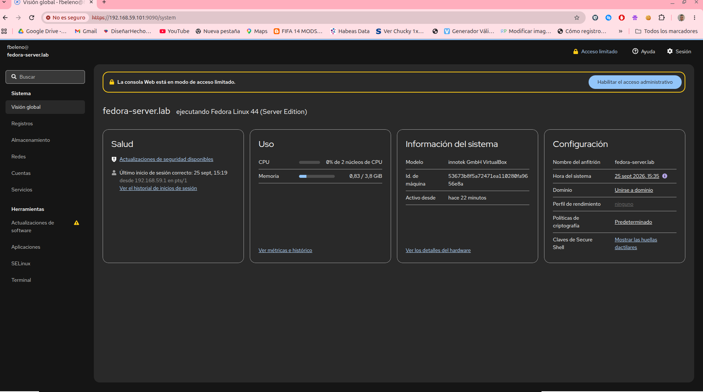

# Módulo 06 — Administración remota segura

- Estado: Completado
- Fecha: 2026-09-25
- Versión de Fedora: Fedora Linux 44 (Server Edition)
- Objetivo diferencial frente a Arch: entender el modelo de **zonas** de
  `firewalld` (cada interfaz de red pertenece a una zona, cada zona tiene
  su propia lista de servicios permitidos) y usarlo para separar el
  acceso de administración del acceso público — no reglas planas como en
  muchas configuraciones típicas de `nftables`/`ufw`.

## Concepto diferencial

Hasta el módulo 01 accedimos a la VM únicamente por NAT + reenvío de
puertos manual (`VBoxManage ... natpf1`). Es funcional, pero no
representa cómo se administra un servidor real en una red — un
administrador real tiene una interfaz de gestión separada del tráfico
público. Hoy se agregó una segunda interfaz de red **Host-Only**
(`vboxnet0`, 192.168.59.1/24) a la VM desde el host, que permite que
Ubuntu hable directo con la VM sin reenvío de puertos.

`firewalld` organiza el filtrado en **zonas**: cada interfaz de red se
asigna a una zona (`public`, `FedoraServer`, `internal`, etc.), y cada
zona define qué servicios/puertos están permitidos. Esto permite, por
ejemplo, permitir Cockpit y SSH desde la interfaz Host-Only (zona de
confianza) pero restringirlos en la interfaz NAT (zona pública).

## Práctica guiada

```bash
nmcli device status
ip addr show
sudo firewall-cmd --get-active-zones
sudo firewall-cmd --list-all-zones | less
```

Luego, probar acceso directo desde el host (sin reenvío de puertos) a la
IP de la interfaz Host-Only:

```bash
# Desde el host (Ubuntu), una vez identificada la IP de la interfaz host-only
ssh fbeleno@<ip-hostonly>
```

Y evaluar mover Cockpit/SSH a una zona más restrictiva en la interfaz
NAT, dejando la interfaz Host-Only como la única "de confianza".

```bash
sudo firewall-cmd --get-zones
sudo firewall-cmd --zone=public --list-all
sudo nmcli connection modify "Conexión cableada 1" connection.zone public
sudo nmcli connection up "Conexión cableada 1"
sudo firewall-cmd --get-active-zones
```

## Hallazgos reales

1. **`enp0s8` (host-only) recibió IP por DHCP** (`192.168.59.101`) pese a
   que `VBoxManage list hostonlyifs` mostraba `DHCP: Disabled` para
   `vboxnet0`. Causa raíz: `VBoxManage list dhcpservers` reveló un
   servidor DHCP de VirtualBox activo y aparte (rango
   `192.168.59.100-254`), heredado de otro proyecto que comparte la
   misma red host-only (`arch_linux`/`Kali_linux`/`uefi-explorer`). El
   flag de `hostonlyifs` y el servicio DHCP son cosas distintas.
2. **SSH directo por host-only funcionó sin ningún reenvío de puertos**
   (`ssh fbeleno@192.168.59.101`) — a diferencia del acceso NAT del
   módulo 01, que requirió `natpf1` sí o sí.
3. **Ambas interfaces cayeron en la misma zona (`FedoraServer`) por
   defecto**, con `cockpit`/`ssh` habilitados en las dos por igual — sin
   separación entre "red de administración" y "red general".
4. **`firewall-cmd --zone=public --change-interface=enp0s3 --permanent`
   + `--reload` no persistió** — `enp0s3` seguía reportando `FedoraServer`
   después. Causa raíz real: `nmcli connection show ... | grep zone`
   mostró `connection.zone: --` (sin configurar). Cuando el perfil de
   NetworkManager no tiene zona explícita, NM le indica a firewalld que
   use la **zona por defecto** cada vez que la conexión se activa
   (incluido tras un `--reload`), pisando el cambio hecho solo a nivel de
   firewalld.
5. **Solución correcta y persistente**: `nmcli connection modify
   "Conexión cableada 1" connection.zone public` + `nmcli connection up`.
   Confirmado con `firewall-cmd --get-active-zones`:
   `FedoraServer: enp0s8` / `public: enp0s3`.
6. **Validación cruzada exitosa**: `https://192.168.59.101:9090` (Cockpit
   vía host-only) siguió funcionando, con el login registrado desde
   `192.168.59.1` (la IP del host en esa red); `https://localhost:9090`
   (Cockpit vía NAT/`enp0s3`) dejó de cargar — confirma que la zona
   `public` bloqueó Cockpit en esa interfaz sin afectar la interfaz de
   administración.

## Evidencias

**01 — Dos interfaces, misma zona activa**
`nmcli device status` + `ip addr show`: `enp0s3` (NAT, 10.0.2.15) y `enp0s8` (host-only, 192.168.59.101) ambas activas.



**02 — SSH directo por host-only, sin reenvío de puertos**
Login exitoso desde la terminal de Ubuntu directo a `192.168.59.101`.



**03 — `firewall-cmd --list-all`: `cockpit`/`ssh` en ambas interfaces por igual**
Punto de partida antes de separar las zonas.



**04 — Zona `public`: `ssh` sí, `cockpit` no**
Confirma que existe una zona lista para restringir la interfaz NAT.



**05 — `firewall-cmd --change-interface --permanent` + `--reload` no persiste**
`enp0s3` sigue reportando `FedoraServer` después del cambio.



**06 — Causa raíz: `connection.zone` vacío en el perfil de NetworkManager**
`nmcli connection show | grep zone` → `--`. NM reasigna la zona por defecto en cada activación cuando no hay una zona explícita en el perfil.



**07 — Solución persistente: `nmcli connection modify ... connection.zone public`**
`firewall-cmd --get-active-zones` confirma: `FedoraServer: enp0s8` / `public: enp0s3`.



**08 — Validación cruzada: Cockpit sigue funcionando por host-only**
Login registrado `desde 192.168.59.1` (la IP del host en esa red) — mientras `https://localhost:9090` (ruta NAT) dejó de cargar.



## Pendientes
