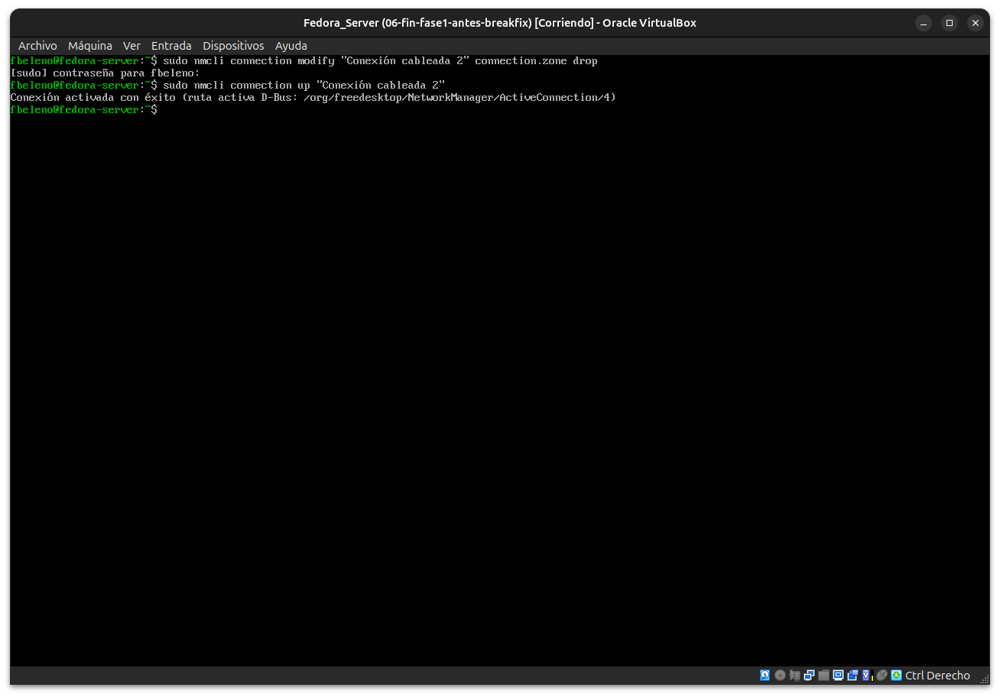
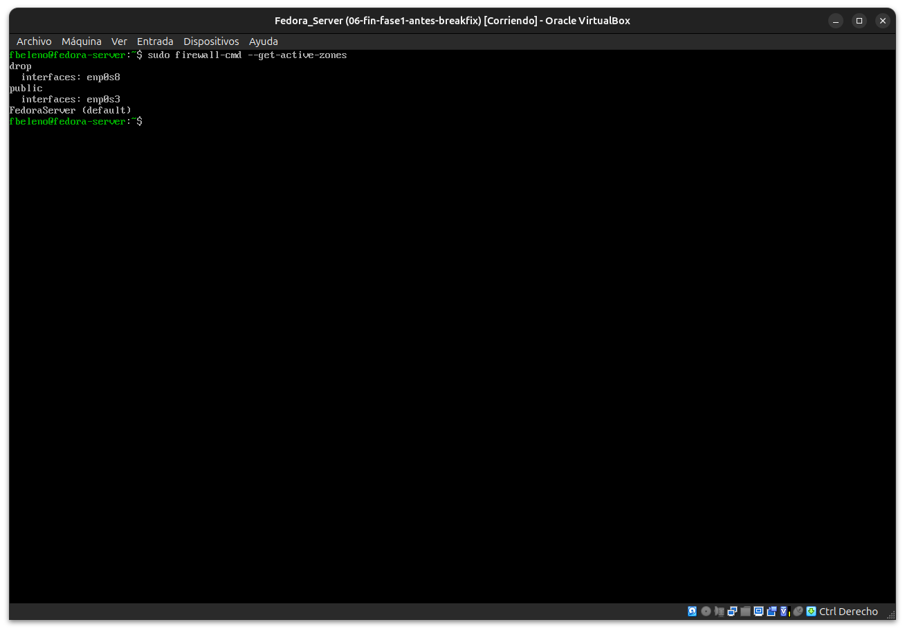
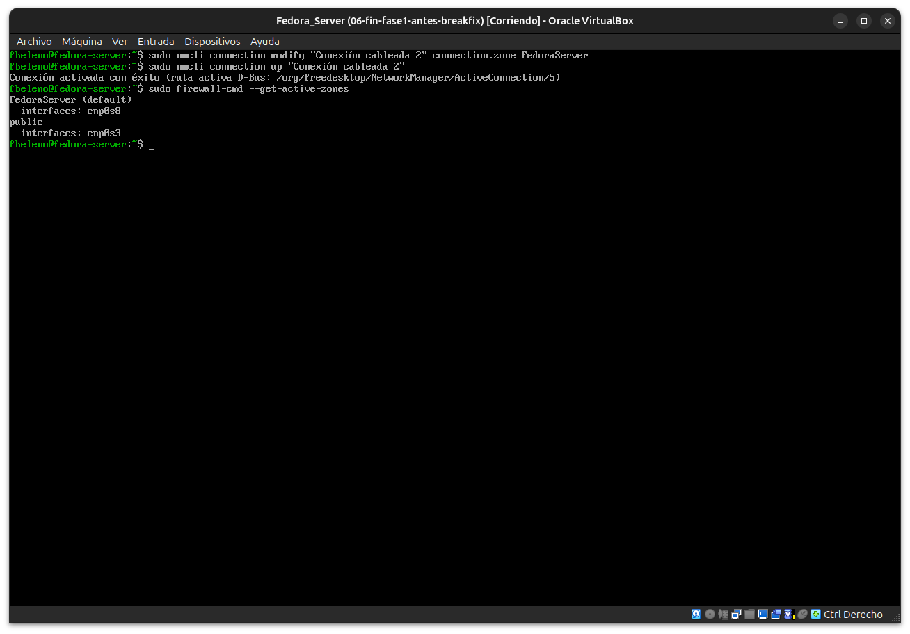
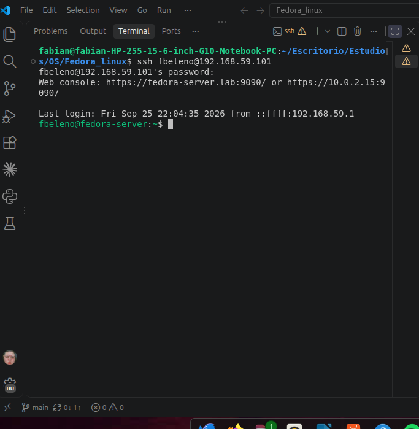
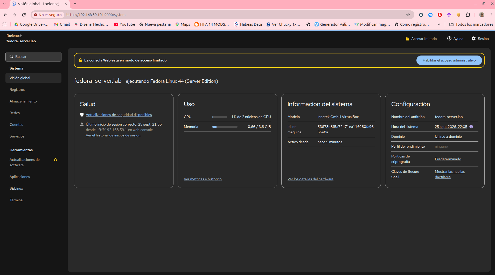

# Módulo 07 — Break & Fix de acceso (cierre de Fase 1 y Proyecto 1)

- Estado: Completado
- Fecha: 2026-09-25
- Versión de Fedora: Fedora Linux 44 (Server Edition)
- Objetivo diferencial frente a Arch: primer Break & Fix formal del
  curso — provocar un incidente real de acceso (no simulado en el
  papel) y recuperarlo sin reinstalar, usando la consola local de
  VirtualBox como vía de recuperación fuera de banda, igual que un
  puerto serie/iDRAC en un servidor físico real.

## Entorno y punto de restauración

Snapshot `06-fin-fase1-antes-breakfix` tomado antes de este módulo
(fin de Fase 1: LVM extendido, VG `datos`/`compartido`, zonas de
firewalld separadas — `FedoraServer` en `enp0s8`, `public` en `enp0s3`).

## Cambio deliberado

Aprovechando lo aprendido en el módulo 06 sobre `connection.zone` de
NetworkManager, se mueve `enp0s8` (la interfaz host-only, hasta ahora en
zona `FedoraServer` con SSH y Cockpit permitidos) a la zona **`drop`**
— la zona más restrictiva de firewalld, que descarta todo el tráfico
entrante sin responder (ni siquiera rechaza, silencia).

```bash
# Ejecutado desde la consola local de VirtualBox (no por SSH)
sudo nmcli connection modify "Conexión cableada 2" connection.zone drop
sudo nmcli connection up "Conexión cableada 2"
```

Como `enp0s3` (NAT) está en zona `public` sin Cockpit habilitado y sin
reenvío de puertos configurado para SSH, este cambio deja la VM **sin
ningún camino de red** hacia SSH ni Cockpit desde el host.

## Síntoma

- `ssh fbeleno@192.168.59.101` desde el host: sin respuesta, timeout.
- `https://192.168.59.101:9090` desde el navegador: no carga.
- `https://localhost:9090` (ruta NAT): tampoco cargaba desde el módulo
  06 (ya esperado, sin relación con este incidente).

## Diagnóstico y recuperación

- **Observación** (desde la consola local de VirtualBox, la única vía
  que seguía funcionando):
  ```bash
  sudo firewall-cmd --get-active-zones
  ```
  → `drop: interfaces: enp0s8` confirmado.
- **Registros consultados**: no hizo falta revisar `journalctl` — la
  causa quedó confirmada directamente con `--get-active-zones`, ya que
  el cambio fue deliberado y conocido de antemano (a diferencia de un
  incidente real donde el primer paso sería revisar
  `journalctl -u NetworkManager` / `journalctl -u firewalld`).
- **Hipótesis**: `enp0s8` quedó en zona `drop` por el cambio aplicado,
  descartando todo el tráfico entrante en silencio (sin RST ni ICMP de
  rechazo) — por eso SSH y el navegador se quedaban "cargando" en vez de
  fallar de inmediato con "Connection refused".
- **Prueba/causa raíz confirmada**: `--get-active-zones` mostró
  exactamente `drop: interfaces: enp0s8`.
- **Solución aplicada**:
  ```bash
  sudo nmcli connection modify "Conexión cableada 2" connection.zone FedoraServer
  sudo nmcli connection up "Conexión cableada 2"
  ```
- **Validación**: desde el host, `ssh fbeleno@192.168.59.101` volvió a
  loguear (`Last login... from ::ffff:192.168.59.1`), y
  `https://192.168.59.101:9090` cargó Cockpit con el login también
  registrado desde `192.168.59.1` (esta vez vía "web console").

## Impacto y riesgos

- Impacto real: ninguno más allá de la pérdida temporal de acceso
  remoto — el servicio (`cockpit.socket`, `sshd`) nunca se detuvo, solo
  quedó inalcanzable por red en una interfaz.
- Riesgo si hubiera sido la **única** interfaz de administración (sin
  consola local disponible, como en un servidor cloud sin acceso
  serie/KVM): el servidor habría quedado completamente inaccesible,
  forzando una intervención física o un reinicio de emergencia — el
  motivo real por el que la zona `drop`/`block` se recomienda usar con
  mucho cuidado y siempre validando desde una sesión ya autenticada
  antes de aplicar el cambio a la sesión activa.

## Cómo evitar recurrencia

- Antes de cambiar la zona de una interfaz activa por SSH, probar el
  cambio primero en una sesión de consola local o con una ventana de
  respaldo ya conectada, nunca solo con la sesión que se va a cortar.
- Usar `firewall-cmd --get-active-zones` como chequeo rápido antes y
  después de cualquier cambio de zona, no asumir que "success" implica
  que el estado final es el esperado (ya vimos en el módulo 06 que
  `firewall-cmd` puede reportar éxito sin que el cambio persista).
- Considerar `drop` solo para interfaces verdaderamente no confiables
  (ej. una DMZ pública) — para "restringir sin dejar de administrar",
  zonas como `public` (con `ssh` explícito) son más seguras que `drop`.

## Evidencias

**01 — Cambio deliberado: `enp0s8` a zona `drop`**
Ejecutado desde la consola local de VirtualBox, no por SSH.



**02 — Causa raíz confirmada: `drop: interfaces: enp0s8`**



**03 — Solución aplicada: zonas restauradas**
`FedoraServer: enp0s8` / `public: enp0s3` — estado idéntico al del cierre del módulo 06.



**04 — Validación: SSH restaurado**
Login exitoso desde el host, `Last login... from ::ffff:192.168.59.1`.



**05 — Validación: Cockpit restaurado**
Panel principal cargando normalmente vía `192.168.59.101:9090`.



## Pendientes
