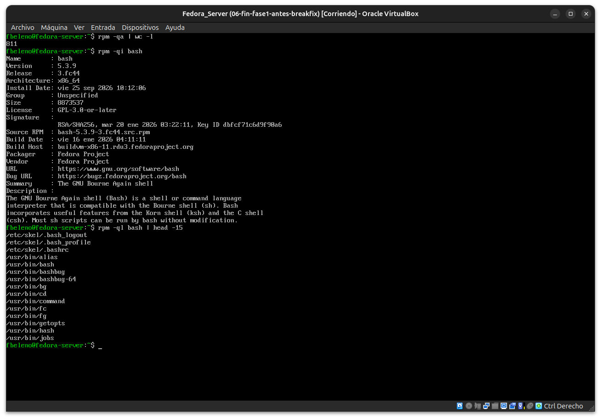
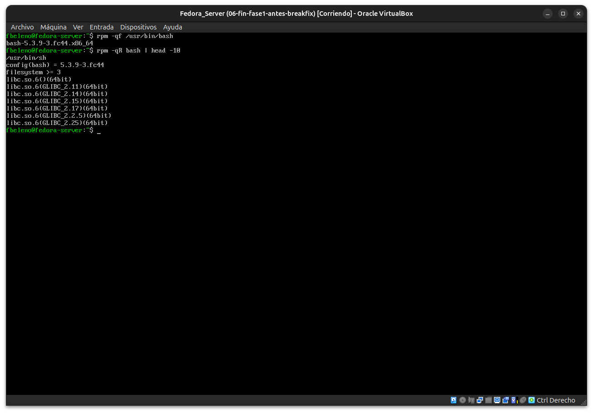

# Módulo 08 — RPM frente a pacman

- Estado: Completado
- Fecha: 2026-09-25
- Versión de Fedora: Fedora Linux 44 (Server Edition)
- Objetivo diferencial frente a Arch: entender la base de datos de RPM y
  las consultas equivalentes a las que ya se dominan en pacman, sin tocar
  todavía resolución de dependencias (eso es DNF5, módulo 09). Arranca la
  Fase 2 del curso.

## Concepto diferencial

`rpm` es solo la capa de bajo nivel: instala/consulta/verifica paquetes
`.rpm` ya descargados, pero **no resuelve dependencias ni descarga nada**
por sí solo — eso lo hace `dnf`. Es una separación más marcada que en
Arch, donde `pacman` hace ambas cosas en el mismo binario.

La base de datos de paquetes instalados vive en `/var/lib/rpm` (backend
`sqlite` por defecto en Fedora moderno, antes Berkeley DB) — es una base
de datos real, con posibilidad de corromperse y necesitar reconstrucción
(`rpm --rebuilddb`). En pacman, `/var/lib/pacman/local` es simplemente una
carpeta con un subdirectorio de texto plano por paquete — más simple,
pero también más fácil de inspeccionar a mano.

## Equivalencias de consulta (RPM ↔ pacman)

| Qué querés saber | RPM | pacman |
|---|---|---|
| Listar instalados | `rpm -qa` | `pacman -Q` |
| Info de un paquete | `rpm -qi <pkg>` | `pacman -Qi <pkg>` |
| Archivos que instaló | `rpm -ql <pkg>` | `pacman -Ql <pkg>` |
| Qué paquete es dueño de un archivo | `rpm -qf <ruta>` | `pacman -Qo <ruta>` |
| Dependencias de un paquete | `rpm -qR <pkg>` | `pacman -Qi <pkg>` (Depends On) |
| Verificar integridad de archivos instalados | `rpm -V <pkg>` | `pacman -Qkk <pkg>` |
| Consultar un archivo sin instalar | `rpm -qip archivo.rpm` | `pacman -Qip archivo.pkg.tar.zst` |

## Práctica guiada

```bash
rpm -qa | wc -l
rpm -qi bash
rpm -ql bash | head -15
rpm -qf /usr/bin/bash
rpm -qR bash | head -10
```

## Hallazgos reales

1. **811 paquetes instalados** (`rpm -qa | wc -l`) — mismo número que en
   el módulo 02, consistente (no se instaló nada nuevo desde entonces).
2. **`rpm -qi bash`** expone trazabilidad de build que pacman no muestra
   igual: `Build Host: buildvm-x86-11.rdu3.fedoraproject.org` (compilado
   en la infraestructura oficial de Koji), firma `RSA/SHA256` con Key ID,
   `Vendor: Fedora Project`.
3. **`rpm -qR bash` revela dos mecanismos que pacman no tiene igual**:
   - `config(bash) = 5.3.9-3.fc44` — una dependencia del paquete contra
     **su propia versión exacta**, para el manejo de archivos de
     configuración (concepto similar a `.pacnew`/`.pacsave` de Arch, pero
     declarado como dependencia explícita en vez de resuelto en tiempo de
     instalación).
   - Varias `libc.so.6(GLIBC_2.XX)(64bit)` — RPM genera automáticamente
     dependencias contra **símbolos versionados específicos de glibc**
     (analizando el binario ELF), no solo contra el nombre del paquete
     `glibc` completo como pacman. Granularidad más fina: detecta si
     falta un símbolo puntual, no solo si falta el paquete.

## Evidencias

**01 — `rpm -qa | wc -l` y `rpm -qi bash`**
811 paquetes, y toda la metadata de `bash`: versión, firma, build host de Koji, licencia.



**02 — `rpm -ql`, `rpm -qf` y `rpm -qR`: archivos, dueño y dependencias**
Incluye las dependencias de símbolos versionados de glibc y la autodependencia `config(bash)`.



## Pendientes
