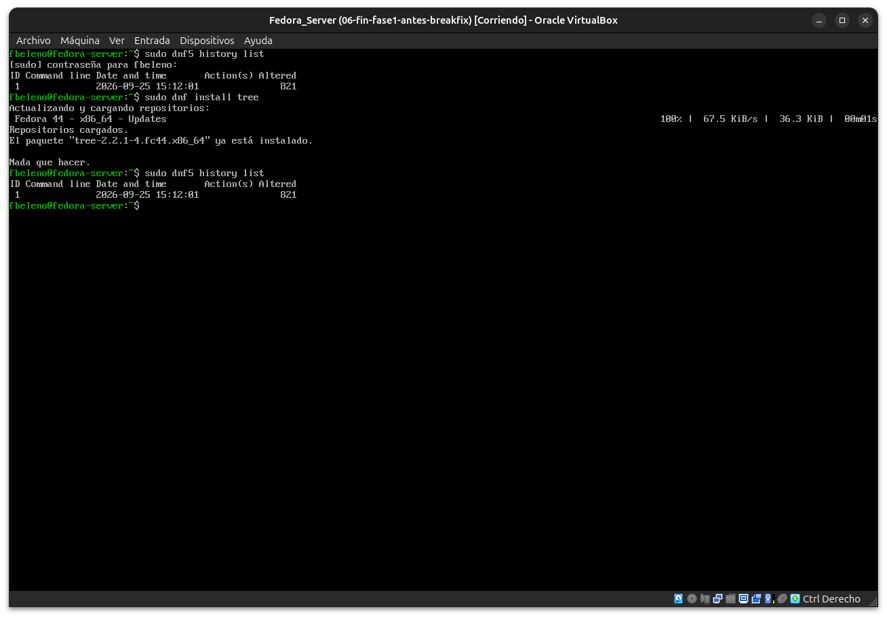
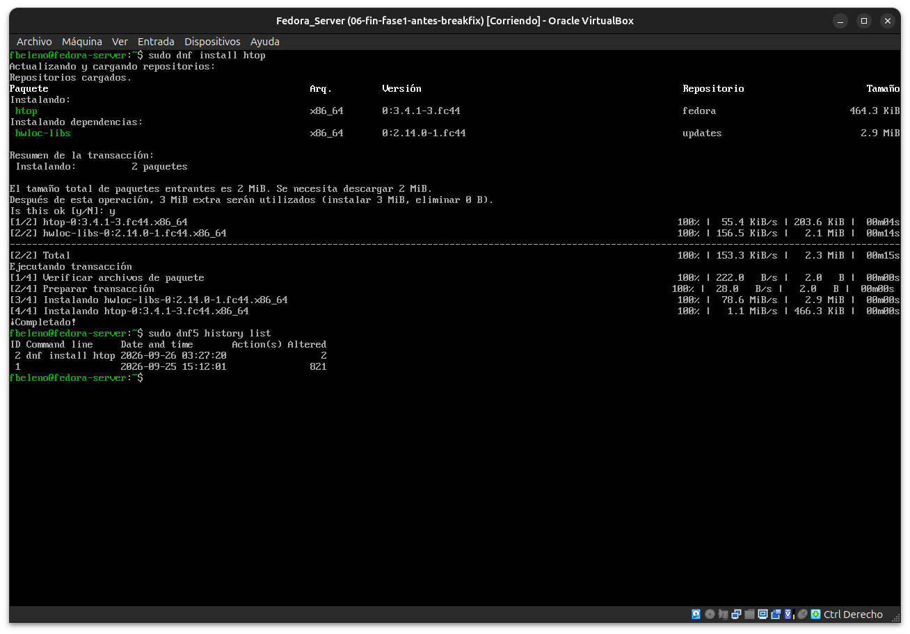
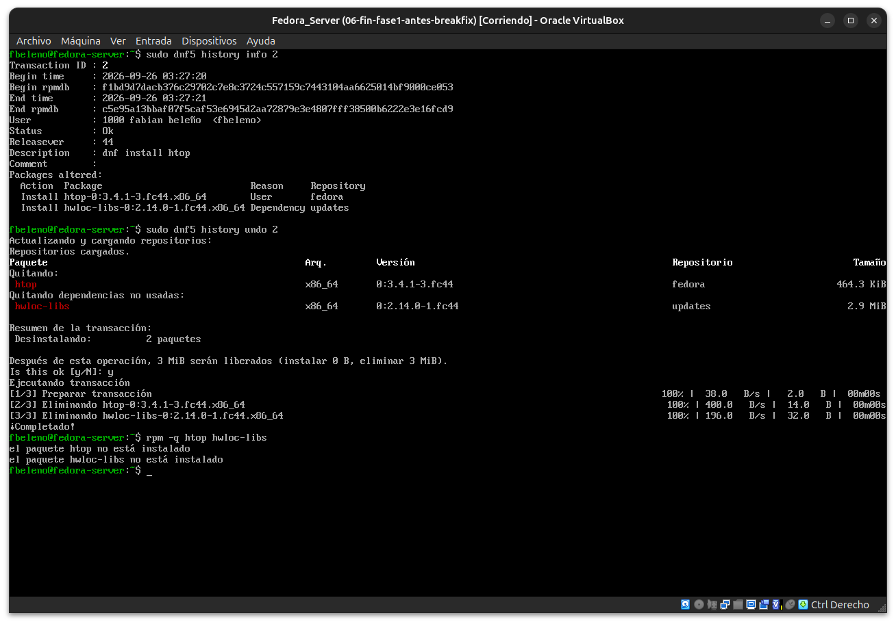

# Módulo 09 — DNF5 y transacciones

- Estado: Completado
- Fecha: 2026-09-25
- Versión de Fedora: Fedora Linux 44 (Server Edition)
- Objetivo diferencial frente a Arch: DNF5 es el equivalente completo a
  `pacman` (resuelve dependencias, descarga, gestiona repos) — a
  diferencia de `rpm` (módulo 08), que es solo la capa de bajo nivel.

## Concepto diferencial

**DNF5** es una reescritura completa en C++ (el `dnf` clásico era
Python) — Fedora lo adoptó como gestor de paquetes por defecto desde
Fedora 41.

La diferencia real más marcada frente a pacman: **DNF mantiene un
historial de transacciones con undo/rollback real**
(`dnf history undo <id>`, `dnf history rollback <id>`). pacman no tiene
esto nativo — en Arch, deshacer una transacción requiere snapshots de
Btrfs/Snapper (ya visto en `arch-linux-desktop`, módulos 21-24) o
revertir manualmente paquete por paquete con `pacman -U` sobre el caché.

## Práctica guiada

```bash
sudo dnf5 history list
sudo dnf install tree
sudo dnf5 history list
sudo dnf5 history info <id-de-la-transaccion-nueva>
sudo dnf5 history undo <id-de-la-transaccion-nueva>
rpm -q tree
```

## Hallazgos reales

1. **`tree` ya estaba instalado** de base — no anticipado, obligó a
   cambiar el paquete de prueba a `htop` para generar una transacción
   real (con `tree` no había nada que hacer, DNF no crea entrada de
   historial cuando no cambia nada).
2. **`dnf5 history info <id>` expone hashes de la base de datos RPM**
   (`Begin rpmdb` / `End rpmdb`) antes y después de la transacción — un
   mecanismo de integridad que permite a DNF verificar que el estado
   real coincide con lo esperado antes de aplicar un undo. pacman no
   expone nada equivalente.
3. **Columna `Reason` (`User` vs `Dependency`)**: DNF registra
   explícitamente en el historial si un paquete se instaló a propósito
   o como dependencia — concepto similar al de "explícito vs huérfano"
   de pacman, pero integrado directamente en cada transacción en vez de
   ser una consulta aparte (`pacman -Qdt`).
4. **`dnf5 history undo 2` revirtió limpiamente ambos paquetes**
   (`htop` + `hwloc-libs`), confirmado con `rpm -q` — el undo real
   funciona como se esperaba, no es solo un registro de auditoría.

## Evidencias

**01 — Historial inicial: solo la transacción de instalación (821 paquetes), `tree` ya instalado**
`sudo dnf5 history list` y el intento fallido de instalar `tree` ("ya está instalado").



**02 — `dnf install htop`: transacción real nueva (ID 2)**
Instala `htop` + `hwloc-libs` como dependencia; el historial ya muestra 2 entradas.



**03 — `history info`, `history undo` y validación con `rpm -q`**
Detalle completo de la transacción (hashes de rpmdb, razón de cada paquete), undo exitoso, y confirmación de que ambos paquetes quedaron desinstalados.



## Pendientes
