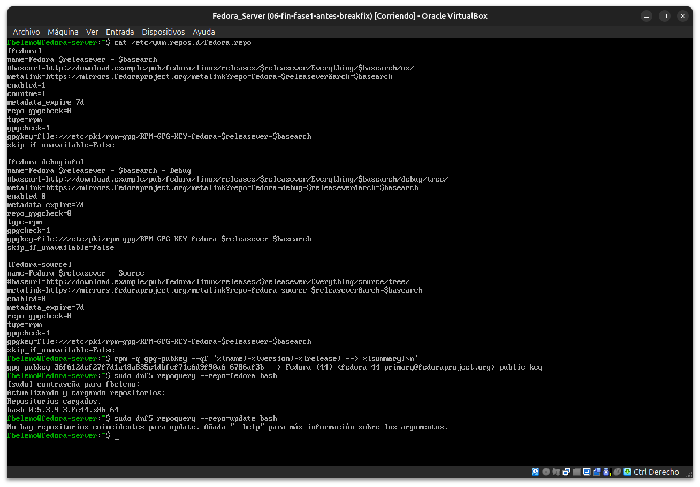
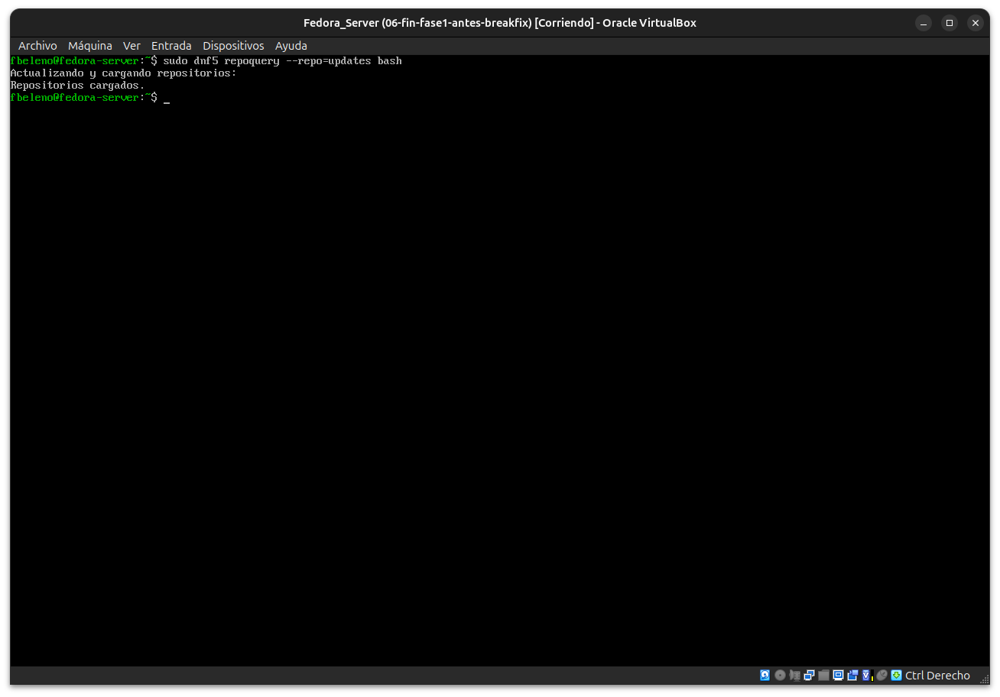
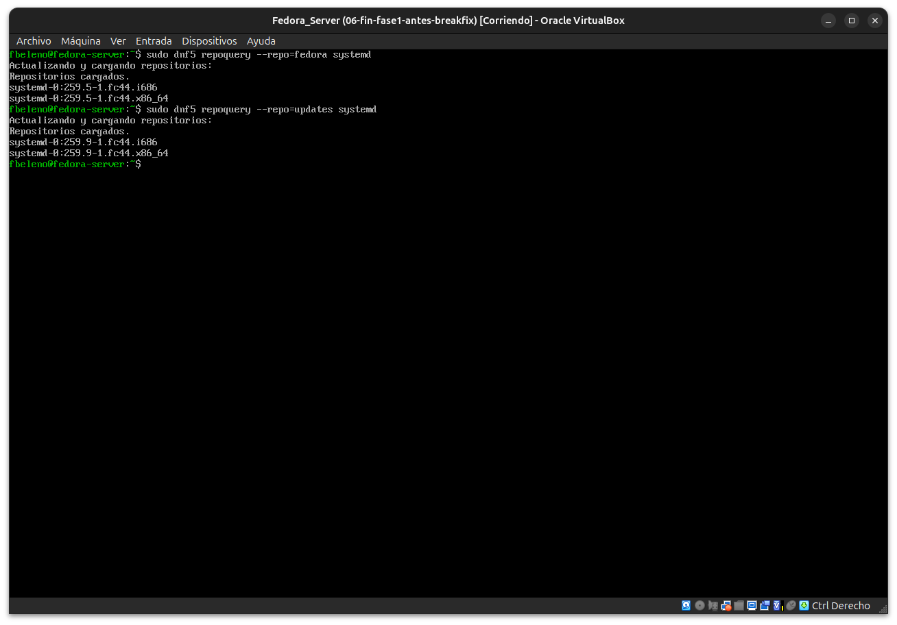
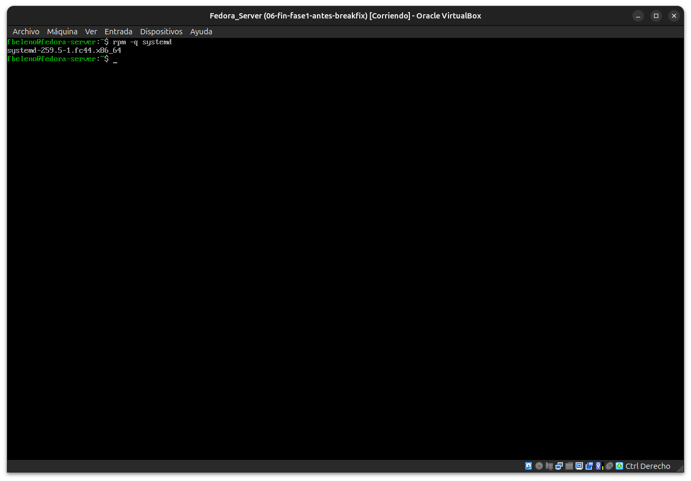

# Módulo 10 — Repositorios, actualizaciones y confianza (GPG)

- Estado: Completado
- Fecha: 2026-09-25
- Versión de Fedora: Fedora Linux 44 (Server Edition)
- Objetivo diferencial frente a Arch: entender cómo Fedora verifica la
  procedencia de cada paquete (GPG por defecto, no opcional) y cómo
  resuelve tener el mismo paquete disponible en dos repos distintos
  (`fedora` + `updates`), algo que Arch no necesita porque todo vive en
  `core`/`extra` sin esta separación.

## Concepto diferencial

- Cada repo (`/etc/yum.repos.d/*.repo`) trae `gpgcheck=1` y una ruta a
  la clave pública (`/etc/pki/rpm-gpg/RPM-GPG-KEY-fedora-*`) — la firma
  se verifica en cada instalación por defecto.
- **Las claves GPG importadas se guardan como "paquetes" en la base de
  datos de RPM** (`gpg-pubkey-xxxxxxxx`), visibles con `rpm -q
  gpg-pubkey`. pacman en cambio usa un keyring completamente separado
  gestionado por `pacman-key`, nunca mezclado con la base de datos de
  paquetes instalados.
- Fedora separa **`fedora`** (paquetes fijos de la release) de
  **`updates`** (parches posteriores). Cuando el mismo paquete existe en
  ambos con versiones distintas, DNF resuelve a la versión más nueva
  disponible entre todos los repos habilitados — no hace falta un
  sistema de prioridades explícito para el caso común.

## Práctica guiada

```bash
cat /etc/yum.repos.d/fedora.repo
rpm -q gpg-pubkey --qf '%{name}-%{version}-%{release} --> %{summary}\n'
sudo dnf5 repoquery --repo=fedora bash
sudo dnf5 repoquery --repo=updates bash
```

## Hallazgos reales

1. **Dos capas de verificación GPG distintas**: `gpgcheck=1` valida la
   firma de cada paquete individual; `repo_gpgcheck=0` (deshabilitado en
   Fedora por defecto) validaría la firma de los metadatos del repo
   completo — pacman no separa estas dos capas.
2. **`metalink=` en vez de `baseurl` fijo**: Fedora resuelve el mirror
   dinámicamente por metalink; el `baseurl` queda solo como comentario de
   referencia. Distinto del `mirrorlist` estático de Arch.
3. **Una sola clave GPG importada** (`gpg-pubkey-...-6786af3b`, Fedora
   44), visible como pseudo-paquete en `rpm -q gpg-pubkey`.
4. **`bash` no tenía versión pendiente en `updates`** (primer intento
   sin resultado) — no todos los paquetes tienen actualización
   simultánea; `systemd` sí:
   - `fedora`: `systemd-259.5-1.fc44`
   - `updates`: `systemd-259.9-1.fc44`
   - Instalado realmente: `259.5-1` (la vieja) — confirma que tener
     metadatos en ambos repos no instala nada automáticamente, solo los
     combina para que `dnf upgrade` decida.

## Evidencias

**01 — `fedora.repo`, clave GPG importada y `repoquery` inicial**
`gpgcheck`/`repo_gpgcheck` separados, `metalink` en vez de `baseurl`, y la única clave GPG importada como pseudo-paquete.



**02 — Typo corregido: `--repo=updates`, `bash` sin resultado**
`bash` no tiene versión pendiente en `updates` en este momento.



**03 — `systemd`: dos versiones distintas en `fedora` y `updates`**
`259.5-1` (fedora) vs `259.9-1` (updates).



**04 — Versión realmente instalada: la vieja**
`rpm -q systemd` confirma `259.5-1` — la actualización sigue pendiente, tener ambos repos no instala nada solo.



## Pendientes
