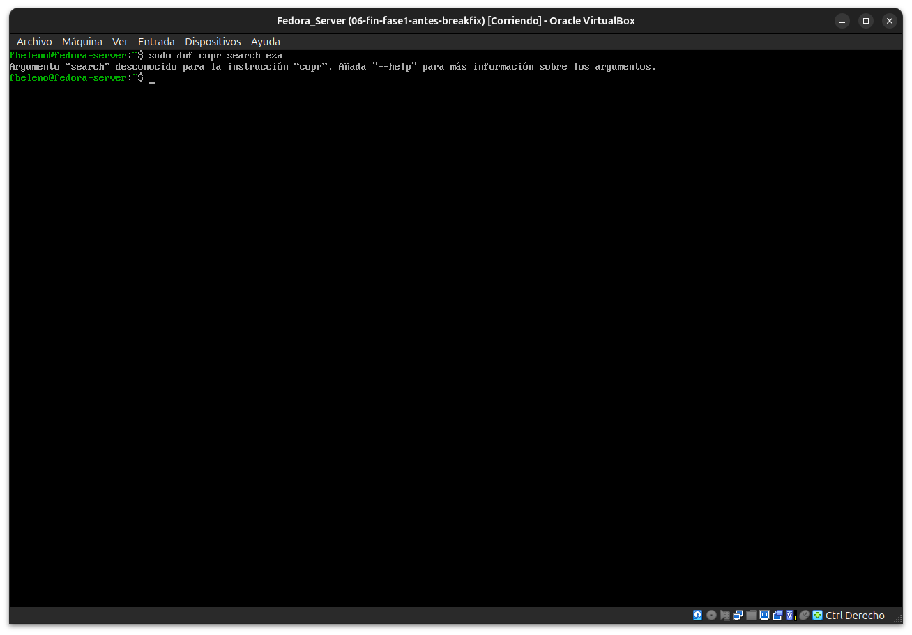
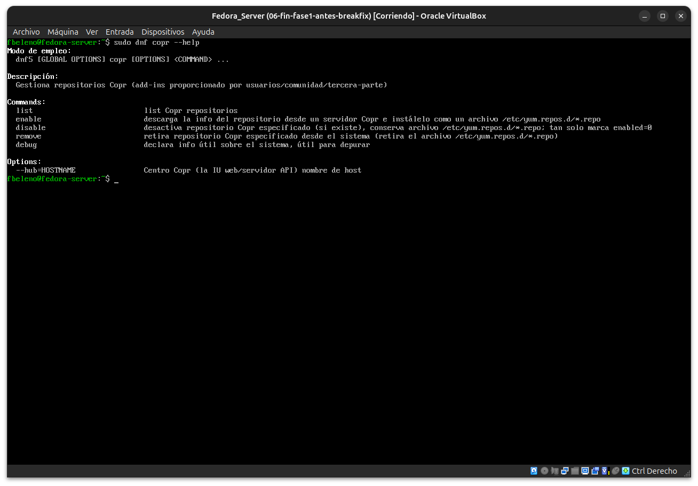
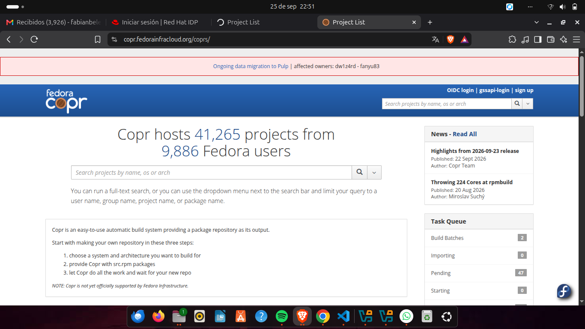
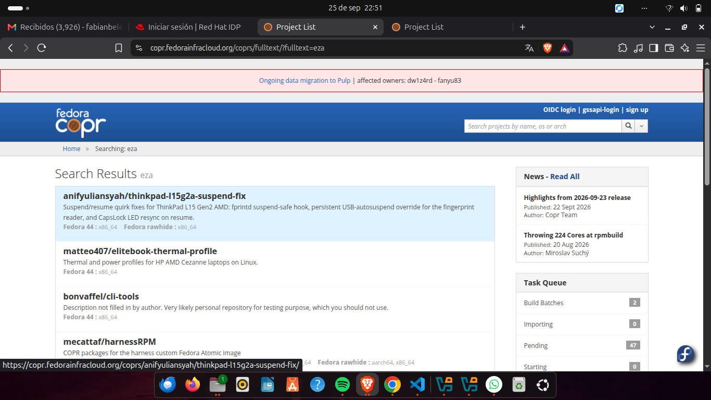
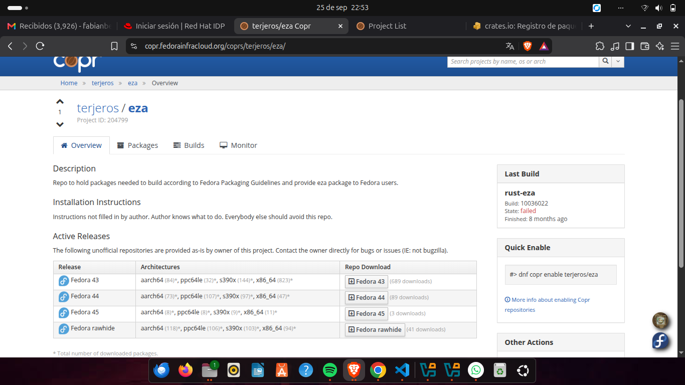
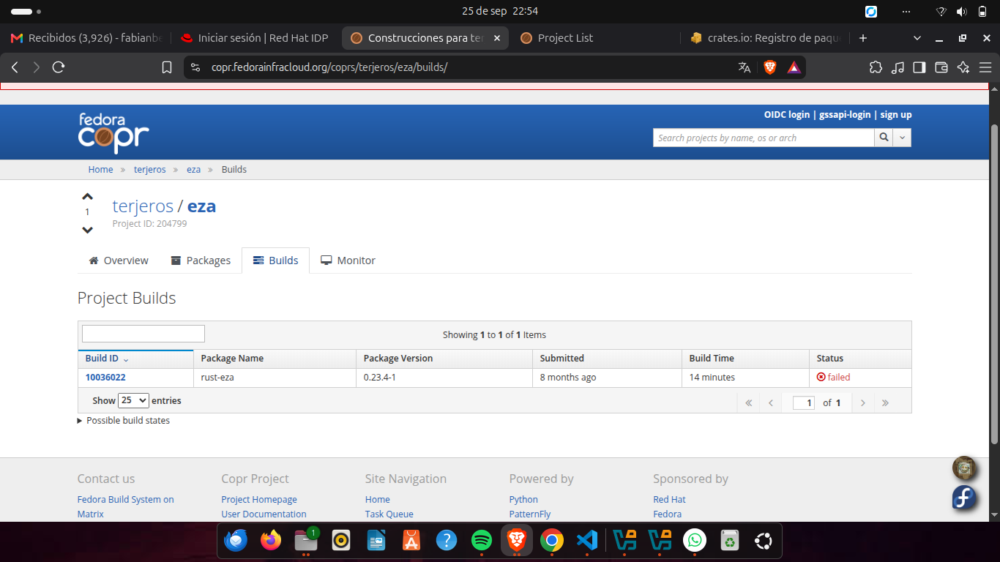
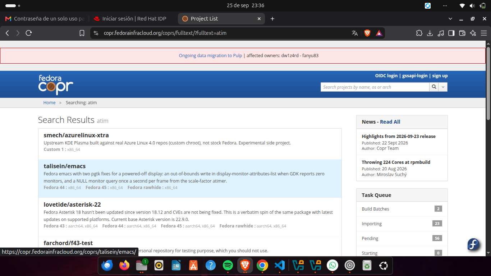

# Módulo 11 — COPR: búsqueda, revisión y evaluación de riesgos

- Estado: Completado
- Fecha: 2026-09-25
- Versión de Fedora: Fedora Linux 44 (Server Edition)
- Objetivo diferencial frente a Arch: COPR no es un AUR equivalente —
  distinto modelo de confianza y de construcción de paquetes.

## Concepto diferencial

En AUR, el usuario compila el paquete localmente desde un `PKGBUILD`:
confía en la receta, pero el binario lo genera su propia máquina. En
**COPR**, el binario ya viene precompilado por la infraestructura de
build de Fedora (Copr Build System, usando `mock`) — el modelo de
confianza se parece más a agregar un PPA de Ubuntu que al AUR: hay que
confiar en el mantenedor del proyecto **y** en que Fedora construyó ese
binario correctamente, sin compilarlo uno mismo.

Antes de habilitar un repo COPR conviene revisar: quién es el
mantenedor, cuántos proyectos tiene, si el `.spec` es público, y si el
paquete hace lo que dice.

## Práctica guiada

```bash
sudo dnf copr search eza      # falla: search no existe en dnf5-plugin-copr
sudo dnf copr --help          # subcomandos reales: list, enable, disable, remove, debug
```

## Hallazgos reales

1. **`dnf copr search` no existe en DNF5** — regresión real frente a
   DNF4 (que sí lo tenía). Sin comando de búsqueda por CLI, la única vía
   es el sitio web de COPR (`copr.fedorainfracloud.org`).
2. **Búsqueda por texto completo trae ruido real**: buscar "eza" o
   "atim" devuelve coincidencias parciales de palabras (`atimer`,
   `ezaz`, `unbreq-atime`) mezcladas con resultados relevantes. El
   filtro "package name" del dropdown no cambió el resultado en la
   práctica — se comportó igual que el texto completo.
3. **`terjeros/eza`** parecía el candidato ideal por descripción (repo
   dedicado, sigue las guías de empaquetado de Fedora), pero al revisar
   la pestaña "Builds" tenía **un solo build en toda su historia, y
   falló** — nunca produjo un paquete instalable. Descartado.
4. **Hipótesis inicial equivocada**: se sugirió `atim/eza` de memoria
   como mantenedor confiable conocido — **no existe** (`Error 404:
   Project atim/eza does not exist`). Se corrigió sin insistir en la
   suposición.
5. **Conclusión real del módulo**: entre los candidatos reales
   disponibles hoy para el paquete `eza`, ninguno cumplió un umbral
   razonable de confianza (dedicado + builds exitosos + bajo riesgo).
   Las alternativas que sí construyen `eza` (`mradityaalok/satori`,
   `aahsnr-work/halcyon`) lo hacen empaquetado junto a un stack
   completo de escritorio (Hyprland) ajeno a lo que se necesitaba,
   aumentando la superficie de riesgo sin necesidad.
6. **Decisión tomada**: no habilitar ningún repositorio COPR hoy. Es un
   resultado válido de la "evaluación de riesgos" que da nombre al
   módulo — a veces la conclusión correcta es no confiar en nada de lo
   disponible, no forzar una instalación para completar el ejercicio.

## Evidencias

**01-02 — `dnf copr search` no existe; subcomandos reales de `dnf copr --help`**




**03-04 — Búsqueda web en COPR: página principal y resultados con ruido para "eza"**




**05-06 — `terjeros/eza`: parecía ideal, pero un solo build y falló**




**07 — Búsqueda de "atim": sin coincidencia real (la hipótesis inicial era incorrecta)**



## Pendientes
