# Módulo 12 — Construcción de un RPM: SPEC, dependencias y validación

- Estado: Completado
- Fecha: 2026-09-26
- Versión de Fedora: Fedora Linux 44 (Server Edition)
- Objetivo diferencial frente a Arch: construir un RPM propio desde un
  archivo `.spec`, comparándolo con el `PKGBUILD` ya usado en
  `arch-linux-desktop` (módulo 26).

## Concepto diferencial

`rpmbuild` exige una estructura de directorios fija
(`~/rpmbuild/{SPECS,SOURCES,BUILD,RPMS,SRPMS}`), generada con
`rpmdev-setuptree` — a diferencia de `makepkg`, que solo necesita un
`PKGBUILD` en cualquier carpeta.

El archivo `.spec` tiene secciones obligatorias con nombres fijos
(`%prep`, `%build`, `%install`, `%files`, `%changelog`) — más rígido y
verboso que las funciones `build()`/`package()` de un PKGBUILD, pero más
explícito sobre qué pasa en cada etapa de la construcción.

## Práctica guiada

```bash
sudo dnf install rpm-build rpmdevtools
rpmdev-setuptree
ls ~/rpmbuild
```

Luego se escribe un `.spec` simple (paquete `fedora-mastery-diag`, un
script de diagnóstico propio sin fuente externa), se construye con
`rpmbuild -bb`, se valida el `.rpm` resultante y se instala.

## Hallazgos reales

1. **`rpm-build`/`rpmdevtools` instalaron 46 paquetes**, incluyendo
   `*-srpm-macros` de prácticamente todos los lenguajes que Fedora
   empaqueta (rust, go, ocaml, ghc, java, lua, zig, qt5/qt6...) — mucho
   más pesado que `base-devel` de Arch para lo mismo.
2. **Typo real en el `.spec`**: `%{_nindir}` en vez de `%{_bindir}` en
   la sección `%files` (verificado con `grep`, no era la fuente de la
   terminal) — corregido con `sed`.
3. **"mangling shebang... from `/bin/bash` to `#!/usr/bin/bash`"** —
   RPM normaliza automáticamente los shebangs a la ruta canónica
   (Fedora usa usrmerge: `/bin` → symlink a `/usr/bin`).
4. **"fecha fraudulenta en %changelog"**: puse "Fri Sep 26 2026" sin
   verificar el día real — `date -d "2026-09-26" +%A` confirmó que es
   **sábado**. `rpmbuild` valida que el nombre del día coincida con la
   fecha real del calendario, algo que un `PKGBUILD` no chequea.
5. **Heredoc anidado perdió una línea al pegarse** en la consola de
   VirtualBox: el `.spec` tenía la línea `echo "IP: ..."` en la versión
   escrita en el chat, pero el archivo real en la VM solo tenía 2 de
   los 3 `echo`. Corregido con `sed` en vez de repetir el pegado
   completo — lección real sobre los límites de pegar bloques grandes
   con heredocs anidados en una terminal de VM.
6. **Conexión directa con el módulo 10**: al instalar el `.rpm` local
   sin firmar, DNF avisó explícitamente *"comprobante OpenPGP omitido
   para 1 paquete desde repositorio: @commandline"* — confirma en la
   práctica el mecanismo de verificación GPG visto en la teoría.
7. **Validación final exitosa**: `fedora-mastery-diag` imprime
   hostname, las 3 IPs (NAT + host-only + IPv6) y el uso de disco real.

## Evidencias

**01-02 — Instalación de `rpm-build`/`rpmdevtools`: 46 paquetes, todos los `*-srpm-macros`**

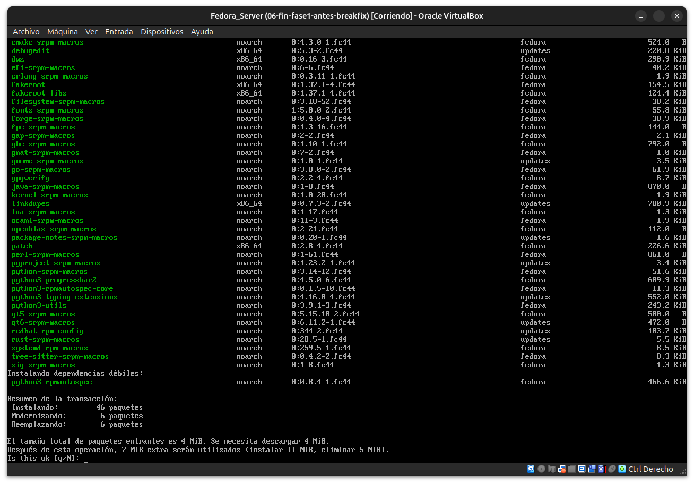
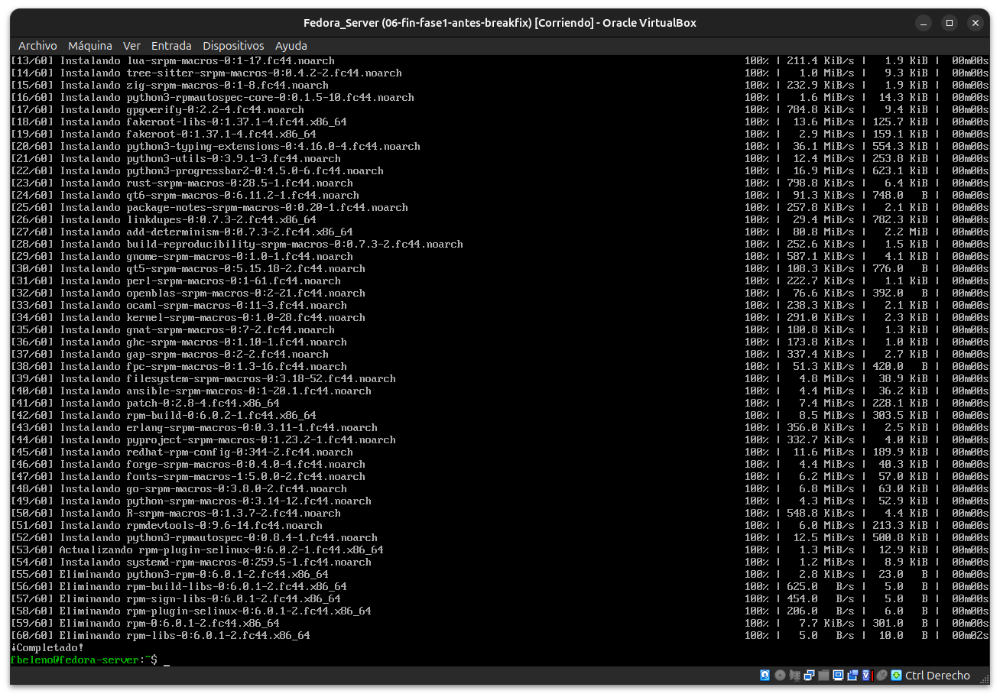

**03 — `rpmdev-setuptree`: estructura de directorios creada**

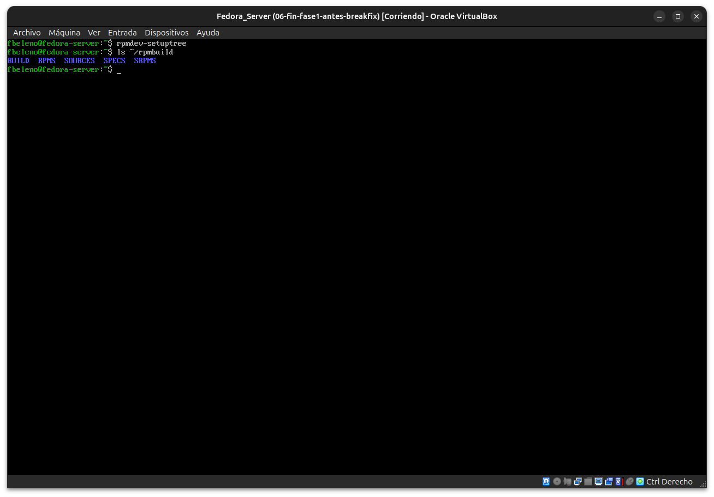

**04-06 — El `.spec` con el typo real (`_nindir`), diagnóstico y corrección**

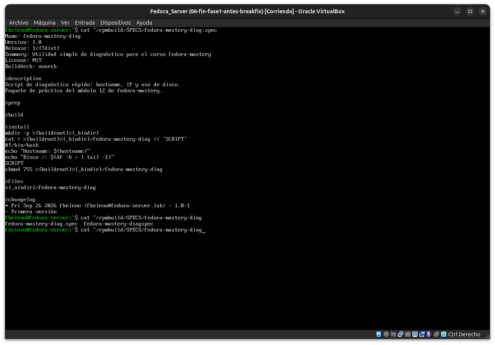
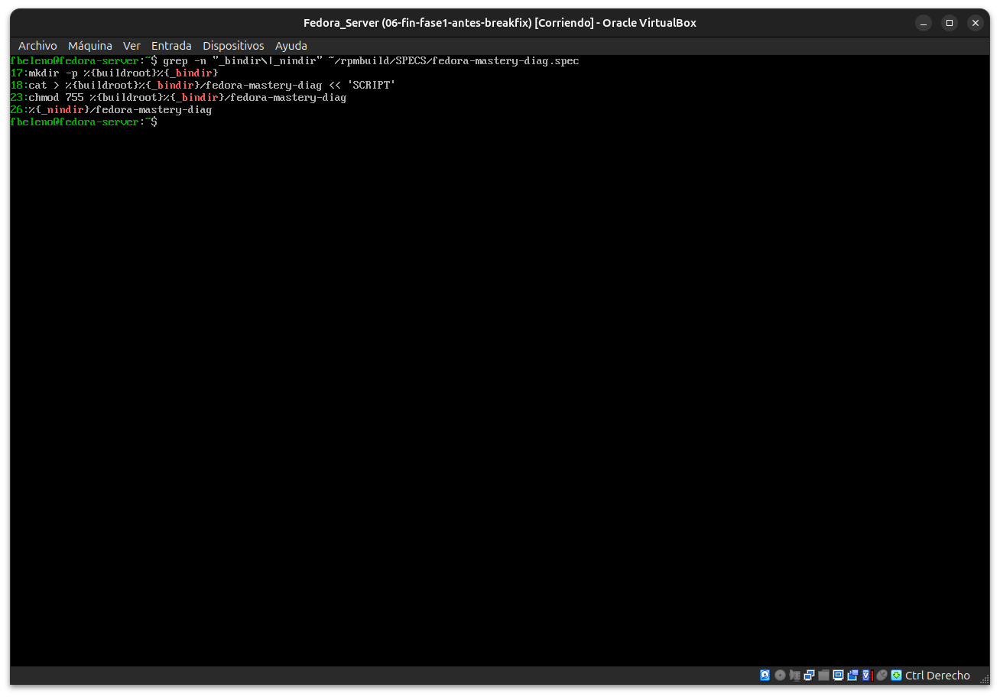
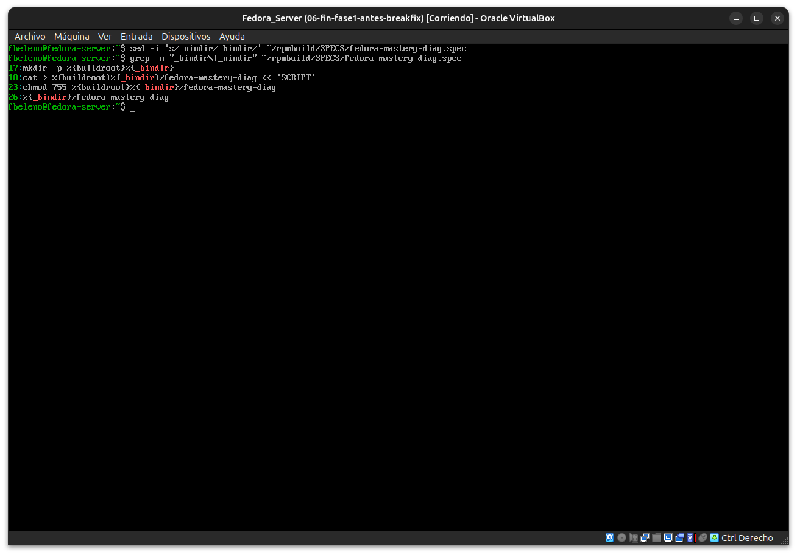

**07-08 — Primer build: advertencia de fecha fraudulenta, confirmada con `date`**

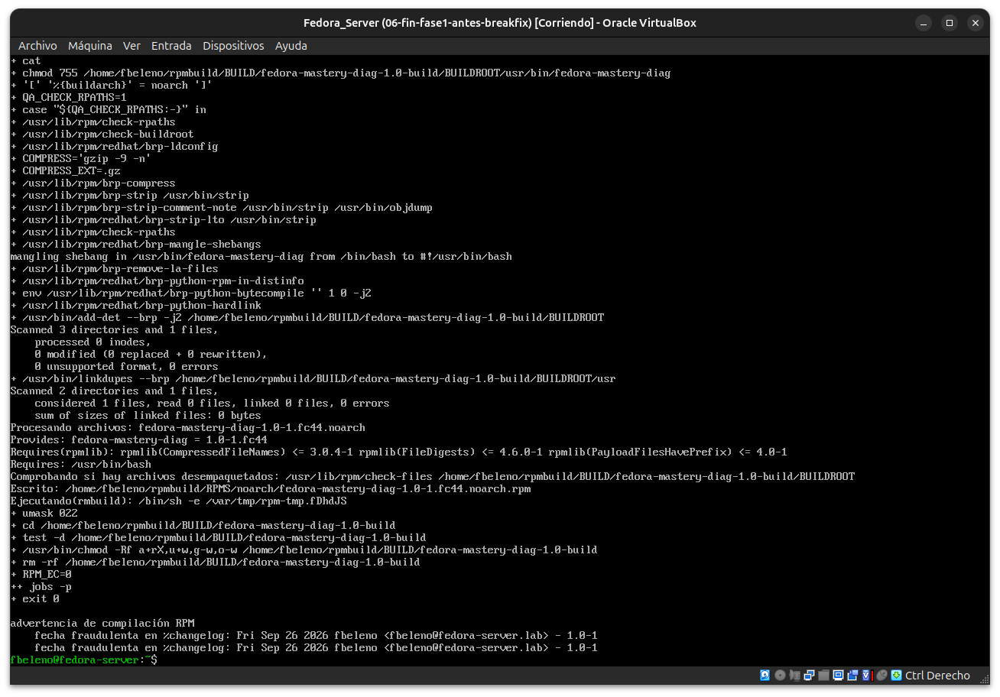
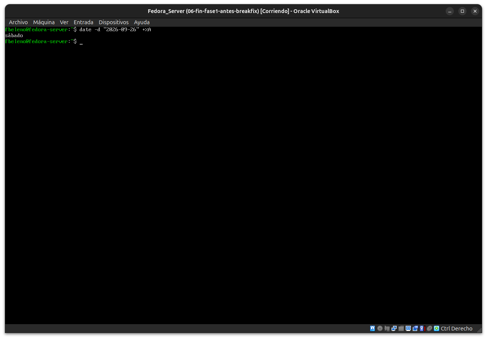

**09 — Segundo build: limpio, sin advertencias**

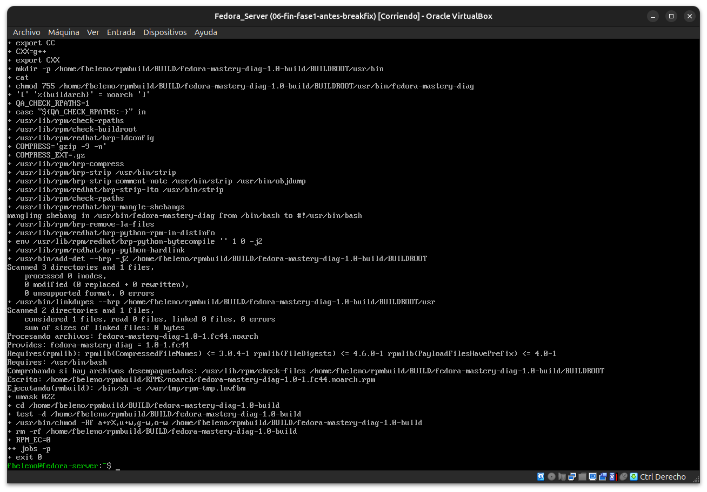

**10-11 — Instalado y ejecutado, pero falta la línea IP — diagnóstico del heredoc perdido**

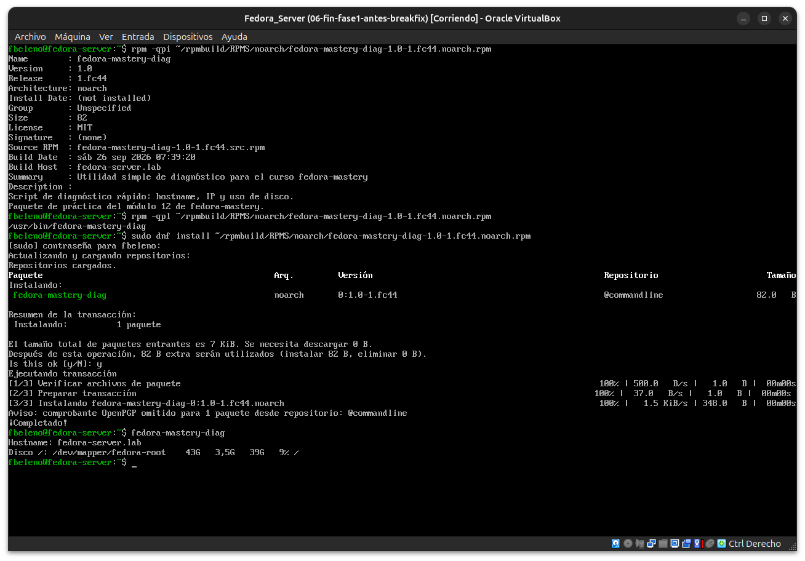
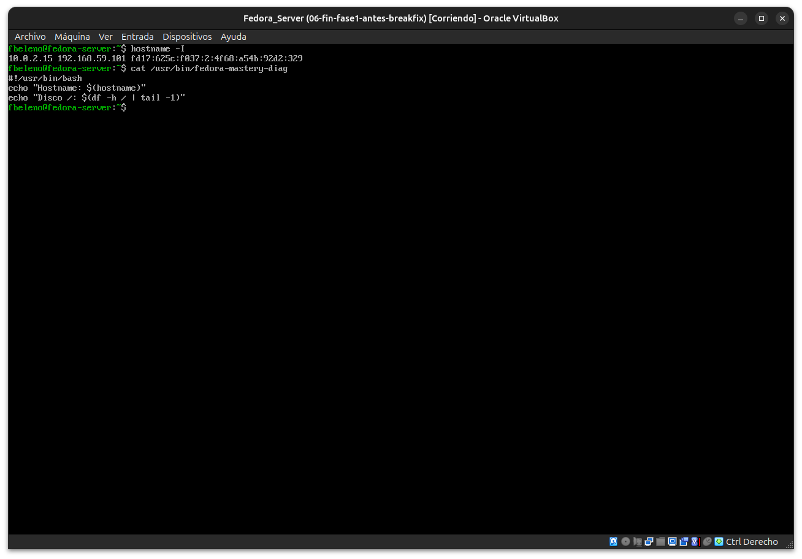

**12-13 — Corrección con `sed` y tercer build**

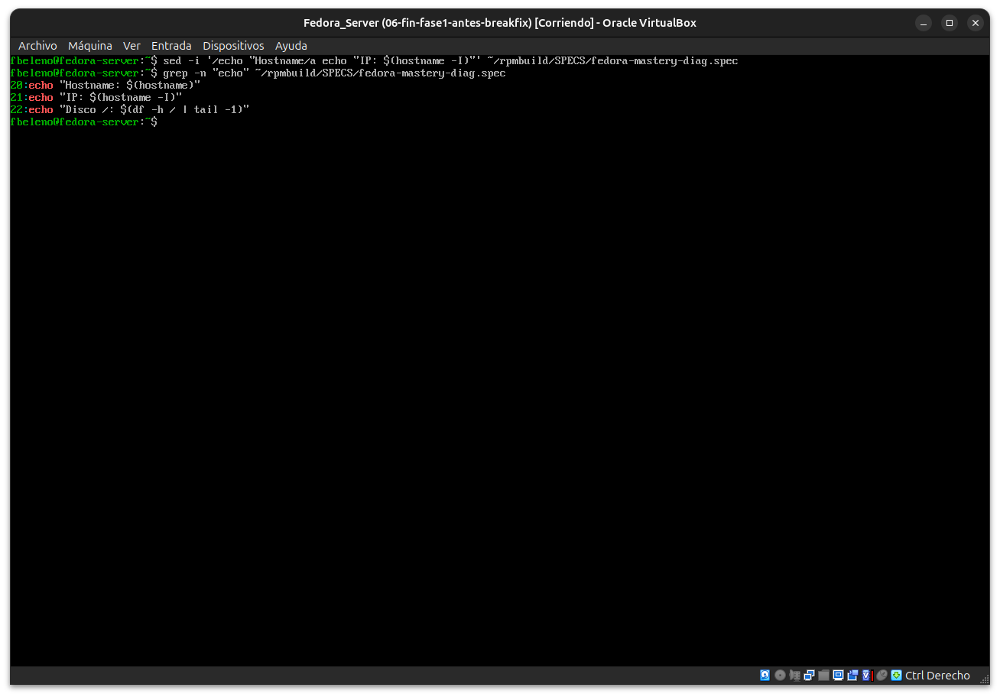


**14 — Validación final: las 3 líneas completas**

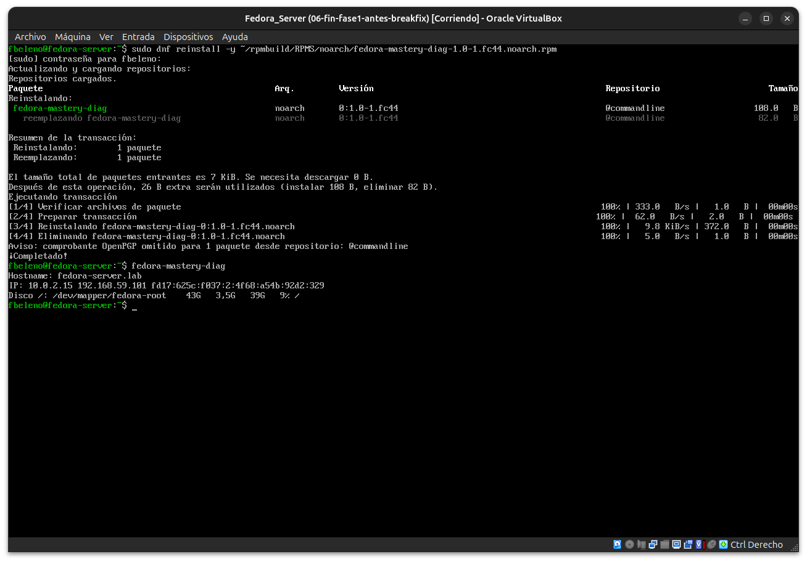

## Pendientes
