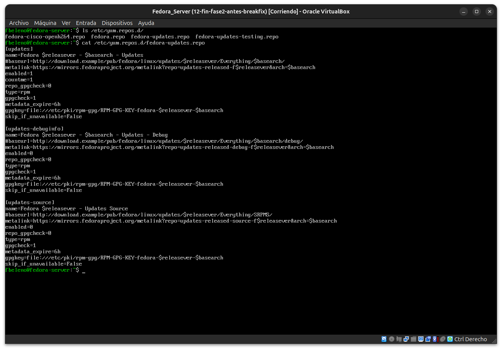
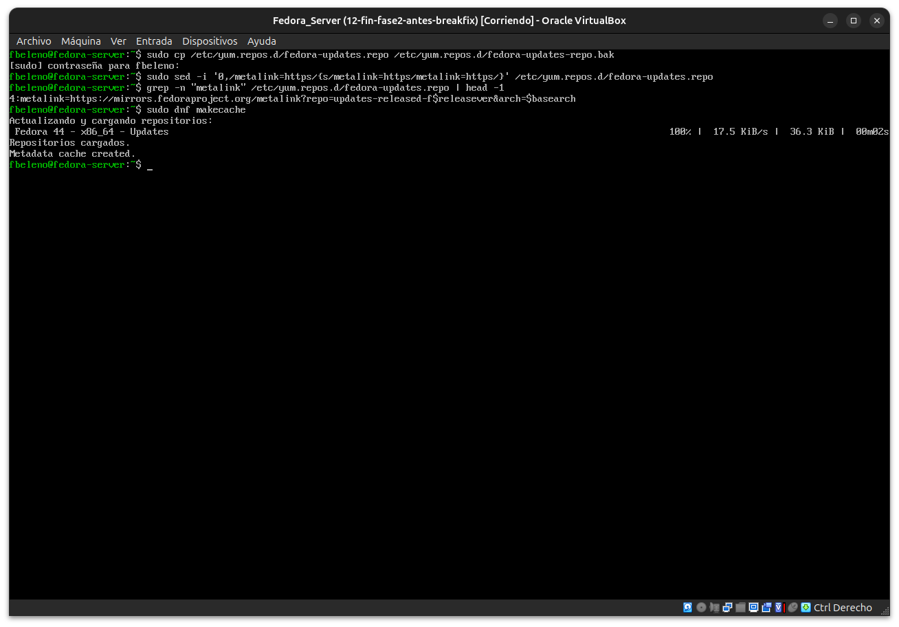
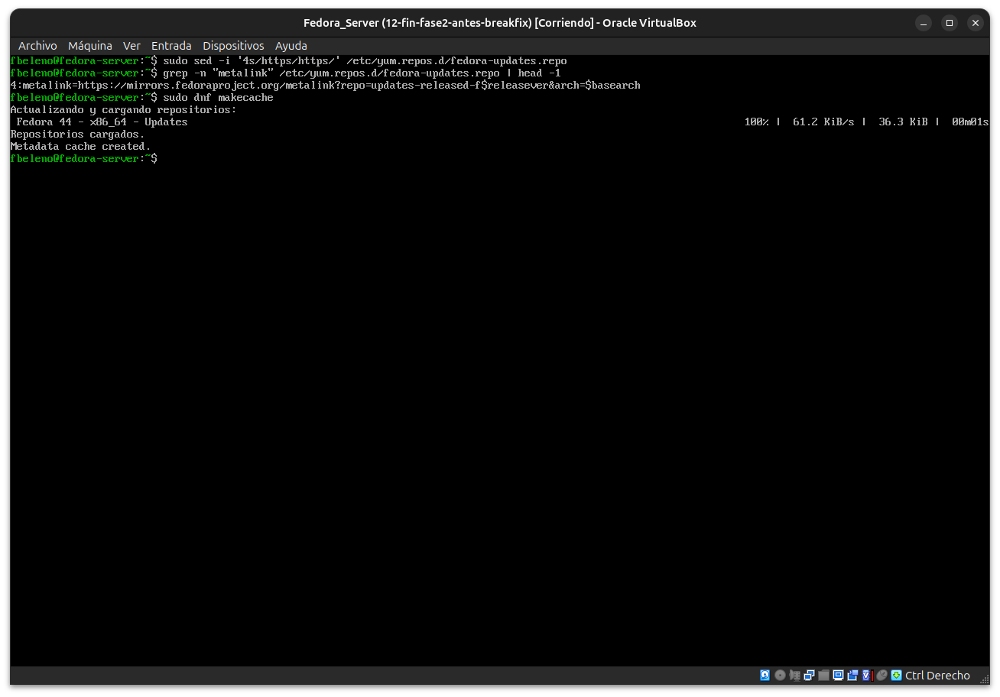
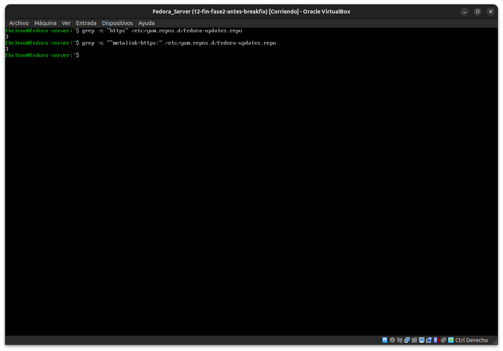
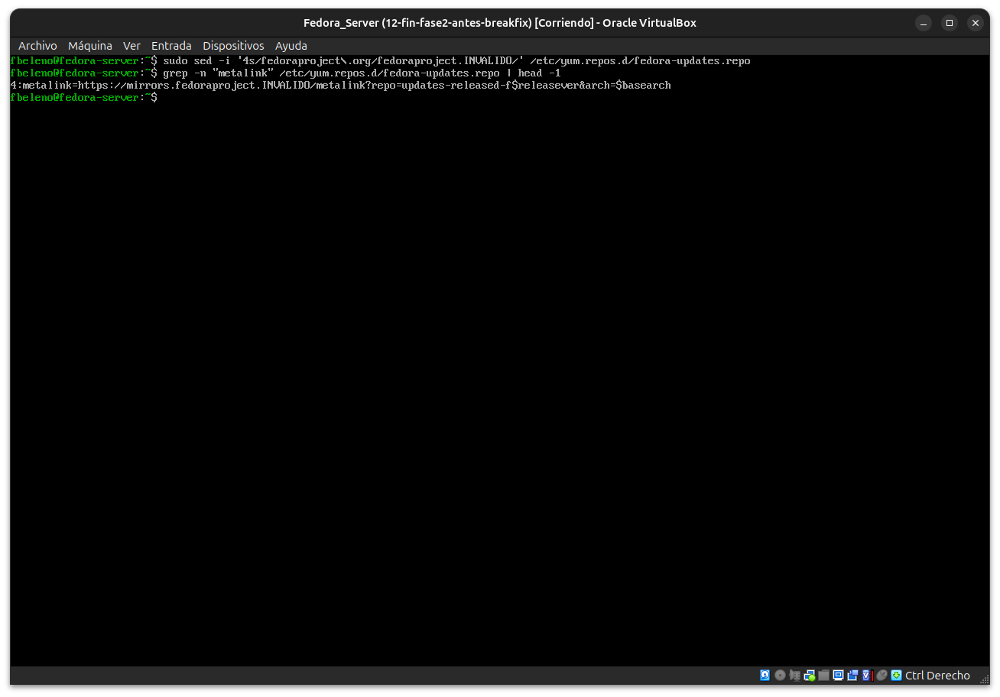
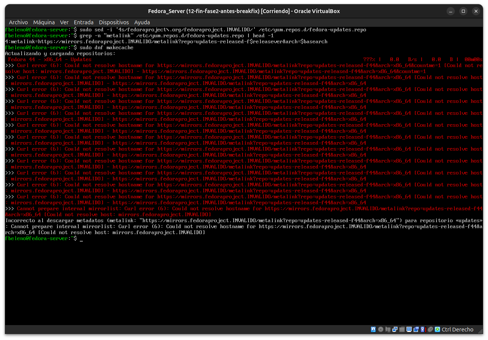
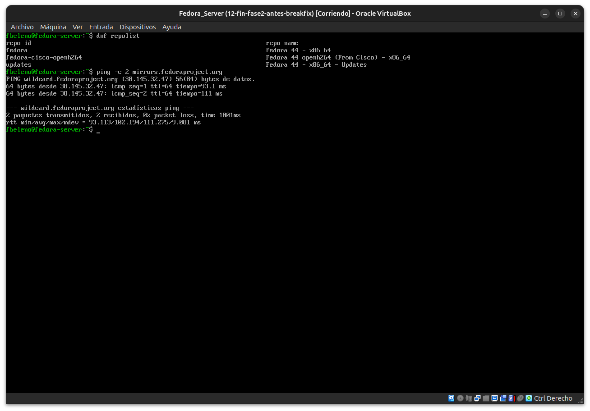
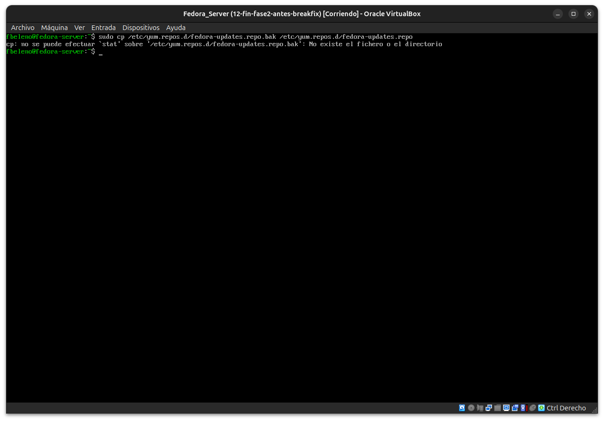
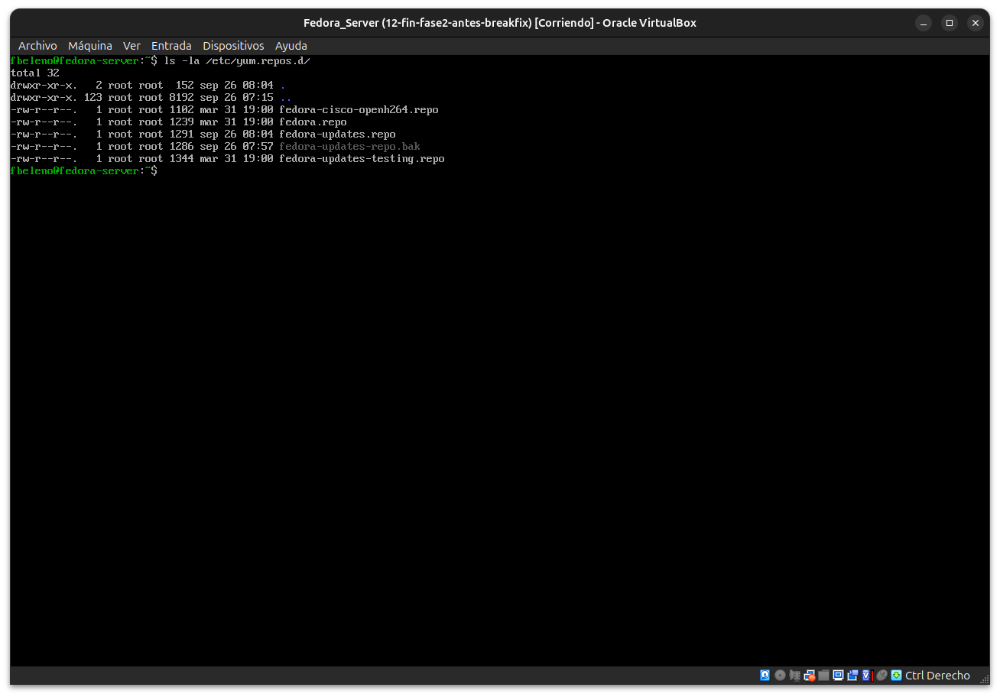
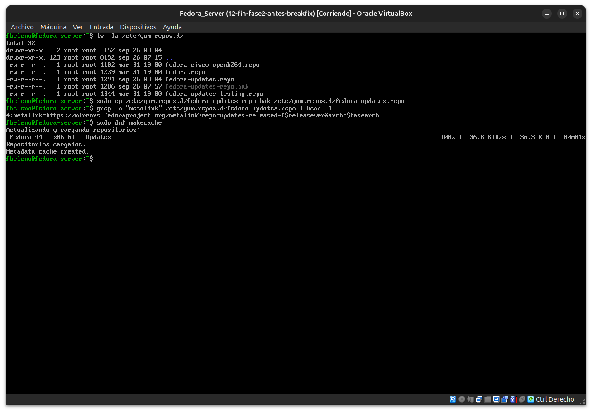

# Módulo 13 — Break & Fix de paquetes (cierre de Fase 2)

- Estado: Completado
- Fecha: 2026-09-26
- Versión de Fedora: Fedora Linux 44 (Server Edition)
- Objetivo diferencial frente a Arch: segundo Break & Fix formal del
  curso — romper un repositorio real (typo en la URL de metadatos) y
  diagnosticar el error de DNF hasta la causa raíz, reparando sin
  restaurar snapshot.

## Entorno y punto de restauración

Snapshot `12-fin-fase2-antes-breakfix` tomado antes de este módulo (fin
de Fase 2: RPM/pacman, DNF5 history/undo, GPG/repos, COPR evaluado sin
habilitar, primer RPM propio construido).

## Cambio deliberado

Se hizo una copia de seguridad de `/etc/yum.repos.d/fedora-updates.repo`
y se introdujo un dominio inválido en el `metalink=` de la sección
`[updates]`, simulando un error de configuración manual.

```bash
sudo cp /etc/yum.repos.d/fedora-updates.repo /etc/yum.repos.d/fedora-updates.repo.bak
sudo sed -i '4s/fedoraproject\.org/fedoraproject.INVALIDO/' /etc/yum.repos.d/fedora-updates.repo
```

**Hallazgo real durante el propio "cambio deliberado"**: dos intentos
previos de romper el archivo con `sed` (reemplazando `https` por
`htttp`, duplicando una letra) **fallaron silenciosamente** — el
archivo seguía intacto, confirmado con `grep -c`. Se descartó ese
enfoque por uno más robusto (reemplazar el dominio completo), que sí
funcionó de forma verificable.

## Síntoma

`sudo dnf makecache` produce **12 reintentos de curl** (`Curl error
(6): Could not resolve hostname`) contra la URL de metalink rota,
terminando en `Incorrecto al descargar metadatos... para repositorio
«updates»: Cannot prepare internal mirrorlist`.

## Diagnóstico y recuperación

- **Observación**: el error apunta específicamente al repositorio
  `updates` y a una URL con "Could not resolve hostname" — un error que
  a primera vista podría confundirse con un problema de red general.
- **Hipótesis**: ¿es un problema de DNS/red real, o algo específico de
  la configuración de este repo?
- **Prueba**: `dnf repolist` sigue mostrando los 3 repos sin colapsar
  todo el sistema; `ping -c 2 mirrors.fedoraproject.org` resuelve
  perfecto (0% de pérdida) — descarta un problema de red general.
- **Causa raíz confirmada**: la URL de metalink de `[updates]` apunta a
  un dominio que no existe (`fedoraproject.INVALIDO`), verificable
  comparando contra el backup.
- **Solución aplicada**: restaurar el archivo desde el backup.
  **Segundo hallazgo real en el propio proceso de reparación**: el
  primer intento de restaurar falló (`cp: no se puede efectuar 'stat'`)
  porque el backup **no se llamaba como se esperaba** —
  `ls -la /etc/yum.repos.d/` reveló que el archivo real era
  `fedora-updates-repo.bak` (con guion, no punto, entre "updates" y
  "repo") — otro desajuste de tipeo al pegar el comando original de
  backup. Corregido usando el nombre real del archivo.
- **Validación**: `sudo dnf makecache` volvió a cargar
  `Fedora 44 - x86_64 - Updates` sin errores (`Metadata cache
  created.`).

## Impacto y riesgos

- Impacto real: ninguno más allá de la imposibilidad temporal de
  refrescar metadatos del repo `updates` — no se perdió ningún paquete
  instalado, ni se corrompió la base de datos de RPM.
- Riesgo si no se hubiera tenido un backup del `.repo`: reconstruir la
  configuración correcta de memoria (metalink exacto, opciones de
  `gpgcheck`, etc.) en vez de restaurar un archivo conocido — mucho más
  lento y propenso a error.
- Riesgo real adicional descubierto en la práctica: **un backup con un
  nombre distinto al esperado es tan inútil como no tener backup**, si
  no se verifica que existe con el nombre correcto antes de necesitarlo.

## Cómo evitar recurrencia

- Verificar siempre con `ls` que un backup se creó con el nombre
  exacto esperado, en vez de asumirlo — como se vio acá, un pegado de
  comando puede alterar sutilmente un nombre de archivo sin que salte
  ningún error en el momento.
- Antes de editar cualquier archivo en `/etc/yum.repos.d/`, usar
  `cp archivo.repo archivo.repo.bak-$(date +%Y%m%d)` con fecha en el
  nombre, y confirmar con `ls` inmediatamente después.
- Ante un error de `dnf` que mencione "Could not resolve hostname",
  primero descartar un problema de red real (`ping`, `dnf repolist`)
  antes de asumir que la configuración del repo está rota — el mensaje
  de curl es genérico y no distingue "DNS caído" de "URL mal escrita".

## Evidencias

**01 — Contenido original de `fedora-updates.repo`**



**02-03 — Backup creado, dos intentos de romper el metalink fallan silenciosamente**




**04 — `grep` confirma: ningún intento anterior modificó el archivo**



**05 — Cambio deliberado exitoso: dominio inválido en el metalink**



**06 — Síntoma real: 12 reintentos de curl antes de fallar**



**07 — Diagnóstico: DNS y red funcionan, no es un problema general**



**08-09 — Primer intento de restaurar falla; `ls` revela el nombre real del backup**




**10 — Restauración exitosa y validación final**



## Pendientes
