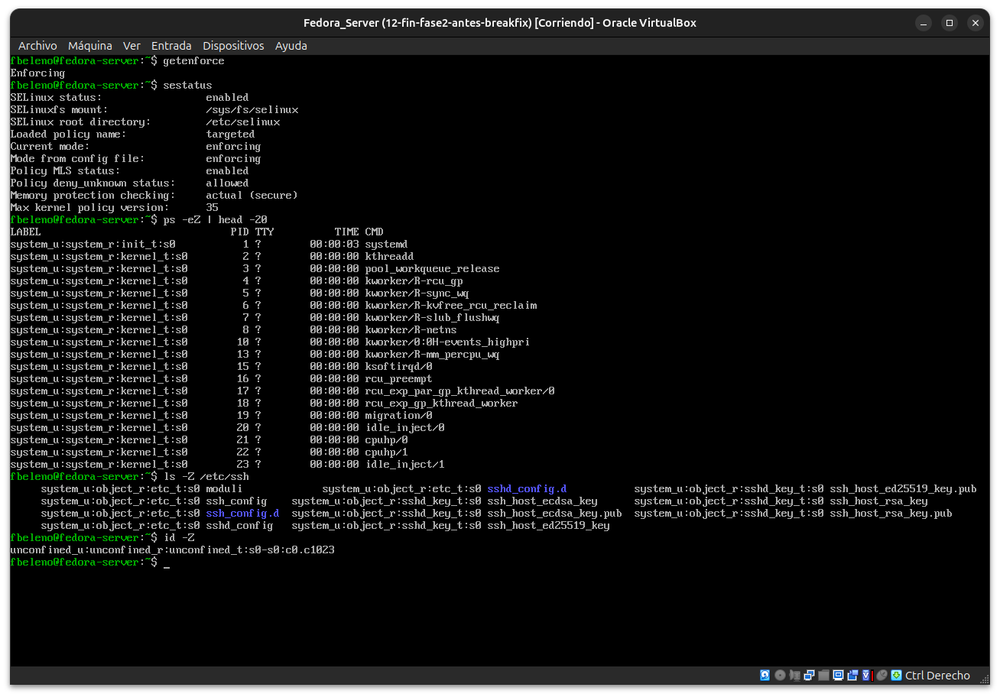

# Módulo 14 — Política SELinux en Fedora

- Estado: Completado
- Fecha: 2026-09-26
- Versión de Fedora: Fedora Linux 44 (Server Edition)
- Objetivo diferencial frente a Arch: SELinux agrega una capa de **MAC**
  (Mandatory Access Control) sobre el **DAC** tradicional de Unix
  (dueño/grupo/permisos) que es lo único que existe en Arch. Arranca la
  Fase 3 del curso.

## Concepto diferencial

En Arch, el control de acceso es puramente **DAC**: si tenés permisos de
lectura/escritura sobre un archivo (por dueño, grupo, u "otros"), podés
acceder. Fin de la historia.

Fedora agrega **SELinux**, una capa de **MAC** que se evalúa además del
DAC, no en su lugar. Cada **proceso** corre en un **dominio** (visible
con `ps -Z`), cada **archivo/objeto** tiene un **tipo** (visible con
`ls -Z`), y la política decide qué dominios pueden acceder a qué tipos.
Si el dominio de un proceso no tiene permiso explícito sobre el tipo de
un archivo, SELinux bloquea el acceso **aunque los permisos Unix lo
permitan** — el DAC decir que sí no alcanza, hace falta que el MAC
también diga que sí.

Fedora usa la política **`targeted`** por defecto (no `mls` ni
`minimum`): solo confina procesos específicos considerados de riesgo
(servicios de red, daemons expuestos), dejando al usuario normal
("unconfined") sin restricciones adicionales de SELinux.

## Práctica guiada

```bash
getenforce
sestatus
ps -eZ | head -20
ls -Z /etc/ssh
id -Z
```

## Hallazgos reales

1. **`getenforce` y `sestatus` coinciden**: `Enforcing` /
   `Current mode: enforcing` / `Mode from config file: enforcing` — sin
   desajuste entre el estado real del kernel y el archivo de
   configuración.
2. **`Policy MLS status: enabled` bajo política `targeted`** — no
   esperaba esto; se asume a veces que MLS solo aplica a la política
   `mls` completa, pero Fedora incluye extensiones MLS también en
   `targeted` (visibles en los niveles `s0` de cada contexto).
3. **`ps -eZ`**: todo el kernel corre en
   `system_u:system_r:kernel_t:s0`, `systemd` (PID 1) en `init_t`.
4. **`ls -Z /etc/ssh` revela granularidad por archivo, no por
   directorio**: `sshd_config`/`moduli` → tipo genérico `etc_t`; las
   claves `ssh_host_*` → tipo específico **`sshd_key_t`**. Con DAC puro
   (Arch), todos esos archivos podrían tener exactamente los mismos
   permisos Unix sin ninguna diferenciación — SELinux distingue por
   función del archivo, no por ubicación.
5. **`id -Z` confirma el modelo `targeted`**:
   `unconfined_u:unconfined_r:unconfined_t:s0-s0:c0.c1023` — la sesión
   del usuario normal corre literalmente en el dominio "unconfined", sin
   restricciones adicionales de SELinux; solo los servicios específicos
   están confinados.

## Evidencias

**01 — `getenforce`, `sestatus`, `ps -eZ`, `ls -Z /etc/ssh`, `id -Z`**
Confirma modo enforcing, política targeted con MLS habilitado, dominios de proceso, tipos de archivo granulares por función, y el dominio "unconfined" del usuario normal.



## Pendientes
