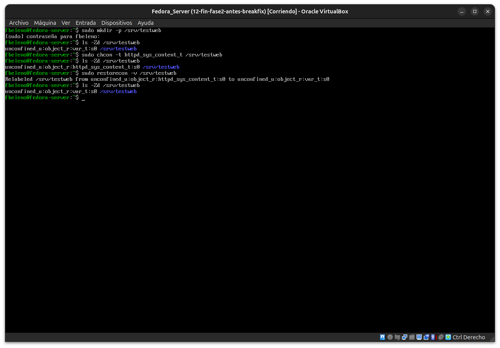
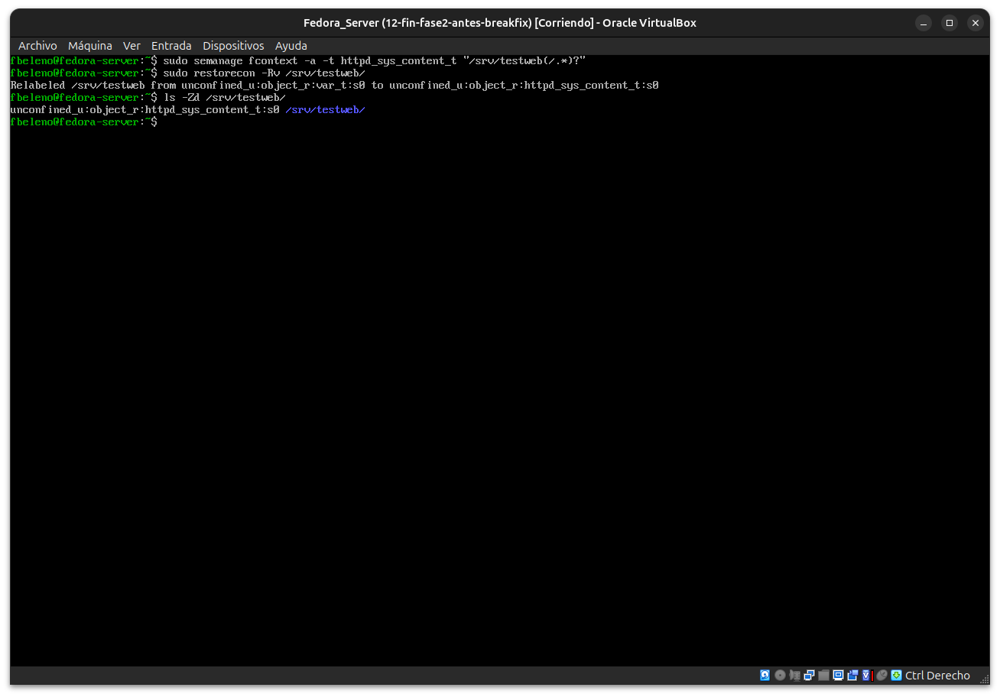
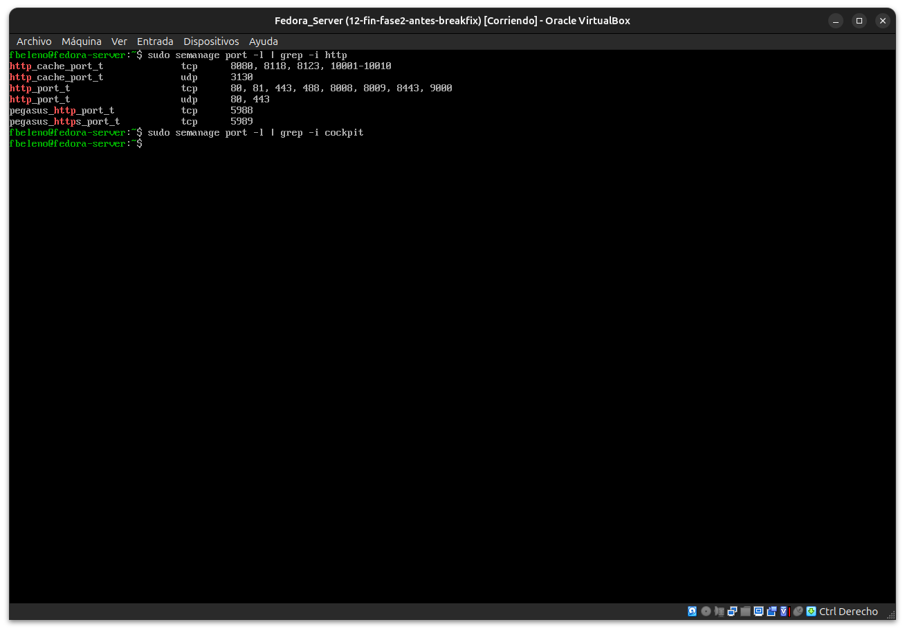
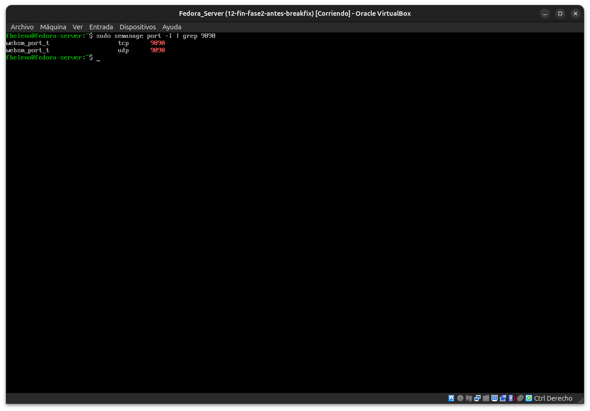

# Módulo 15 — Contextos persistentes: `ls -Z`, `semanage`, `restorecon`

- Estado: Completado
- Fecha: 2026-09-26
- Versión de Fedora: Fedora Linux 44 (Server Edition)
- Objetivo diferencial frente a Arch: entender por qué un cambio de
  contexto con `chcon` se pierde solo, y cómo persistirlo de verdad con
  `semanage fcontext`.

## Concepto diferencial

`chcon` cambia el contexto de un archivo **en el momento**, pero no
toca la política — es un atributo extendido temporal. Si después corre
`restorecon` (manual o durante un relabel completo del sistema), el
archivo vuelve al contexto que la política dice que "debería" tener
según su ruta, perdiendo el cambio de `chcon`.

`semanage fcontext` en cambio **escribe una regla en la base de datos
de política** (asociando un patrón de ruta a un tipo). `restorecon`
respeta esa regla y la vuelve a aplicar siempre — es la forma correcta
y persistente de cambiar contextos.

También existen contextos de **puertos** (`semanage port`), relevantes
para publicar servicios en puertos no estándar (módulo 17).

## Práctica guiada

```bash
sudo mkdir -p /srv/testweb
ls -Zd /srv/testweb
sudo chcon -t httpd_sys_content_t /srv/testweb
ls -Zd /srv/testweb
sudo restorecon -v /srv/testweb
ls -Zd /srv/testweb
```

Luego, la forma persistente:

```bash
sudo semanage fcontext -a -t httpd_sys_content_t "/srv/testweb(/.*)?"
sudo restorecon -Rv /srv/testweb
ls -Zd /srv/testweb
```

Y contextos de puertos:

```bash
sudo semanage port -l | grep -i http
sudo semanage port -l | grep -i cockpit
```

## Hallazgos reales

1. **Contexto por defecto de `/srv/testweb`**: `var_t` (no `default_t`
   genérico) — confirma que `/srv` tiene su propia regla de política.
2. **`chcon` se revierte con `restorecon`**: el log fue explícito —
   `Relabeled /srv/testweb from ...httpd_sys_content_t:s0 to
   ...var_t:s0` — confirma que `chcon` nunca tocó la política, solo el
   atributo extendido del momento.
3. **`semanage fcontext` sí persiste**: el mismo `restorecon` esta vez
   aplicó el cambio en la dirección contraria — `from var_t:s0 to
   httpd_sys_content_t:s0` — porque ahora la regla vive en la base de
   datos de política real.
4. **No existe un tipo de puerto "cockpit"**: `semanage port -l | grep
   -i cockpit` no devolvió nada. Buscando directamente por el puerto
   9090 apareció **`websm_port_t`** — un tipo heredado de "Web-based
   System Manager" (herramienta antigua de administración remota de
   IBM AIX). Cockpit reutiliza ese tipo genérico preexistente en la
   política en vez de tener un tipo de puerto dedicado propio.

## Evidencias

**01 — `chcon` revertido por `restorecon`**
Log explícito: `Relabeled ... from httpd_sys_content_t:s0 to var_t:s0`.



**02 — `semanage fcontext` persistente**
`restorecon` aplica el cambio en sentido contrario: `from var_t:s0 to httpd_sys_content_t:s0`.



**03 — `semanage port -l`: tipos http reales, sin "cockpit"**



**04 — `websm_port_t` cubre el puerto 9090**



## Pendientes
