# Módulo 16 — Diagnóstico de denegaciones AVC: `ausearch`, `sealert`

- Estado: Completado
- Fecha: 2026-09-26
- Versión de Fedora: Fedora Linux 44 (Server Edition)
- Objetivo diferencial frente a Arch: diagnosticar una denegación real
  de SELinux con las herramientas de auditoría, en vez de solo mirar
  permisos DAC como sería suficiente en Arch.

## Concepto diferencial

Cada vez que un dominio intenta acceder a un tipo sin permiso, el
kernel genera un evento **AVC** (Access Vector Cache) que queda
registrado en el log de auditoría. `ausearch` permite filtrar esos
eventos; `sealert` (si `setroubleshoot` está disponible) traduce el
mensaje técnico a una explicación humana con sugerencia de solución.

## Práctica guiada

Provocar una denegación real y controlada: copiar una clave de host
SSH, forzarle un contexto de otro servicio (`httpd_sys_content_t`),
agregarla como `HostKey` extra en `sshd_config`, y reiniciar `sshd`.

```bash
sudo cp /etc/ssh/ssh_host_ed25519_key /etc/ssh/ssh_host_ed25519_key.extra
sudo chcon -t httpd_sys_content_t /etc/ssh/ssh_host_ed25519_key.extra
ls -Z /etc/ssh/ssh_host_ed25519_key.extra
echo "HostKey /etc/ssh/ssh_host_ed25519_key.extra" | sudo tee -a /etc/ssh/sshd_config
sudo systemctl restart sshd
sudo systemctl status sshd
```

Luego, diagnóstico con `ausearch` y `sealert`, y reparación (quitar la
línea `HostKey` agregada, borrar el archivo, reiniciar `sshd`).

## Hallazgos reales

1. **Typo real al escribir la ruta** en el primer `ls -Z`: se escribió
   `/etc/ssh/shh_ed25519_key.extra` (se comió "ssh_host_") en vez de la
   ruta completa — corregido reescribiéndola entera.
2. **`sshd` no ignora un `HostKey` ilegible, falla por completo**:
   `Failed to start sshd.service`, en loop de auto-restart — más
   estricto de lo que anticipaba (esperaba solo un warning y que
   siguiera con las otras claves).
3. **AVC confirmado con `ausearch -m avc -ts recent`**: `denied {
   read }`, `scontext=...sshd_t`, `tcontext=...httpd_sys_content_t`,
   `tclass=file`, `permissive=0` — repetido en cada intento de
   auto-restart.
4. **`sealert -a` no mostró la alerta nueva la primera vez** — mostró 2
   alertas viejas sin relación (`loadkeys`/`dac_override`, del arranque
   del sistema). Causa raíz: **`setroubleshootd.service` estaba
   `inactive (dead)`** — el daemon que alimenta la base de datos de
   `sealert` no estaba corriendo. Confirmado el evento real en el log
   crudo con `sudo grep` (sin `sudo` da "Permiso denegado", el log de
   auditoría es solo para root).
5. **Tras iniciar `setroubleshootd` y regenerar el evento**, `sealert`
   sí tradujo la alerta completa: *"SELinux está negando a sshd de read
   el acceso a archivo ssh_host_ed25519_key.extra"*, con **45 alertas
   acumuladas** desde el primer intento — el daemon procesó todo el
   historial retroactivamente una vez activo, no solo el evento nuevo.
6. **El `sed` para quitar la línea `HostKey` falló en el primer
   intento** (mismo patrón visto en módulos anteriores con pegado de
   comandos) — verificado con `grep -n`, corregido con un patrón más
   simple (`ssh_host_ed25519_key\.extra`), confirmado vacío después.
7. **Validación final completa**: `sshd` reinició limpio (`Server
   listening on 0.0.0.0 port 22` / `:: port 22`), y el login SSH real
   desde el host volvió a funcionar sin problemas.

## Evidencias

**01-02 — Cambio deliberado: clave copiada, contexto forzado a `httpd_sys_content_t`**

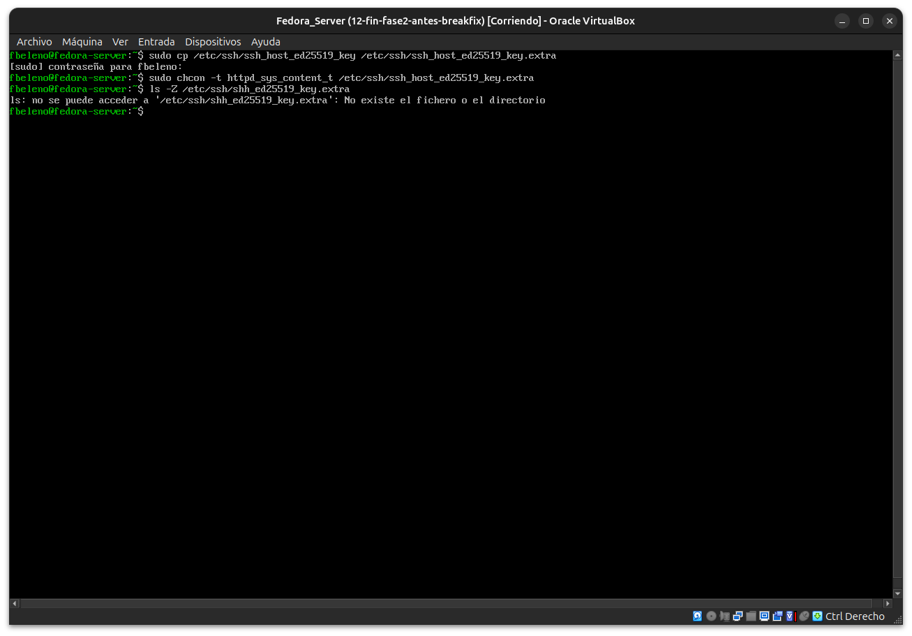
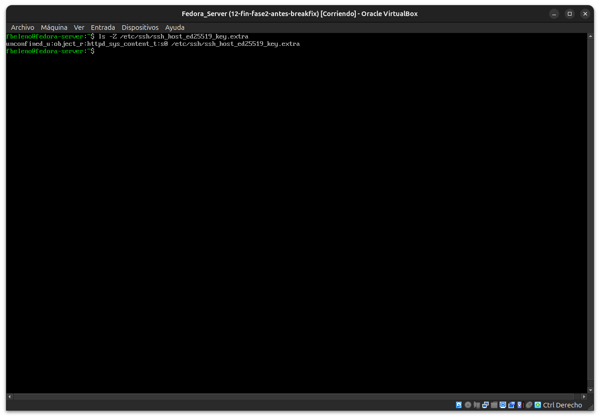

**03 — `HostKey` agregado, `sshd` falla por completo al iniciar**

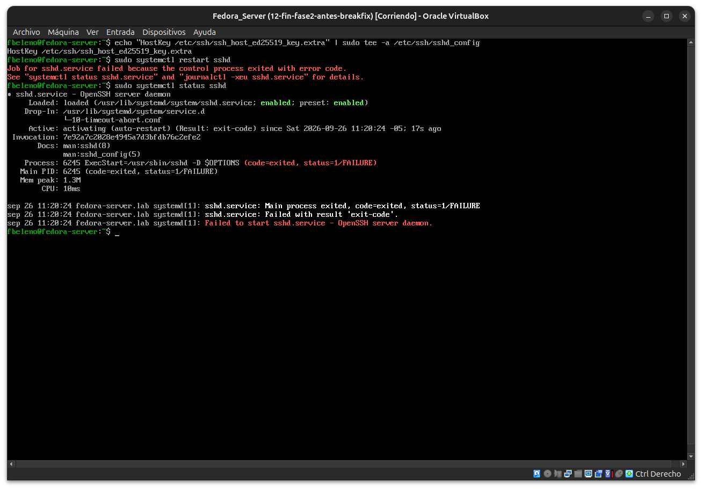

**04 — `ausearch -m avc`: denegación confirmada**

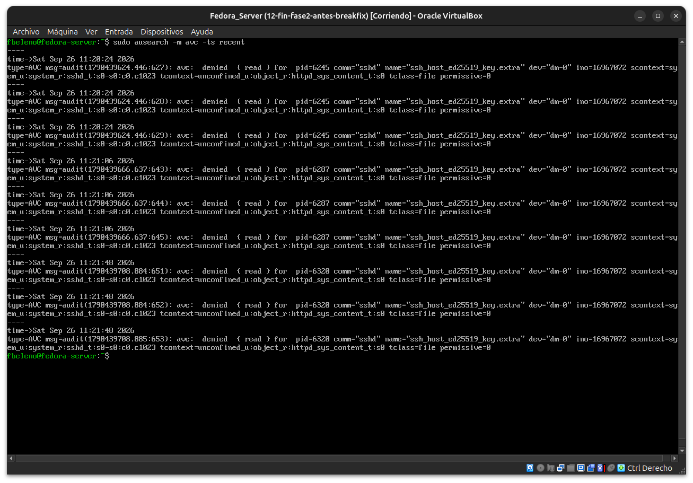

**05-06 — `sealert` muestra alertas viejas sin relación; causa raíz: `setroubleshootd` inactivo**

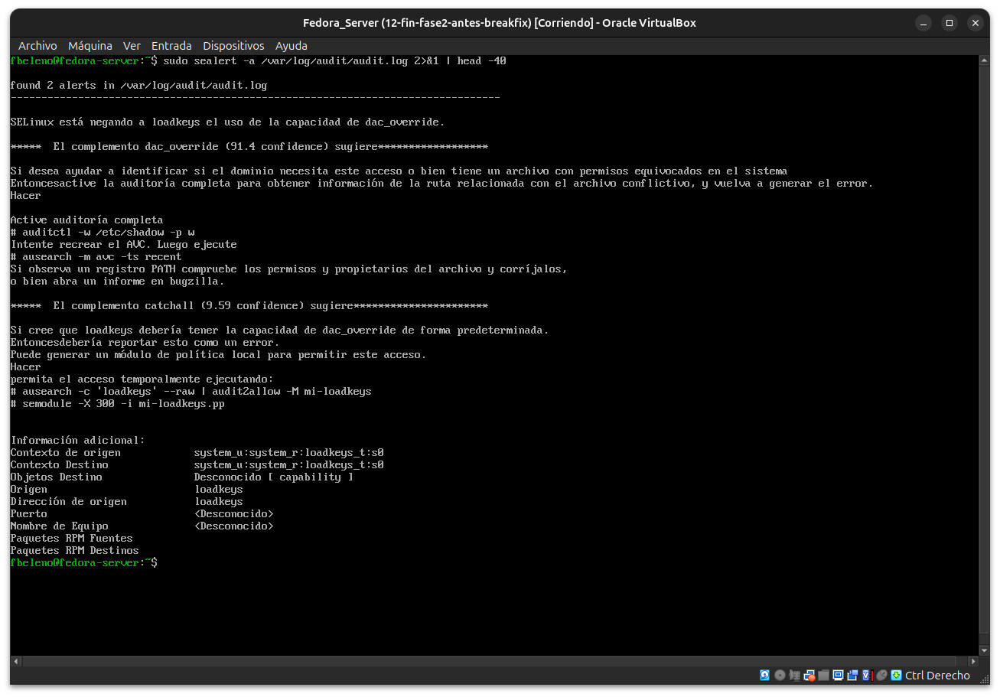
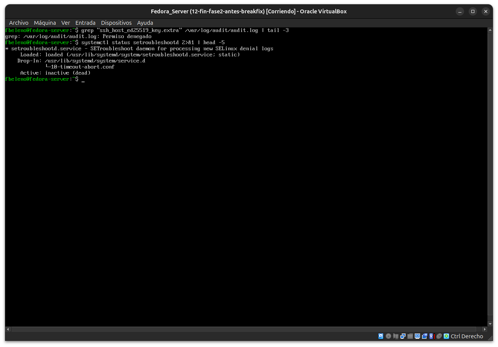

**07-08 — Daemon iniciado, evento regenerado, `sealert` traduce correctamente (45 alertas)**

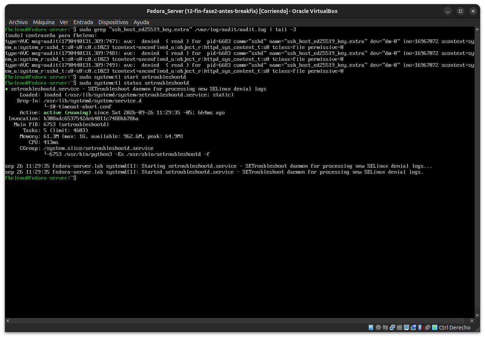
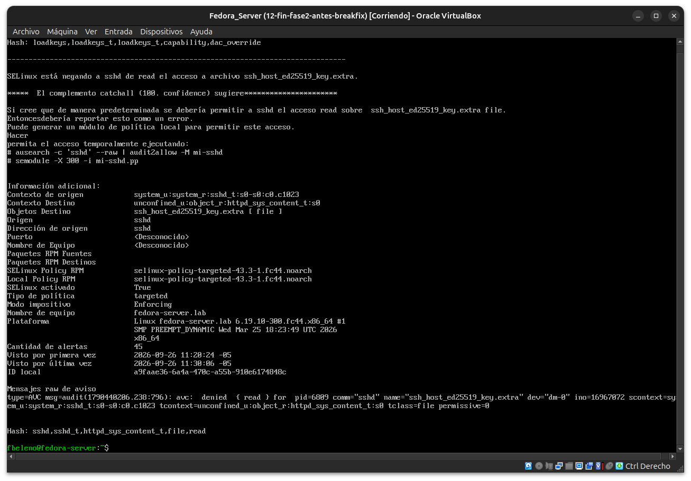

**09-10 — Primer intento de reparar falla (sed no coincide); reparación exitosa**

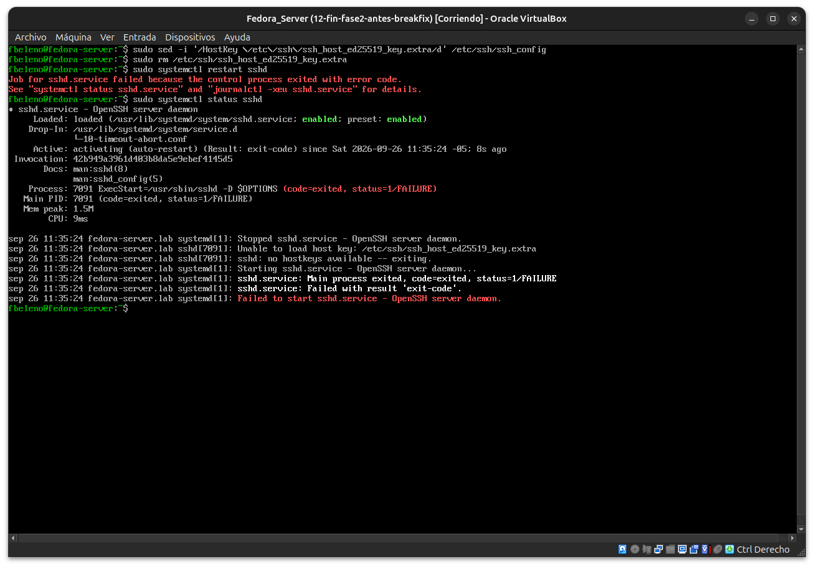
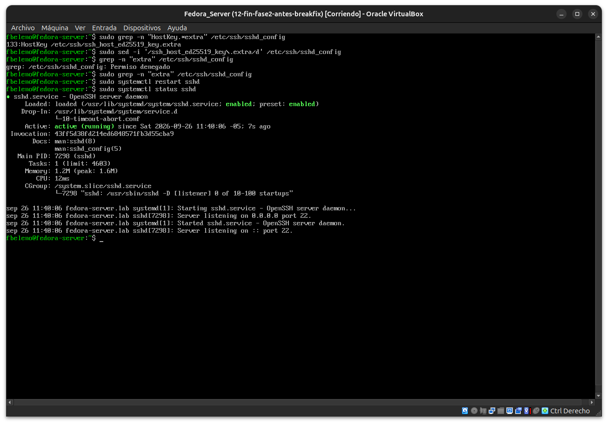

**11 — Validación final: SSH funcionando desde el host**

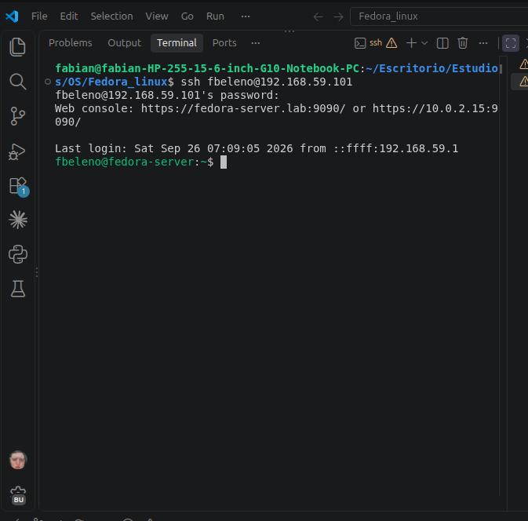

## Pendientes
