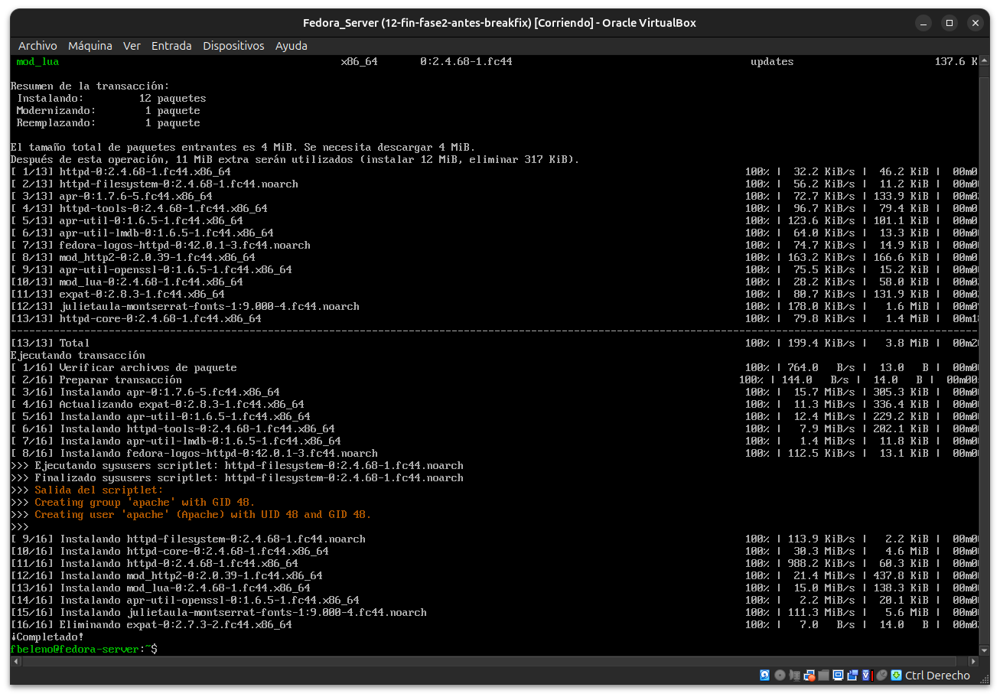
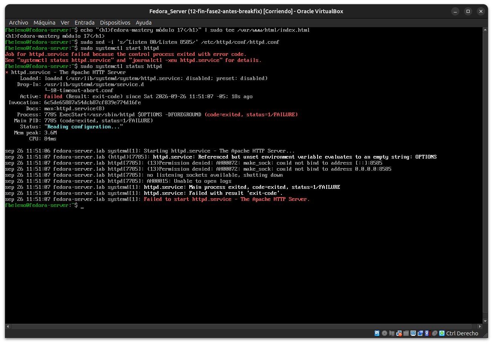
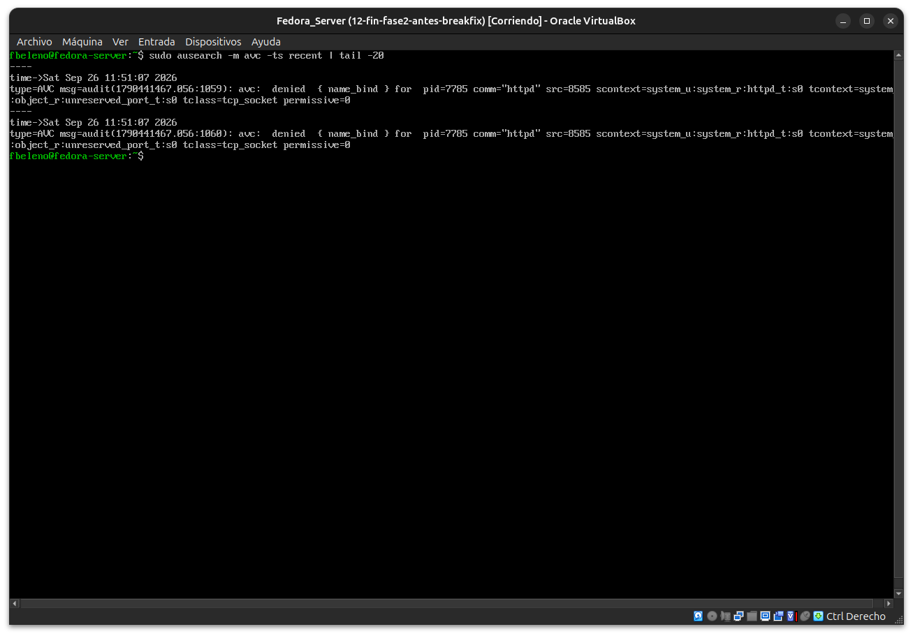
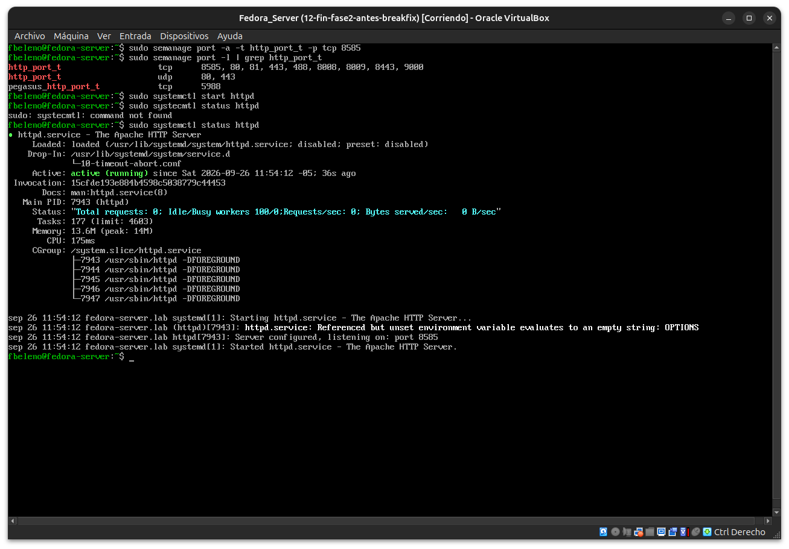
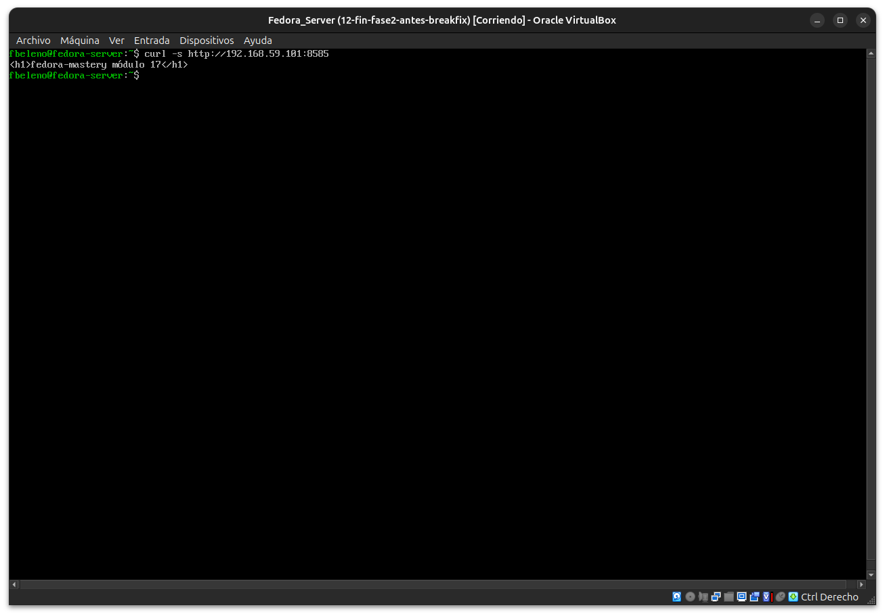
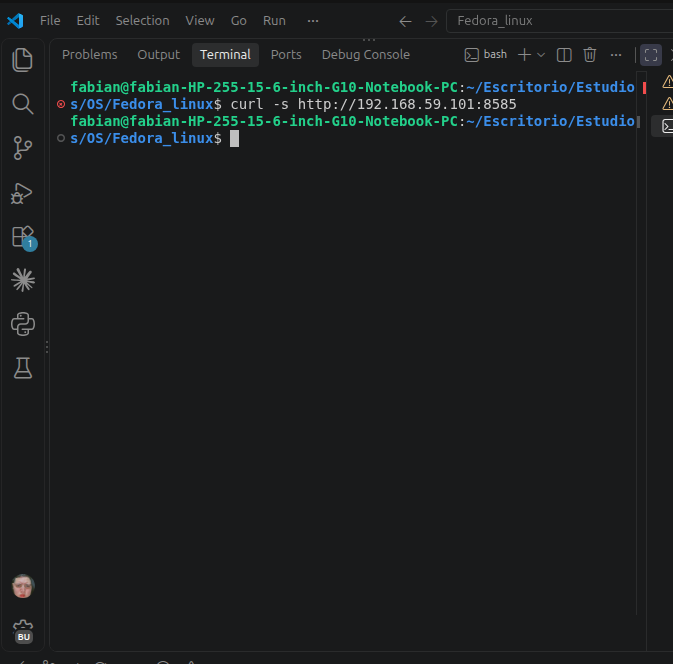
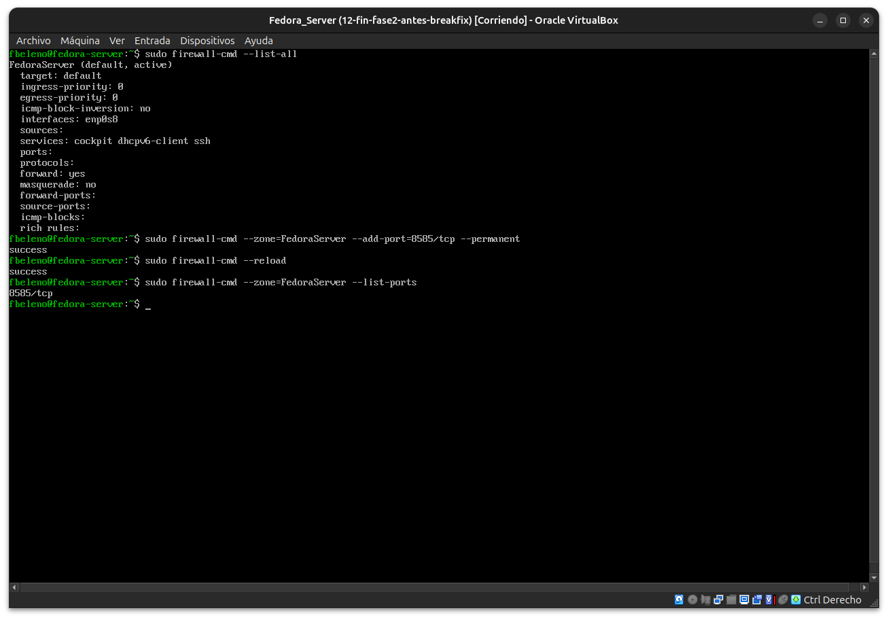
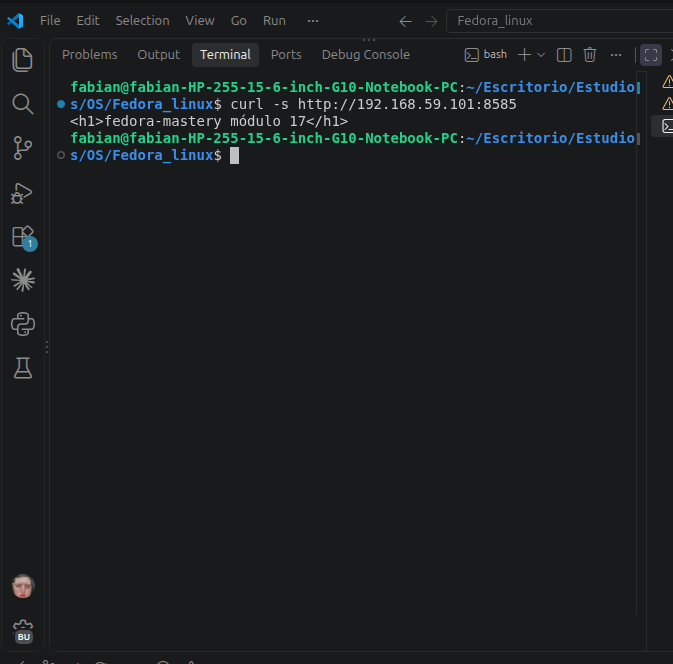

# Módulo 17 — Booleanos y puertos: servicio web en puerto no estándar

- Estado: Completado
- Fecha: 2026-09-26
- Versión de Fedora: Fedora Linux 44 (Server Edition)
- Objetivo diferencial frente a Arch: publicar un servicio en un puerto
  no estándar sin desactivar `enforcing`, resolviendo la denegación con
  `semanage port` (la vía mínima y correcta) en vez de `audit2allow`
  (que abriría permisos genéricos de más). Cierra el **Proyecto 2** de
  la Fase 3.

## Concepto diferencial

Un puerto no estándar necesita permiso en **dos capas independientes**:
`firewalld` (si el puerto está permitido a nivel de red, módulo 06) y
`SELinux` (si el tipo de puerto está etiquetado para el dominio del
servicio, módulo 15). Abrir una sin la otra no alcanza — hay que
diagnosticar cuál de las dos está bloqueando en cada caso.

## Práctica guiada

```bash
sudo dnf install -y httpd
echo "<h1>fedora-mastery módulo 17</h1>" | sudo tee /var/www/html/index.html
sudo sed -i 's/^Listen 80/Listen 8585/' /etc/httpd/conf/httpd.conf
sudo systemctl start httpd
sudo systemctl status httpd
```

Luego diagnóstico (SELinux con `ausearch`/`sealert`, firewalld con
`firewall-cmd`), reparación con `semanage port -a -t http_port_t -p tcp
8585` y `firewall-cmd --add-port`, y validación con `curl` real.

## Hallazgos reales

1. **`httpd` falla con `(13)Permission denied: AH00072: make_sock:
   could not bind to address [::]:8585`** — error EACCES al hacer
   bind, firma típica de un bloqueo de SELinux (no de puerto en uso ni
   permisos Unix, corre como root vía systemd).
2. **`ausearch` confirma exacto**: `denied { name_bind }`,
   `scontext=...httpd_t`, `tcontext=...unreserved_port_t` — el 8585 caía
   en el tipo genérico de "cualquier puerto >1024 sin etiqueta
   específica", y `httpd_t` no tiene permiso de bind ahí.
3. **`semanage port -a -t http_port_t -p tcp 8585` resuelve la capa
   SELinux** — `httpd` arranca (`Server configured, listening on: port
   8585`) y `curl http://localhost:8585` funciona.
4. **Segunda capa independiente confirmada**: `curl` desde *dentro* de
   la VM a su propia IP host-only funcionó, pero desde el **host real**
   no devolvió nada — `firewalld` bloqueaba 8585 en la zona
   `FedoraServer` (que solo tenía `cockpit`/`dhcpv6-client`/`ssh`
   permitidos, sin puertos extra). Confirma que SELinux y firewalld son
   controles genuinamente independientes: resolver uno no resuelve el
   otro.
5. **`firewall-cmd --zone=FedoraServer --add-port=8585/tcp
   --permanent` + `--reload` persistió correctamente** (a diferencia
   del `--change-interface` del módulo 06/07, que necesitaba
   `nmcli` para persistir) — abrir un puerto explícito en una zona sí
   es respetado directamente por `firewall-cmd`.
6. **Validación final real**: `curl -s http://192.168.59.101:8585`
   desde el host de Ubuntu devolvió `<h1>fedora-mastery módulo
   17</h1>` — servicio publicado de punta a punta, con `enforcing`
   activo todo el tiempo. Cierra el **Proyecto 2** de la Fase 3.

## Evidencias

**01 — `httpd` instalado (13 paquetes)**



**02 — `httpd` falla: `Permission denied` al hacer bind en 8585**



**03 — `ausearch`: AVC `name_bind` contra `unreserved_port_t`**



**04 — `semanage port` agregado, `httpd` activo**



**05-06 — `curl` local y desde la VM a su propia IP host-only: exitoso**




**07 — `curl` desde el host real: sin respuesta (firewalld bloqueando)**



**08 — `firewall-cmd`: puerto 8585 agregado a la zona `FedoraServer`**



**09 — Validación final: `curl` desde el host real funciona**



## Pendientes
