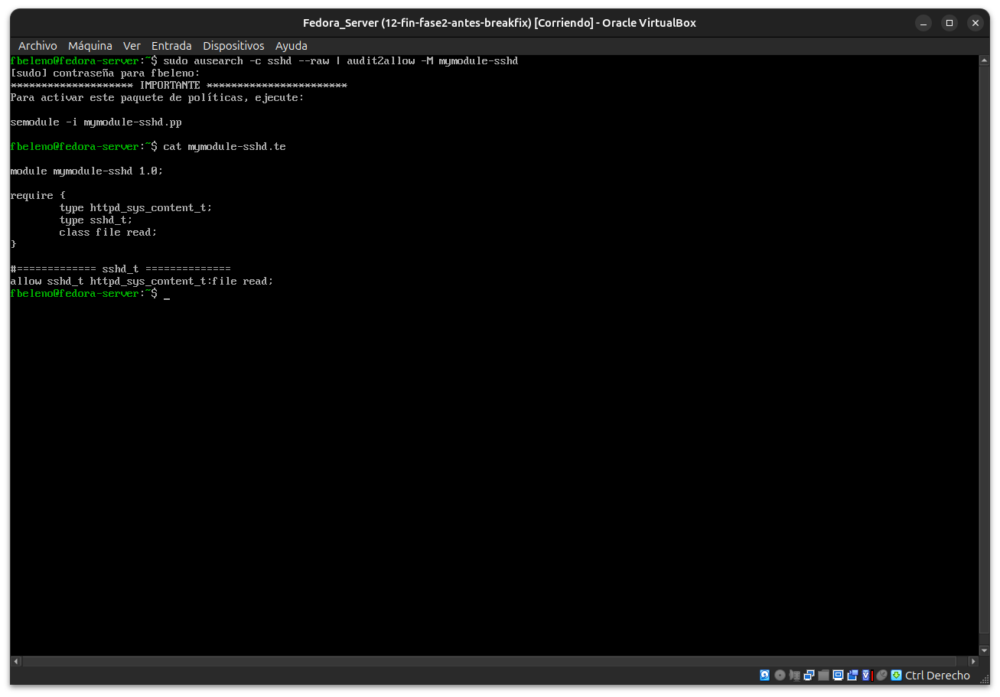
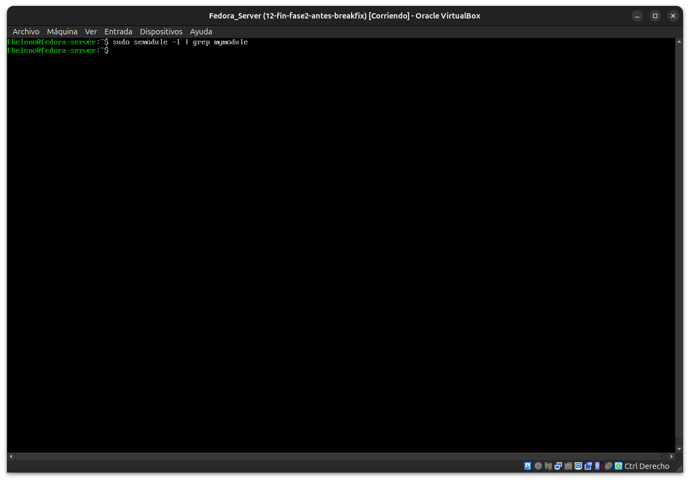
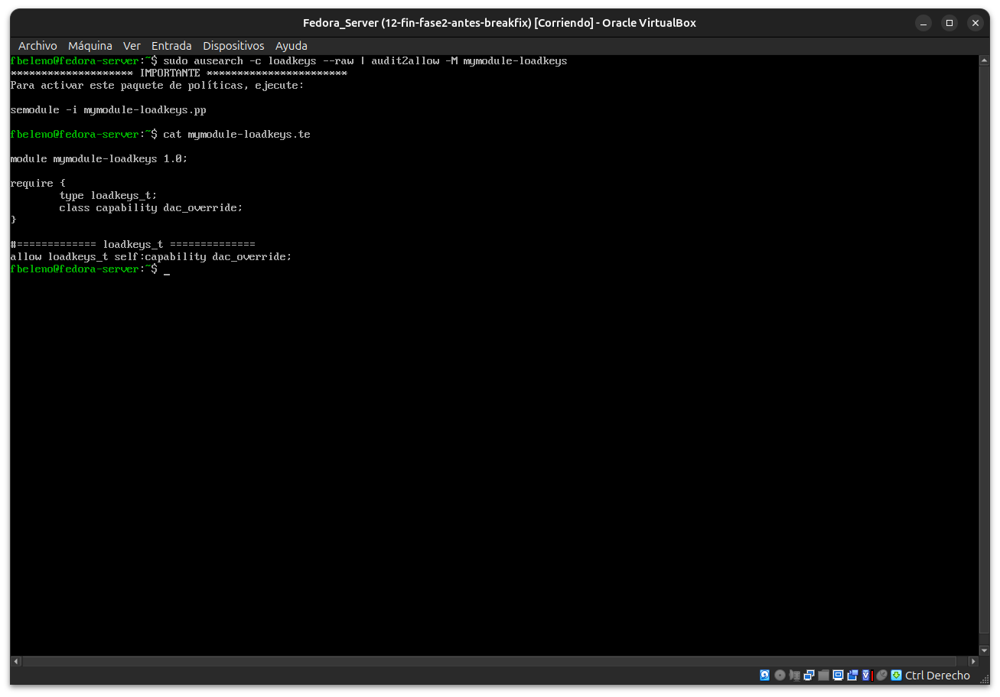

# Módulo 18 — Políticas locales y `audit2allow`

- Estado: Completado
- Fecha: 2026-09-26
- Versión de Fedora: Fedora Linux 44 (Server Edition)
- Objetivo diferencial frente a Arch: interpretar críticamente lo que
  `audit2allow` propone, en vez de aceptarlo como solución automática.

## Concepto diferencial

`audit2allow` genera un módulo de política que permite exactamente lo
que fue denegado — no juzga si eso es una buena decisión de seguridad.
La regla de oro (ya citada por `sealert` en el módulo 16): primero
revisar si el problema se resuelve con `semanage fcontext`, booleanos, o
`semanage port` — todos mecanismos ya cubiertos por la política
oficial. `audit2allow` es el último recurso, para casos genuinamente sin
cobertura, y cada regla que genera debe justificarse antes de instalarla
con `semodule -i`.

## Práctica guiada

Generar (sin instalar) el módulo para la denegación real del módulo 16:

```bash
sudo ausearch -c sshd --raw | audit2allow -M mymodule-sshd
cat mymodule-sshd.te
```

Analizar críticamente la regla generada, y decidir si instalarla o
rechazarla con justificación. Repetir el análisis con la denegación de
`loadkeys`/`dac_override` vista desde el módulo 16.

## Caso 1 — `sshd` leyendo `httpd_sys_content_t` (módulo 16)

`audit2allow` generó: `allow sshd_t httpd_sys_content_t:file read;`

**Análisis crítico:**
- La regla es **permanente y global**: permitiría a `sshd_t` leer
  *cualquier* archivo con ese tipo, en todo el sistema, para siempre —
  no solo el archivo puntual que rompimos.
- No resuelve ninguna necesidad real del servicio: `sshd` en producción
  nunca necesita leer contenido de un servidor web.
- La causa raíz (un `chcon` manual mal aplicado) ya se corrigió
  correctamente en el módulo 16 (se borró el archivo mal etiquetado) —
  instalar este módulo resolvería un problema que ya no existe, dejando
  solo el riesgo sin ningún beneficio.

**Decisión: rechazado, no instalado.** Confirmado con
`sudo semodule -l | grep mymodule` → sin resultado.

## Caso 2 — `loadkeys` y la capability `dac_override` (preexistente desde el módulo 16)

`audit2allow` generó: `allow loadkeys_t self:capability dac_override;`

**Análisis crítico:**
- `dac_override` es una de las capabilities más peligrosas de Linux:
  permite a un proceso **ignorar por completo** las verificaciones de
  permisos Unix — mucho más amplio que el caso 1, que al menos estaba
  limitado a un tipo de archivo.
- Es un evento del **arranque del sistema** (`loadkeys` configura el
  mapa de teclado de la consola virtual durante el boot), no algo
  provocado por el usuario.
- El sistema funciona normalmente desde el primer arranque sin este
  permiso — sin ningún síntoma funcional visible asociado.
- El propio `sealert` (módulo 16) ya sugería con baja confianza que,
  de ser necesario, correspondería **reportarlo como bug upstream**, no
  resolverlo con un módulo local.

**Decisión: rechazado, no instalado.** Caso de SELinux funcionando
correctamente (bloqueando algo sin impacto funcional real).

## Evidencias

**01 — `audit2allow` genera la regla para `sshd`**



**02 — `semodule -l` confirma que no se instaló**



**03 — `audit2allow` genera la regla `dac_override` para `loadkeys`**



## Pendientes
