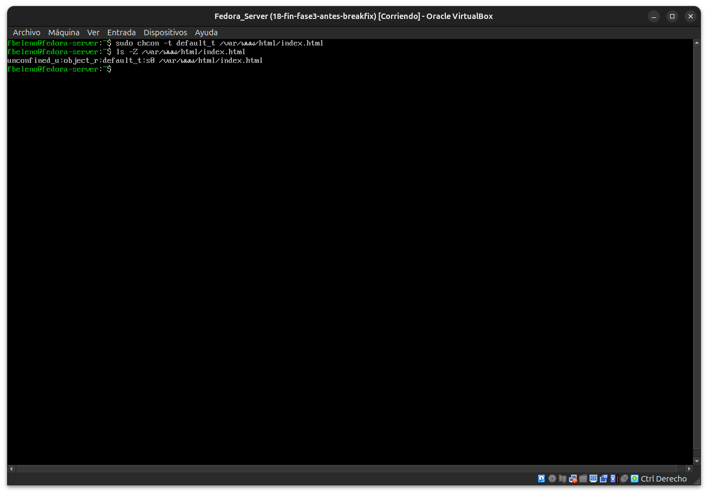
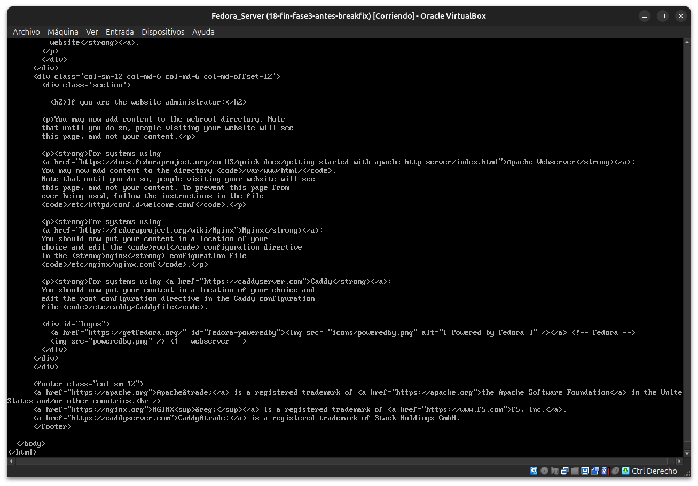
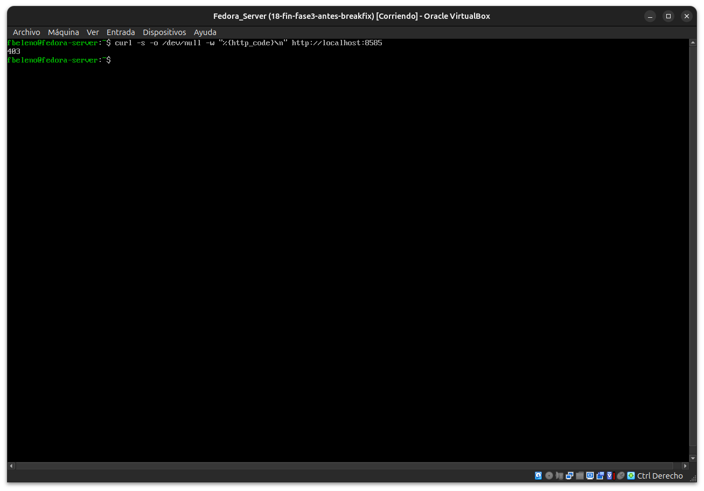
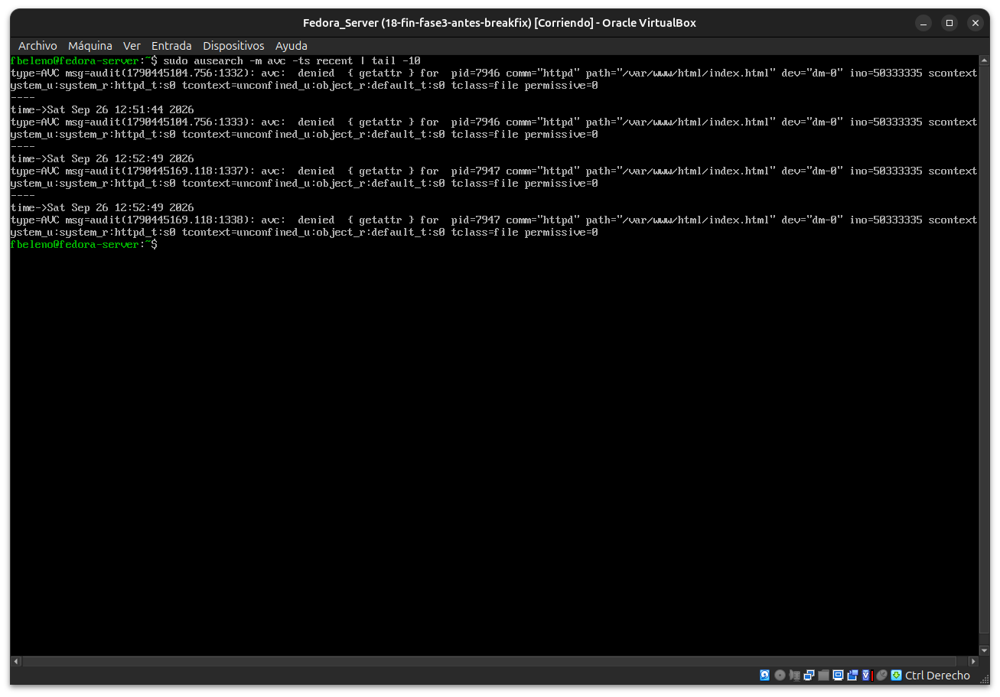
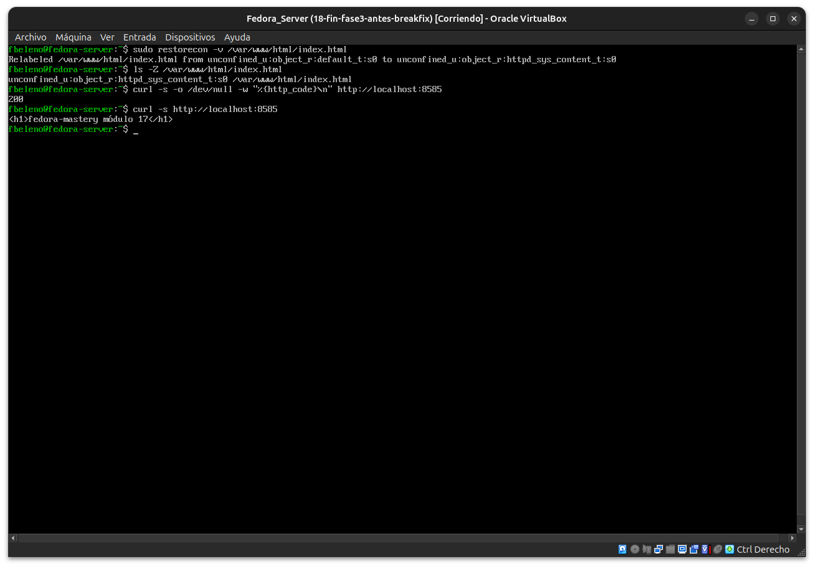

# Módulo 19 — Break & Fix SELinux (cierre de Fase 3)

- Estado: Completado
- Fecha: 2026-09-26
- Versión de Fedora: Fedora Linux 44 (Server Edition)
- Objetivo diferencial frente a Arch: tercer Break & Fix formal —
  recuperar un servicio con contexto SELinux incorrecto **sin
  desactivar `enforcing`** en ningún momento.

## Entorno y punto de restauración

Snapshot `18-fin-fase3-antes-breakfix` tomado antes de este módulo (fin
de Fase 3: SELinux enforcing, contextos, AVC/sealert, servicio web en
puerto 8585 con SELinux+firewalld, audit2allow analizado con criterio).

## Cambio deliberado

Mal-etiquetar el contenido real de `httpd` (módulo 17):

```bash
sudo chcon -t default_t /var/www/html/index.html
ls -Z /var/www/html/index.html
```

## Síntoma

`curl http://localhost:8585` ya no devuelve el contenido propio — sirve
la **página de bienvenida por defecto de Fedora/Apache** (código real
`HTTP 403`, confirmado con `curl -w "%{http_code}"`). Apache trata el
archivo bloqueado como si no existiera, no muestra un error de lectura
explícito.

## Diagnóstico y recuperación

- **Observación**: `ausearch -m avc -ts recent` → `denied { getattr }`
  para `httpd`, `path="/var/www/html/index.html"`,
  `scontext=...httpd_t`, `tcontext=...default_t`, `tclass=file`. Nota:
  es `getattr` (falla el `stat()`), no `read` — por eso Apache ni
  siquiera "ve" que el archivo existe, en vez de fallar al leer su
  contenido.
- **Hipótesis**: el archivo quedó con un tipo (`default_t`) que
  `httpd_t` no tiene permiso de tocar.
- **Causa raíz confirmada**: `ls -Z` antes de reparar mostraba
  `default_t` en vez de `httpd_sys_content_t`.
- **Solución aplicada**: a diferencia del `/srv/testweb` del módulo 15
  (que necesitó una regla nueva con `semanage fcontext -a`),
  `/var/www/html` **ya tiene una regla de contexto por defecto** (viene
  con la política base de `httpd`) — alcanzó con:
  ```bash
  sudo restorecon -v /var/www/html/index.html
  ```
  Log: `Relabeled /var/www/html/index.html from default_t:s0 to
  httpd_sys_content_t:s0`.
- **Validación**: `curl -w "%{http_code}"` → `200`; `curl` normal →
  `<h1>fedora-mastery módulo 17</h1>` de vuelta.

## Impacto y riesgos

- Impacto real: ninguno más allá de servir una página incorrecta
  temporalmente — el servicio `httpd` nunca dejó de correr (a
  diferencia de los Break & Fix de los módulos 07/13/16, donde el
  servicio completo fallaba). Este incidente es "más silencioso": todo
  parece sano (`systemctl status httpd` mostraría activo) salvo por el
  contenido servido.
- Riesgo real de este tipo de incidente: es más difícil de detectar
  que un servicio caído, porque no dispara ninguna alerta de
  "servicio down" — solo se nota revisando el contenido real servido.

## Cómo evitar recurrencia

- Nunca usar `chcon` manualmente sobre contenido de producción sin
  correr `restorecon` (o verificar con `ls -Z`) inmediatamente después,
  para confirmar que el tipo asignado es el correcto.
- Si un archivo se copia o restaura desde afuera del sistema de
  paquetes (backup, `rsync`, `scp`), correr `restorecon -Rv` sobre el
  destino como parte del procedimiento estándar de restauración —
  antes de asumir que "se copió bien" solo por permisos Unix correctos.
- Ante un servicio web que sirve contenido inesperado sin haber tocado
  su configuración, revisar `ausearch -m avc` **antes** de sospechar de
  la configuración de la aplicación — un `403`/página por defecto con
  el servicio corriendo sano es una señal típica de bloqueo SELinux,
  no de un bug de la app.

## Evidencias

**01 — Cambio deliberado: `chcon -t default_t`**



**02 — Síntoma: página de bienvenida en vez del contenido propio**



**03 — HTTP 403 confirmado**



**04 — `ausearch`: AVC `getattr` contra `default_t`**



**05 — `restorecon`, HTTP 200, validación final**



## Pendientes
