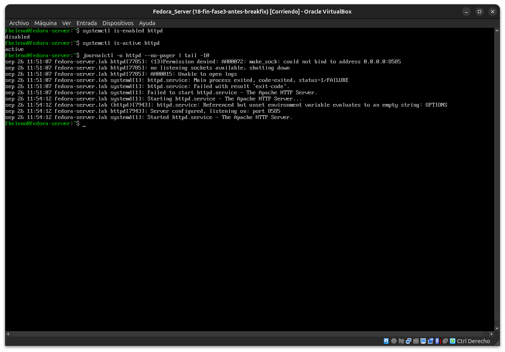
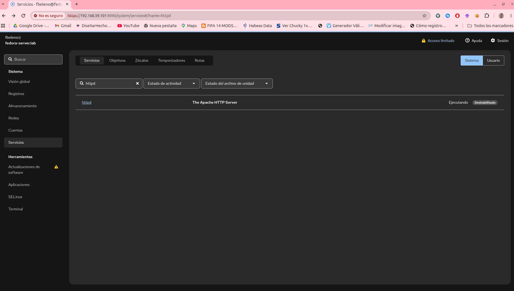
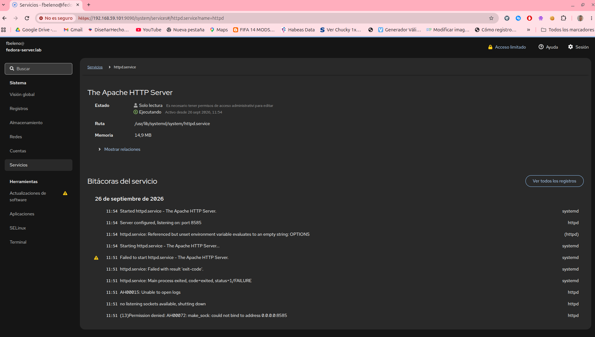
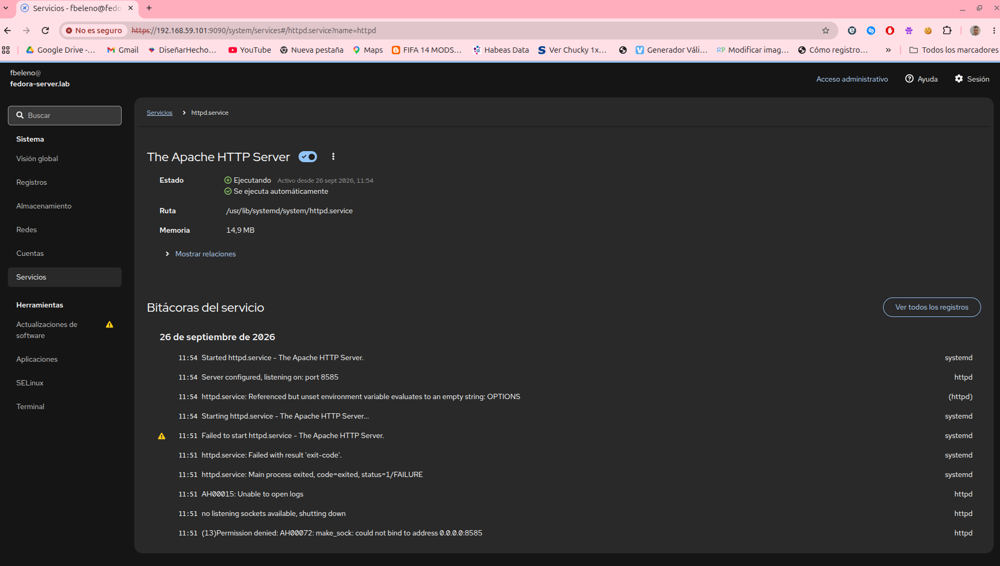
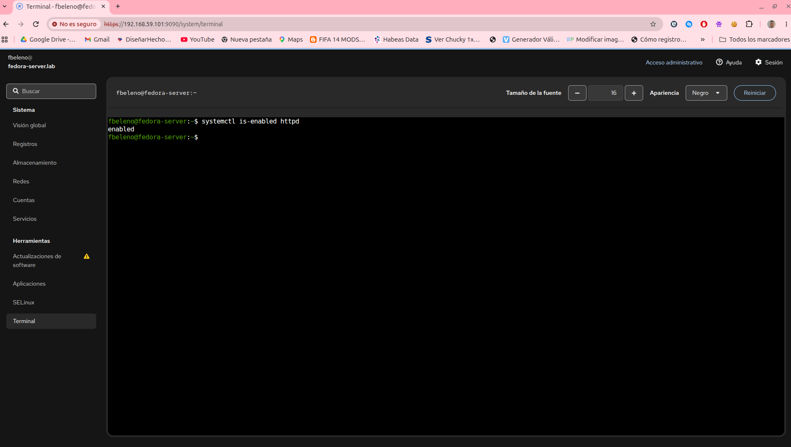

# Módulo 20 — Servidor web desde terminal y Cockpit

- Estado: Completado
- Fecha: 2026-09-26
- Versión de Fedora: Fedora Linux 44 (Server Edition)
- Objetivo diferencial frente a Arch: administrar un servicio real
  (`httpd`, ya corriendo desde el módulo 17) desde Cockpit, comparando
  cada acción contra su equivalente en terminal. Arranca la Fase 4.

## Concepto diferencial

Arch no tiene una capa de administración gráfica nativa — todo pasa
por `systemctl`/`journalctl` en terminal. Cockpit expone los mismos
mecanismos de systemd (unidades, estado, logs) en una interfaz web,
sin agregar una capa de gestión propia: cada botón de Cockpit dispara
el comando equivalente por detrás, verificable siempre desde la CLI.

## Práctica guiada

```bash
systemctl is-enabled httpd
systemctl is-active httpd
journalctl -u httpd --no-pager | tail -10
```

Luego, desde Cockpit → "Servicios": buscar `httpd`, revisar su estado,
habilitarlo para el arranque (`enable`) desde la interfaz, y comparar
los logs mostrados ahí contra `journalctl -u httpd`. Confirmar el
cambio de habilitación con `systemctl is-enabled httpd` por CLI.

## Hallazgos reales

1. **Estado inicial confirmado 1:1**: `disabled`/`active` por CLI
   coincide exactamente con "Deshabilitado"/"Ejecutando" en el listado
   de Servicios de Cockpit.
2. **Las "Bitácoras del servicio" de Cockpit son el mismo log que
   `journalctl -u httpd`** — mismo contenido, mismo orden, incluyendo
   el historial de fallo y arranque del módulo 17. Cockpit no tiene su
   propio almacén de logs para servicios, lee directo de journald.
3. **El detalle del servicio arranca en modo "Solo lectura"** hasta
   habilitar el acceso administrativo — mismo patrón de "Acceso
   limitado" visto desde el módulo 01, aplicado ahora a nivel de cada
   servicio individual.
4. **El toggle de arranque automático en Cockpit disparó exactamente
   `systemctl enable httpd`** — confirmado con `systemctl is-enabled
   httpd` → `enabled`.
5. **Cockpit incluye su propia terminal web completa** (menú
   "Terminal") — se usó para la verificación cruzada sin salir del
   navegador, sin necesitar SSH ni la consola de VirtualBox.

## Evidencias

**01 — Estado inicial por CLI: `disabled`/`active`, historial de `journalctl`**



**02 — Cockpit → Servicios: `httpd` "Ejecutando"/"Deshabilitado", coincide con la CLI**



**03 — Detalle del servicio en modo "Solo lectura", bitácoras idénticas a `journalctl`**



**04 — Con acceso administrativo: toggle "Se ejecuta automáticamente" habilitado**



**05 — Confirmación cruzada desde la Terminal integrada de Cockpit**



## Pendientes
