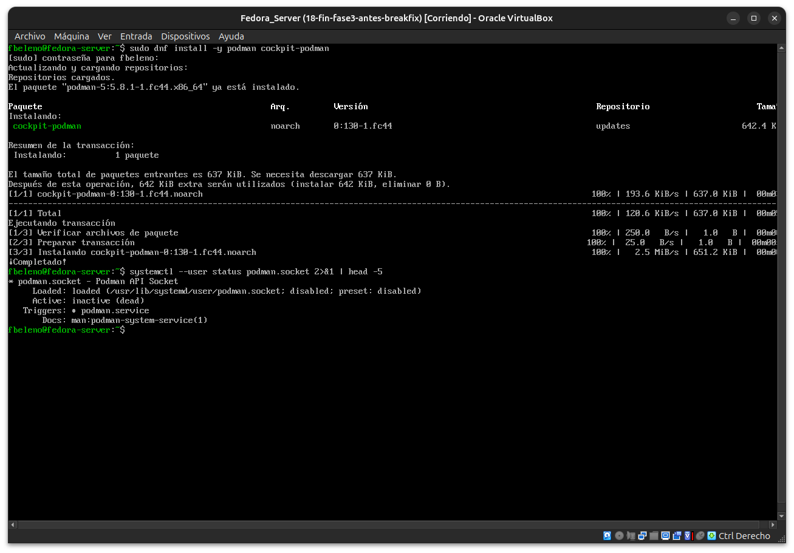
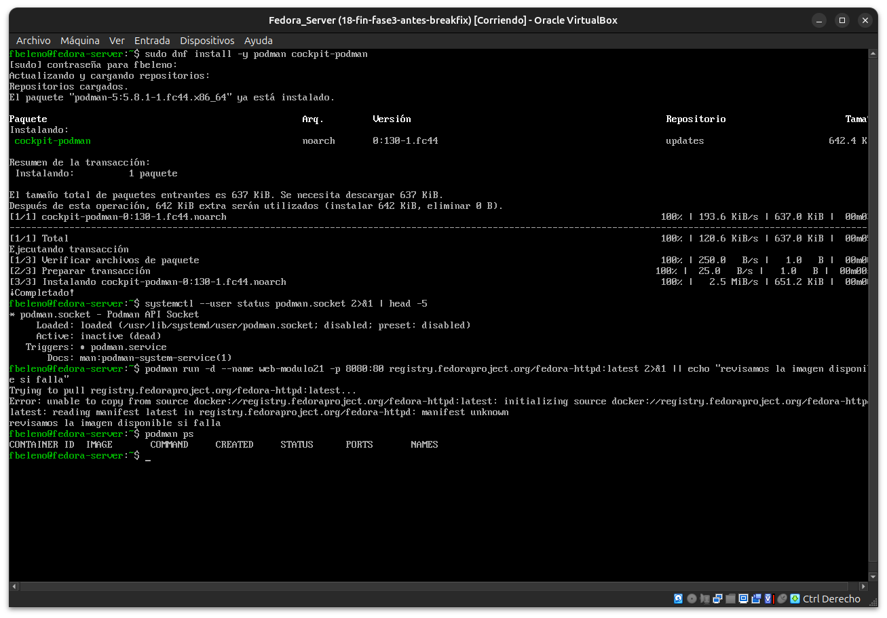
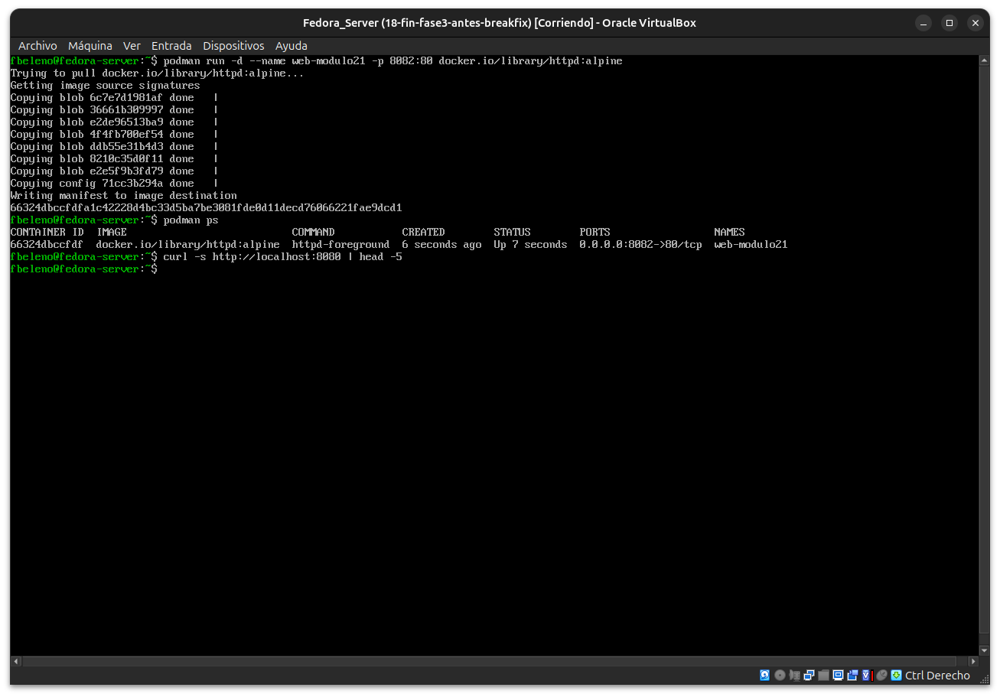
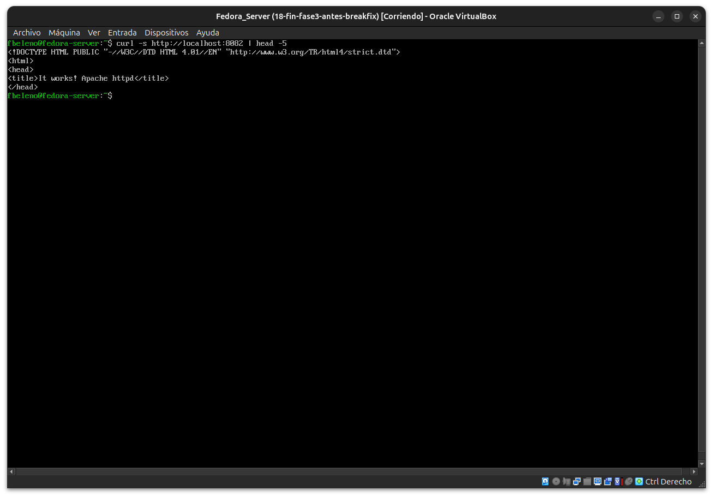
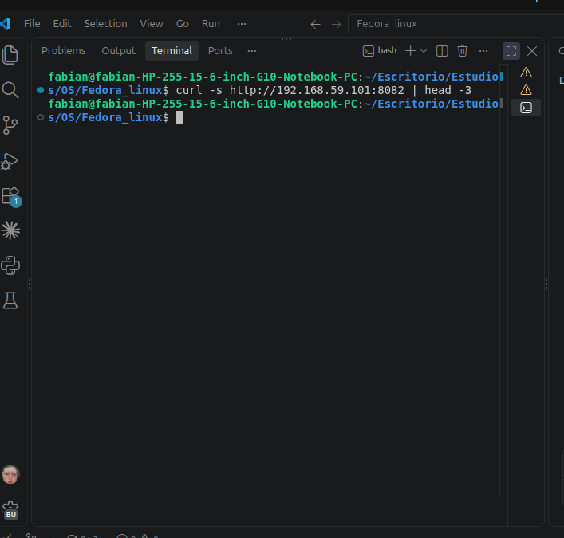
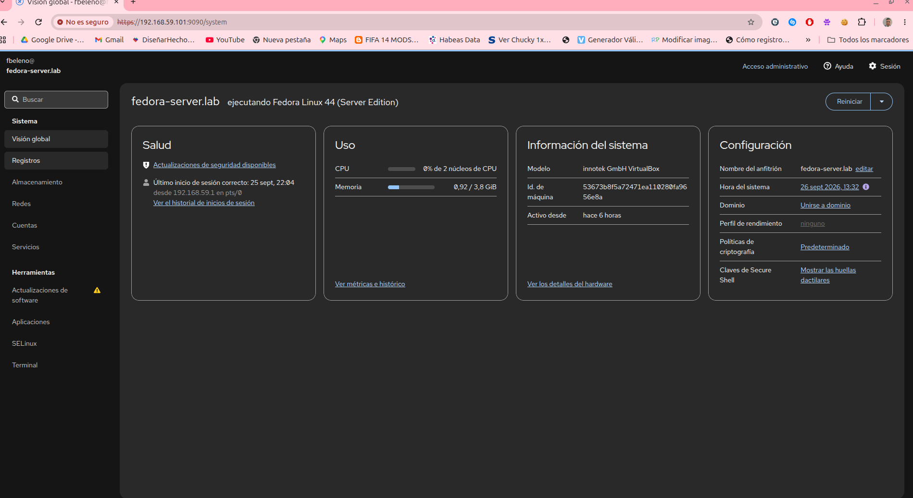
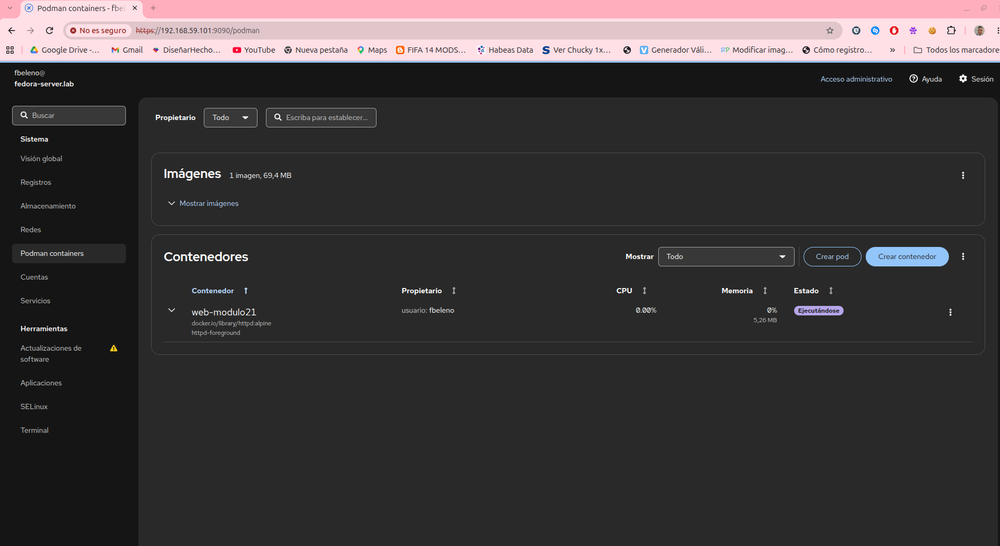

# Módulo 21 — Cockpit y Podman: contenedores, imágenes y volúmenes

- Estado: Completado
- Fecha: 2026-09-26
- Versión de Fedora: Fedora Linux 44 (Server Edition)
- Objetivo diferencial frente a Arch: Podman es el motor de contenedores
  por defecto en Fedora/RHEL — sin demonio central como Docker, rootless
  por defecto. Arch suele usar Docker salvo instalación manual de
  Podman aparte.

## Concepto diferencial

Podman corre contenedores **sin un demonio central** (a diferencia de
`dockerd`) y, por defecto, **rootless** — como tu usuario normal, no
como root. Una consecuencia real de esto: un contenedor rootless **no
puede bindear puertos por debajo de 1024** sin una capability/ajuste de
sysctl extra, algo que sí puede hacer un contenedor Docker corriendo
con el demonio como root.

Cockpit tiene un plugin nativo (`cockpit-podman`) que muestra los
mismos contenedores, imágenes y volúmenes que ve `podman` por CLI —
mismo patrón de correlación 1:1 ya visto con `systemd`/servicios.

## Práctica guiada

```bash
sudo dnf install -y podman cockpit-podman
podman run -d --name web-modulo21 -p 8080:80 docker.io/library/httpd:alpine
podman ps
curl -s http://localhost:8080 | head -5
```

Luego, comparar contra Cockpit → "Podman" (contenedores, imágenes).

## Hallazgos reales

1. **`podman` ya venía instalado** — parte del grupo `container-management`
   detectado en el módulo 02 (`dnf group list --installed`).
2. **`podman.socket` sigue el mismo patrón de activación por socket**
   que `cockpit.socket` (módulo 03): `disabled`/`inactive (dead)` con
   `Triggers: podman.service`.
3. **Typo real corregido dos veces**: el primer comando de imagen usaba
   una ruta inventada (`registry.fedoraproject.org/fedora-httpd`, que
   no existe — `manifest unknown`), corregido a
   `docker.io/library/httpd:alpine`. Luego el puerto se mapeó a `8082`
   en vez de `8080` por error de tipeo — confirmado con `podman ps`
   (`0.0.0.0:8082->80/tcp`) y corregido apuntando el `curl` al puerto
   real.
4. **Acceso local exitoso, acceso externo bloqueado por firewalld**:
   `curl localhost:8082` funciona sin configuración extra; `curl` desde
   el host real no devuelve nada — mismo patrón de dos capas del
   módulo 17 (acá no se abrió el puerto a propósito, no era el
   objetivo de este módulo).
5. **`cockpit-podman` no apareció hasta recargar la página** — Cockpit
   no detecta plugins nuevos instalados durante una sesión ya abierta,
   hace falta refrescar el navegador.
6. **Correlación 1:1 confirmada**: Cockpit muestra `web-modulo21`,
   `Propietario: usuario: fbeleno` (confirma rootless), imagen y
   comando idénticos a `podman ps`.

## Evidencias

**01 — `podman` ya preinstalado; `cockpit-podman` instalado; `podman.socket` inactivo**



**02 — Primer intento: imagen inexistente (`manifest unknown`)**



**03 — Imagen correcta descargada, `podman ps` confirma puerto 8082 (typo)**



**04 — `curl localhost:8082` exitoso**



**05 — `curl` desde el host real: sin respuesta (firewalld)**



**06 — Cockpit sin "Podman containers" en el menú, antes de recargar**



**07 — Correlación final: Cockpit muestra el contenedor idéntico a `podman ps`**



## Pendientes
