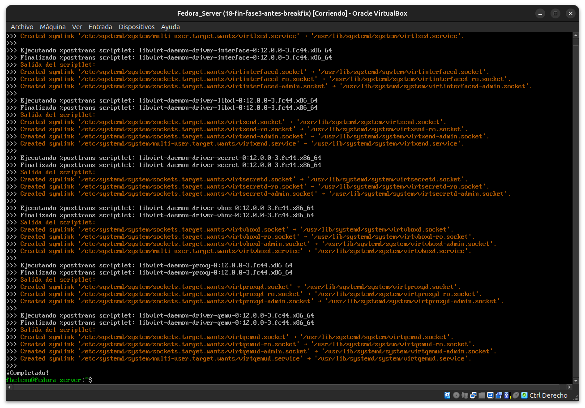
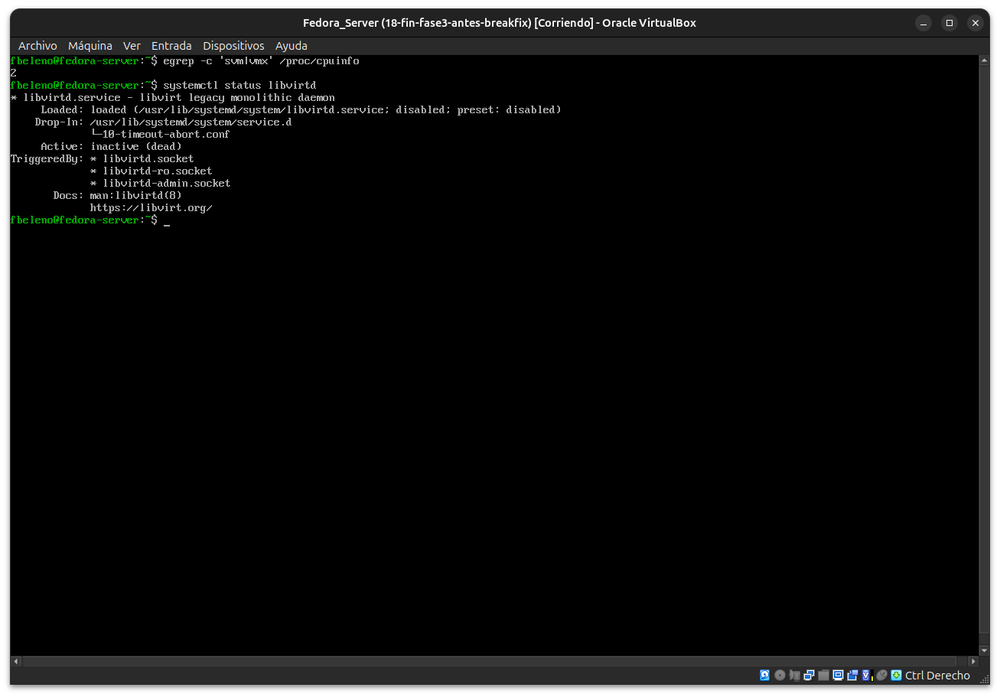
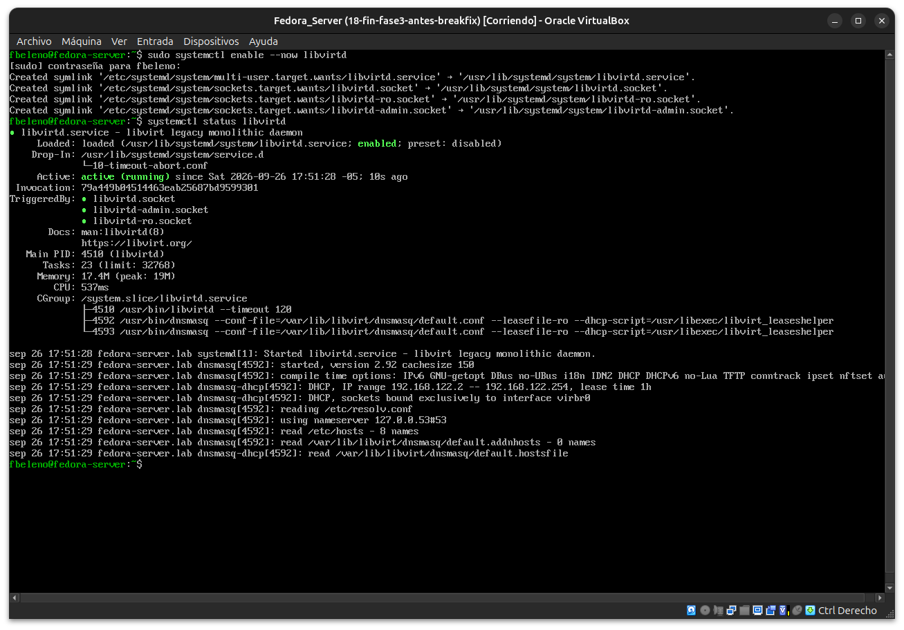
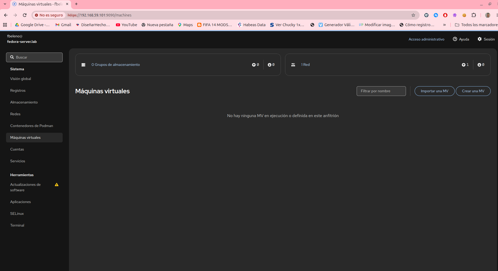
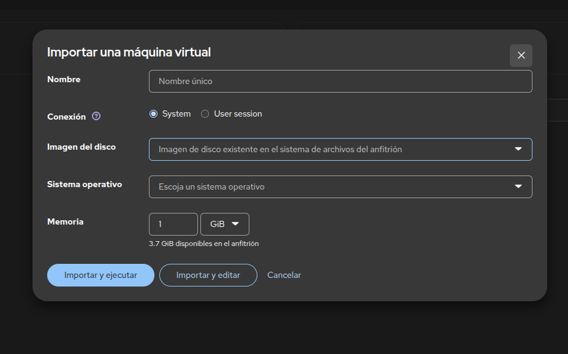
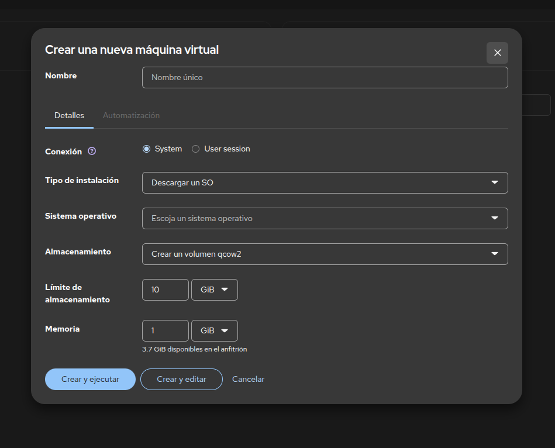

# Módulo 22 — Cockpit y máquinas virtuales dentro de VirtualBox

- Estado: Completado
- Fecha: 2026-09-26
- Versión de Fedora: Fedora Linux 44 (Server Edition)
- Objetivo diferencial frente a Arch: probar un límite real de la
  virtualización anidada (nested virtualization) — capacidad
  específica que hay que habilitar en el hipervisor externo, no algo
  que dependa del sistema operativo huésped.

## Concepto diferencial

Para que la VM de Fedora Server pueda crear **sus propias VMs** (vía
`libvirt`/KVM y `cockpit-machines`), la CPU física necesita
virtualización anidada habilitada — y eso depende de un ajuste
específico de VirtualBox (`nested-hw-virt`), desactivado por defecto.

## Verificación previa (antes de instalar nada)

```bash
# Desde el host
VBoxManage showvminfo "Fedora_Server" --machinereadable | grep -i "nested\|paravirt"
cat /sys/module/kvm_amd/parameters/nested
egrep -c 'svm' /proc/cpuinfo
```

**Resultado real**: `nested-hw-virt="off"` en la VM, pero el host sí
soporta SVM anidado (`nested=1`, 12 cores con flag `svm`). Se apagó la
VM, se habilitó `nested-hw-virt on`, y se reinició.

## Práctica guiada

```bash
sudo dnf install -y virt-install libvirt cockpit-machines
egrep -c 'svm|vmx' /proc/cpuinfo
systemctl status libvirtd
```

Luego, desde Cockpit → "Máquinas virtuales", intentar crear una VM
mínima y documentar el resultado real (éxito o límite encontrado).

## Hallazgos reales

1. **`nested-hw-virt` estaba `off`** en la configuración de la VM
   (VirtualBox), pese a que el host sí soportaba SVM anidado
   (`nested=1` en `kvm_amd`). Requirió apagar la VM, habilitarlo, y
   reiniciar — no es algo configurable en caliente.
2. **Confirmado con `egrep -c 'svm|vmx' /proc/cpuinfo`**: pasó de no
   ver la flag a verla en las 2 vCPUs, una vez reiniciada la VM con el
   ajuste habilitado.
3. **`cockpit-machines` no dispara la activación automática del socket
   de `libvirtd`**, a diferencia de lo visto con `cockpit-podman`
   (módulo 21) — mostró explícitamente *"Servicio de virtualización
   (libvirt) no está activo"* hasta habilitarlo manualmente con
   `systemctl enable --now libvirtd`.
4. **`libvirtd` levantó su propia red virtual por defecto** (`virbr0`,
   DHCP `192.168.122.2-254` vía `dnsmasq`) apenas arrancó — sin
   configuración adicional.
5. **Resultado real: sin ningún límite bloqueante**. Cockpit reconoció
   el servicio, mostró la red por defecto, y ofreció crear/importar una
   VM sin errores — el entorno de virtualización anidada quedó
   completamente funcional dentro de VirtualBox.
6. **Decisión de alcance**: con solo ~3.7 GiB de RAM libres para
   repartir en una tercera capa de virtualización, se decidió **no
   completar la instalación de un sistema operativo real** dentro de la
   VM anidada — el objetivo del módulo (capacidades, requisitos,
   límites) ya estaba cumplido, y una instalación completa solo
   repetiría lo ya aprendido en los módulos 00-01 sin aportar concepto
   nuevo.

## Evidencias

**01 — Instalación de `virt-install`, `libvirt`, `cockpit-machines`**



**02 — `egrep 'svm|vmx'` → 2, `libvirtd` cargado pero `disabled`**



**03 — Cockpit: "Servicio de virtualización (libvirt) no está activo"**


**04 — `libvirtd` habilitado y activo, red `virbr0` levantada**



**05 — Cockpit → Máquinas virtuales: totalmente funcional**



**06-07 — Diálogos explorados: "Importar una MV" y "Crear una MV"**




## Pendientes
