# Módulo 24 — Break & Fix de mantenimiento

- Estado: Completado
- Fecha: 2026-09-27
- Versión de Fedora: Fedora Linux 45 (Server Edition)
- Objetivo diferencial frente a Arch: cierra la Fase 4 con un incidente
  de mantenimiento real ligado a un mecanismo específico de RPM (la
  protección de archivos de configuración modificados), a diferencia
  de los Break & Fix anteriores (acceso, paquetes, SELinux).

## Entorno y punto de restauración

Snapshot tomado antes de este módulo (post módulo 23, Fedora 45 ya
validado): Cockpit, `httpd` en 8585, contenedor Podman rootless,
SELinux enforcing.

## Concepto diferencial

RPM protege los archivos de configuración modificados por el admin:
si un paquete trae una versión nueva de un `.conf` que el usuario ya
personalizó, no lo sobreescribe directo — deja la versión nueva como
`.rpmnew` junto al archivo real. Pero esto **no protege contra un
error humano**: un script de mantenimiento, una restauración manual
mal dirigida, o un admin apurado puede terminar copiando esa versión
"de fábrica" encima de la configuración real, perdiendo cambios
válidos. Vamos a simular exactamente ese error, no una falla de RPM.

## Incidente simulado

Se sobreescribe deliberadamente `/etc/httpd/conf/httpd.conf` con una
copia de la configuración por defecto (`Listen 80` en vez de
`Listen 8585`, sin el `ServerName` ya configurado), simulando que un
proceso de mantenimiento restauró el archivo equivocado tras una
actualización rutinaria.

## Práctica guiada (diagnóstico real)

```bash
curl -s http://localhost:8585        # ya no debería responder
systemctl status httpd
ss -tlnp | grep httpd
grep -i listen /etc/httpd/conf/httpd.conf
journalctl -u httpd --no-pager | tail -20
```

## Reparación

Corregir manualmente el `Listen` (y `ServerName` si aplica) en
`httpd.conf`, validar sintaxis, reiniciar y confirmar:

```bash
sudo httpd -t
sudo systemctl restart httpd
curl -s http://localhost:8585
sestatus
```

## Hallazgos reales

1. **El único cambio real necesario para provocar el incidente fue la
   directiva `Listen`** — el `ServerName` nunca estuvo configurado
   explícitamente (solo la línea de ejemplo comentada), coherente con
   el aviso benigno de FQDN visto en el módulo 23.
2. **Error real propio al diagnosticar**: `grep -IE` (mayúscula) en vez
   de `grep -iE` (minúscula) — `-I` ignora archivos binarios, no activa
   *case-insensitive*. Como `Listen`/`ServerName` llevan mayúscula
   inicial en el archivo real, la búsqueda sensible a mayúsculas no
   encontró nada — un falso negativo por bandera equivocada, no porque
   faltaran las directivas.
3. **`ss -tlnp` sin `sudo` no mostró el proceso**: sin privilegios, `ss`
   no puede asociar el socket con el nombre del programa, así que
   `grep httpd` no encontró coincidencias aunque el puerto sí estaba
   escuchando — señal falsa de "nada corriendo" que se resolvió
   repitiendo el comando con `sudo`.
4. **El journal de `httpd` confirmó el cambio de forma explícita**:
   `Server configured, listening on: port 80` — el mismo mecanismo de
   log ya visto en módulos anteriores sirve tanto para depurar un
   fallo de arranque como para confirmar en qué puerto quedó
   escuchando el servicio tras un cambio de configuración.
5. **Recuperación real sin restaurar el snapshot**: corregir la
   directiva `Listen`, validar con `httpd -t` (`Syntax OK`) antes de
   reiniciar, y `systemctl restart httpd` — el servicio volvió a
   responder en 8585 sin necesidad de revertir a
   `24-antes-breakfix-mantenimiento`.
6. **SELinux y firewalld quedaron completamente al margen del
   incidente**: `sestatus` siguió en `enforcing` durante todo el
   proceso, y `semanage port -l` confirmó que `http_port_t` sigue
   incluyendo el `8585` — el incidente fue puramente de configuración
   de Apache, las dos capas de seguridad del módulo 17 nunca se
   tocaron ni se vieron afectadas.

## Evidencias

**01 — VirtualBox: "Estado actual (modificado)" antes de tomar la instantánea**

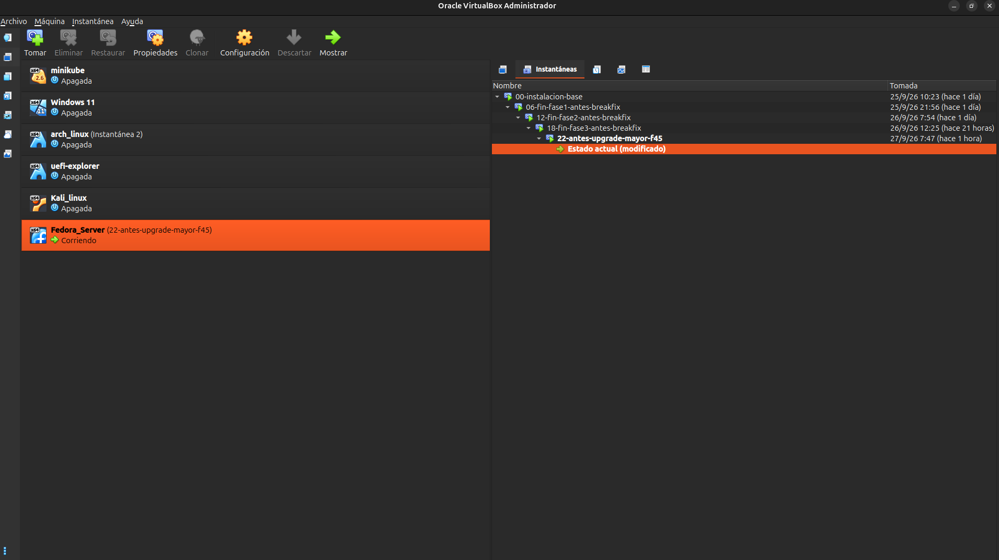

**02-04 — Tomando la instantánea `24-antes-breakfix-mantenimiento`**

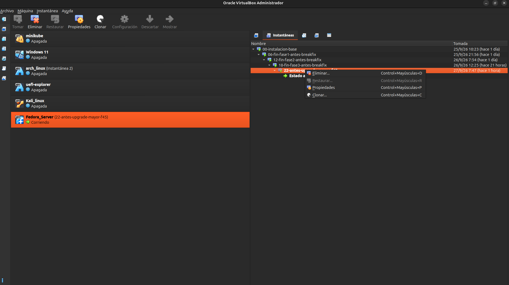
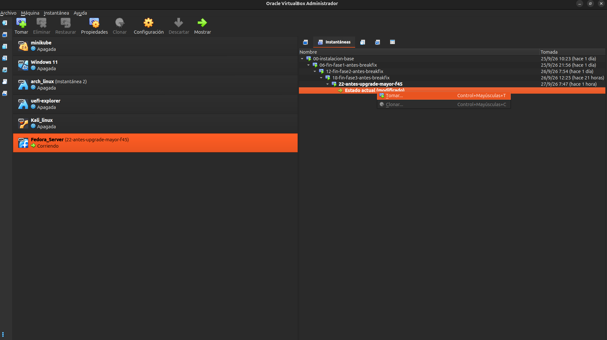
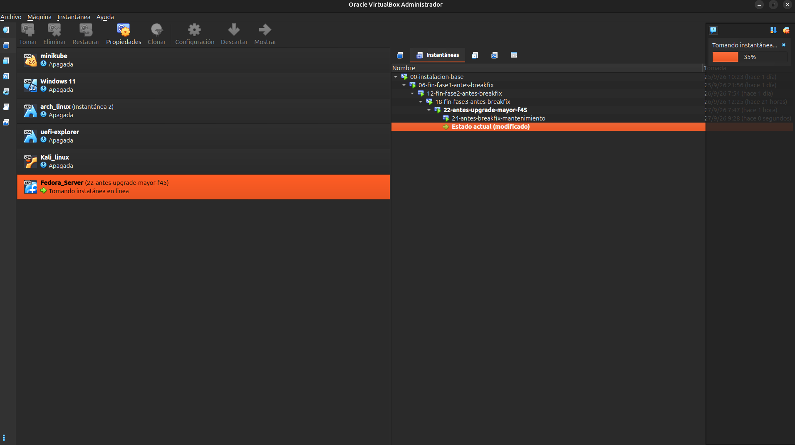

**05 — Instantánea creada, VM corriendo bajo el nuevo estado**

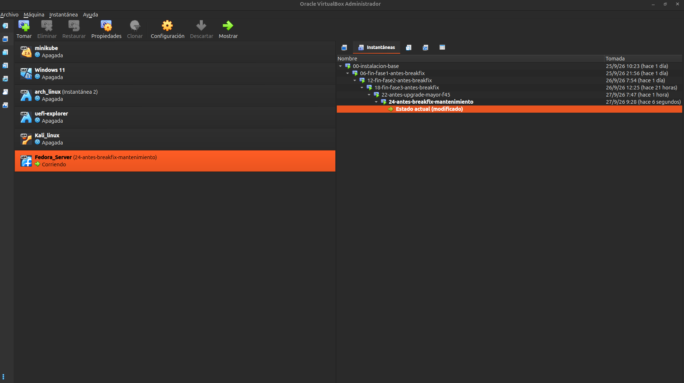

**06 — Estado sano confirmado antes del incidente (`curl` a 8585)**

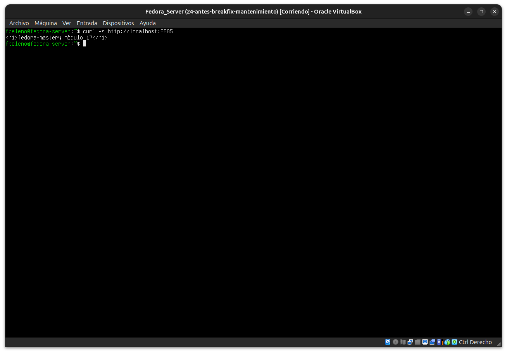

**07 — Error real: typo `http.conf` en vez de `httpd.conf` (mismo patrón de glitch de terminal ya visto en otros módulos)**

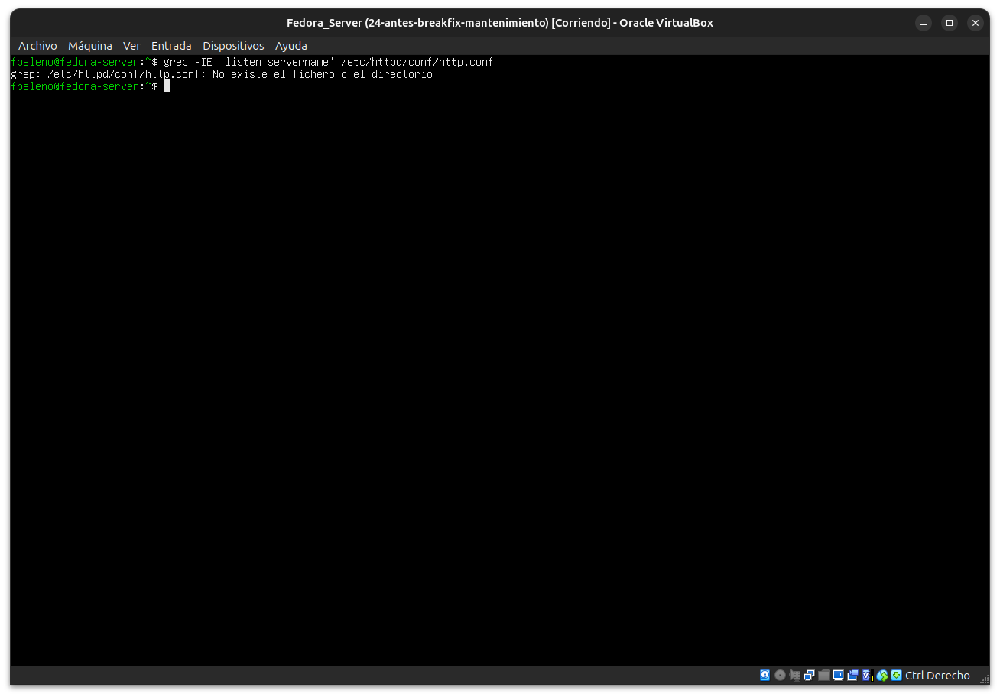

**08 — Segundo error real: `grep -IE` (mayúscula) no es *case-insensitive*, sin resultados**

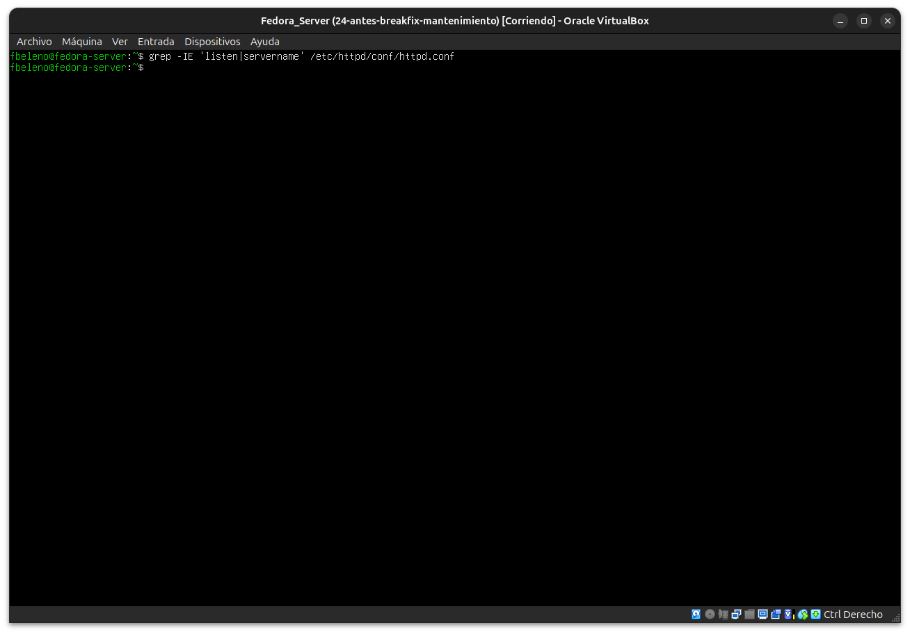

**09 — `grep -iE` correcto: `Listen 8585` activo, `ServerName` solo como ejemplo comentado**

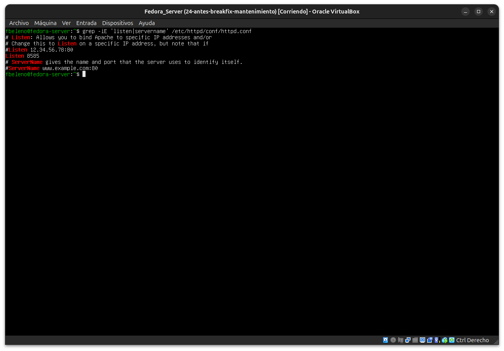

**10 — Incidente provocado: `sed` cambia `Listen 8585` → `Listen 80`, reinicio del servicio**

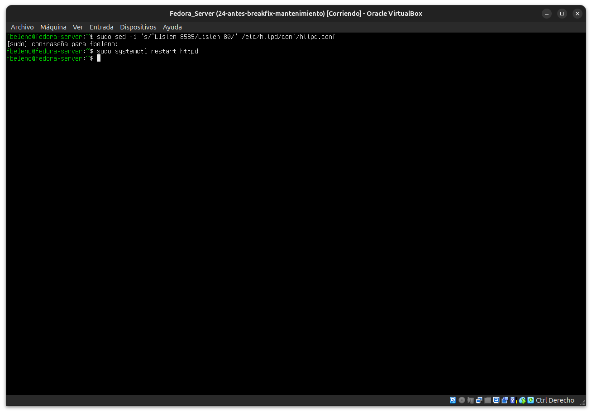

**11 — Diagnóstico: `curl` vacío, `systemctl status` y log confirman "listening on: port 80"**

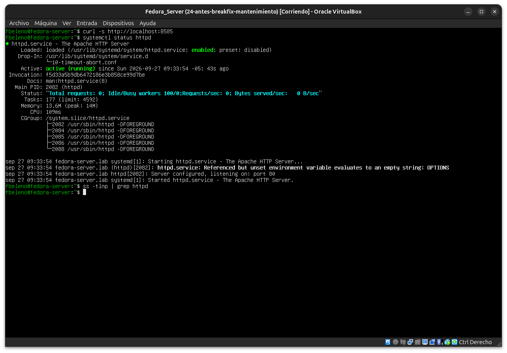

**12 — `sudo ss -tlnp` confirma los 4 procesos `httpd` escuchando en `*:80`**

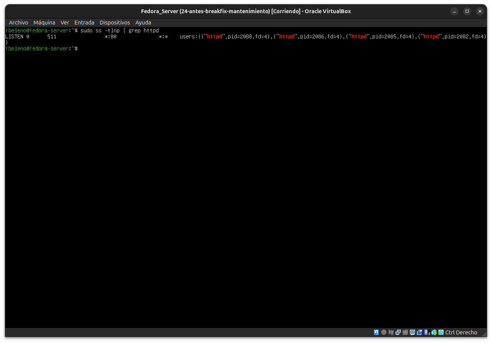

**13 — Reparación: `httpd -t` → `Syntax OK`, reinicio, `curl 8585` restaurado**

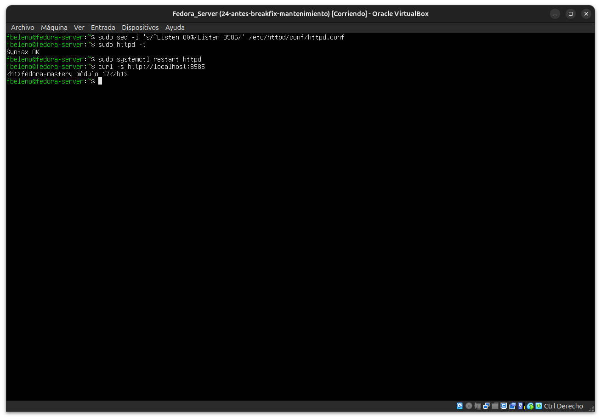

**14 — Validación final: `sestatus` `enforcing`, `semanage port -l` confirma `8585` intacto en `http_port_t`**

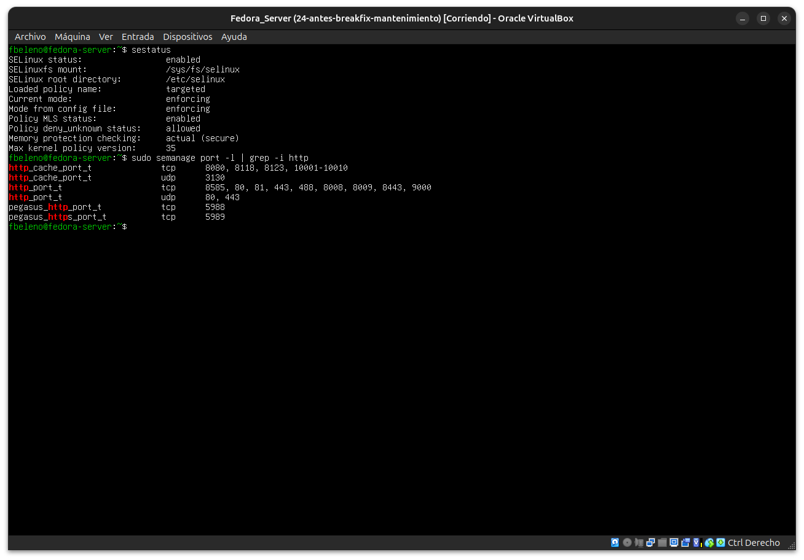

## Pendientes
