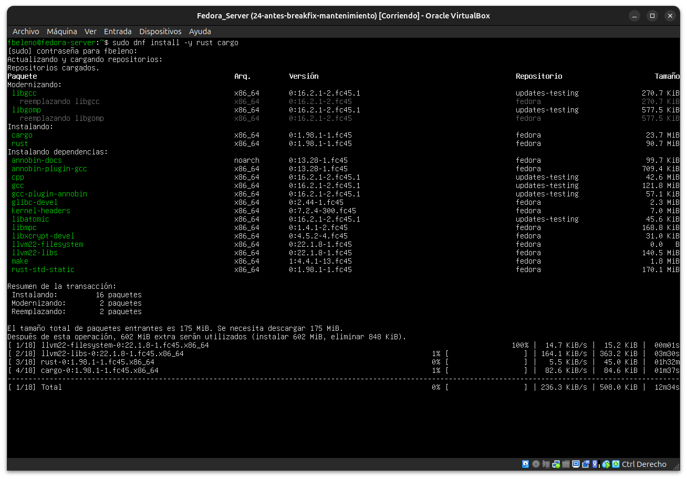
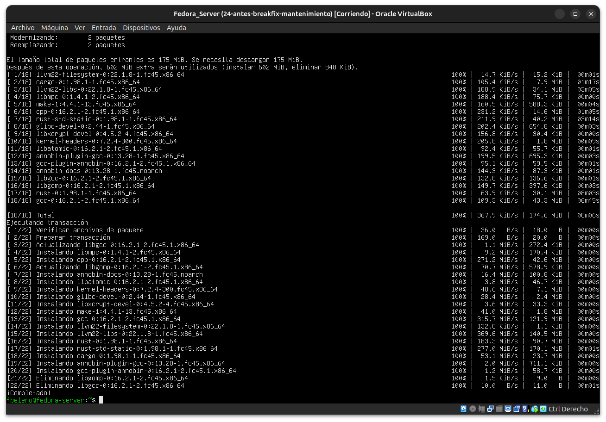
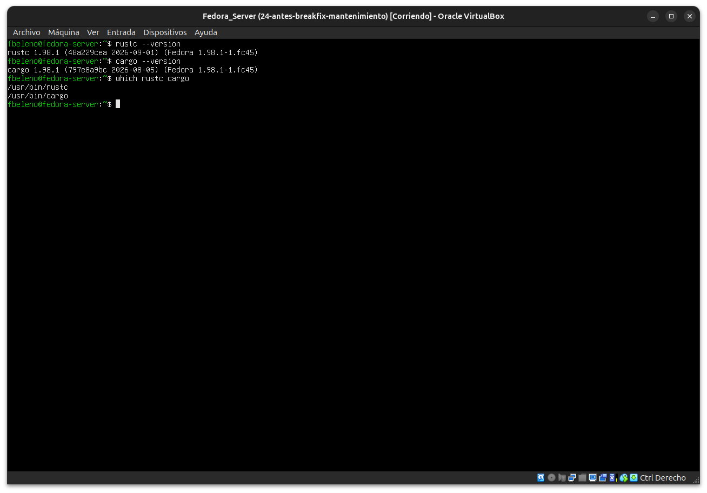
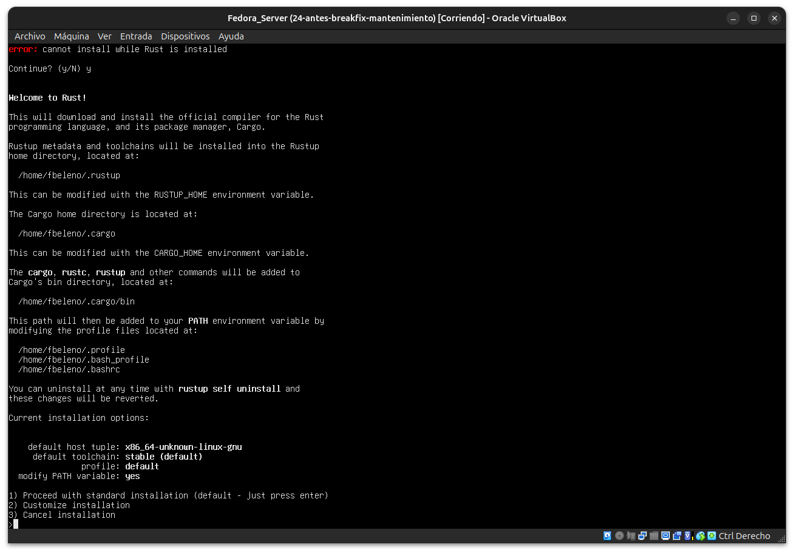
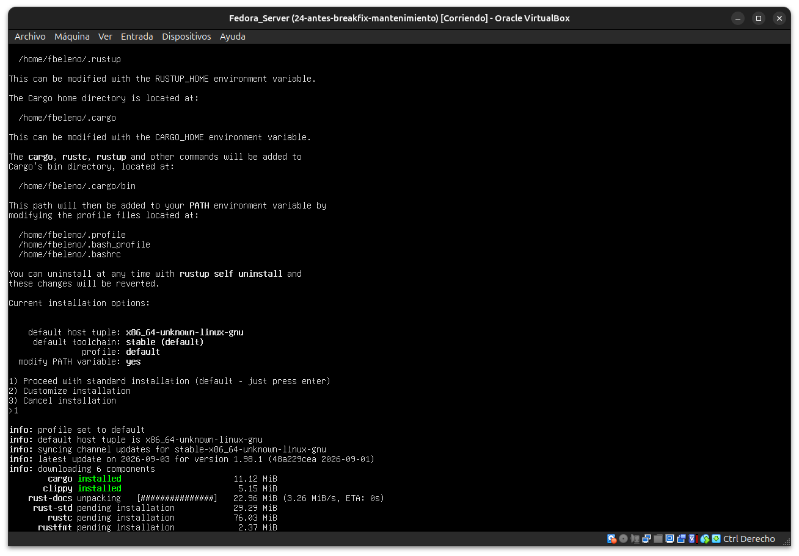
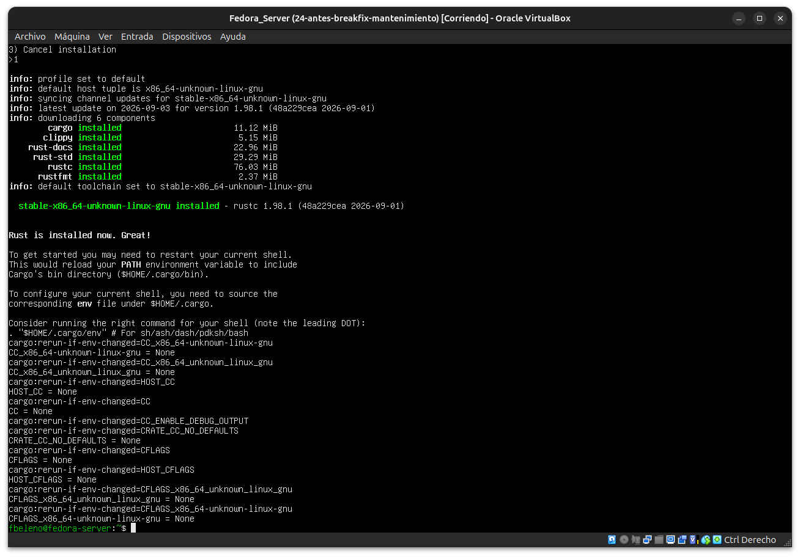
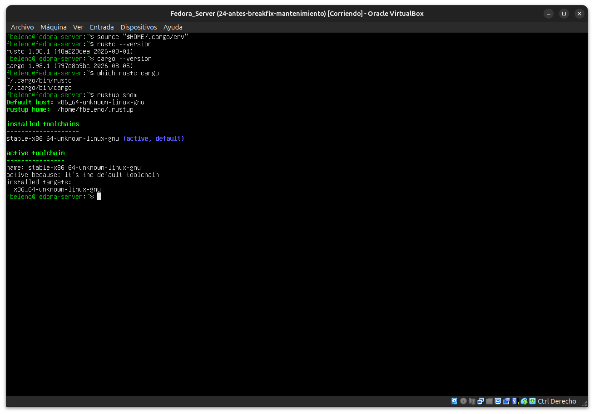

# Módulo 25 — Toolchain Rust: rustup frente a DNF

- Estado: Completado
- Fecha: 2026-09-27
- Versión de Fedora: Fedora Linux 45 (Server Edition)
- Objetivo diferencial frente a Arch: arranca la Fase 5. Comparar dos
  caminos reales para tener Rust en Fedora — el paquete de sistema
  (ligado al ciclo de release de Fedora) frente a `rustup` (herramienta
  oficial del proyecto Rust, versionado independiente del SO).

## Concepto diferencial

Fedora empaqueta Rust como cualquier otro lenguaje del sistema:
`dnf install rust cargo` instala una versión fija, la misma que trae
el repositorio de esa versión de Fedora, actualizada solo cuando DNF
actualiza el sistema. `rustup`, en cambio, es el instalador oficial del
proyecto Rust: vive en `$HOME/.cargo` y `$HOME/.rustup`, permite tener
varias toolchains instaladas a la vez (stable/beta/nightly), cambiar
de una a otra por proyecto, y actualizar el compilador sin depender de
un `dnf update` del sistema completo.

## Práctica guiada

```bash
# Camino 1: paquete de Fedora
sudo dnf install -y rust cargo
rustc --version
cargo --version
which rustc cargo
```

```bash
# Camino 2: rustup (instalador oficial)
curl --proto '=https' --tlsv1.2 -sSf https://sh.rustup.rs | sh
# tras instalar, cargar el entorno de la sesión actual
source "$HOME/.cargo/env"
rustc --version
cargo --version
which rustc cargo
rustup show
```

## Decisión de alcance

Comparar ambas versiones (`rustc --version`) y decidir con criterio
cuál usar para el resto de la Fase 5 (módulos 26-29), considerando que
el módulo 28 va a empaquetar un binario como `.rpm` — un factor real a
favor de compilar con el toolchain que después firme mejor con las
convenciones de Fedora Packaging para Rust.

## Hallazgos reales

1. **DNF instala un stack de compilación pesado**: `rust`/`cargo` de
   Fedora traen consigo `gcc`, `llvm22-libs`, `kernel-headers`,
   `glibc-devel`, etc. — 16 paquetes, ~175 MiB — porque el compilador
   de Rust necesita un enlazador y una toolchain C real por debajo,
   algo que no es evidente instalando "solo" Rust.
2. **`rustup` detectó el conflicto real**: al ejecutar el instalador
   con Rust de DNF ya presente, mostró explícitamente
   `error: cannot install while Rust is installed` antes de pedir
   confirmación para continuar — un aviso genuino de que ambos
   caminos comparten el mismo `$PATH` por defecto.
3. **Coincidencia real de versión**: ambos instalaron `1.98.1` (la
   misma versión estable), aunque con fechas de build distintas
   (`2026-09-01` vía DNF, mismo día vía rustup) — Fedora empaqueta la
   versión estable de Rust con muy poco desfase frente a upstream.
4. **Los shims de `rustup` ganan el `PATH` sin desinstalar nada**: tras
   `source $HOME/.cargo/env`, `which rustc cargo` pasó de
   `/usr/bin/rustc` (DNF) a `~/.cargo/bin/rustc` (rustup) — ambas
   instalaciones coexisten, solo cambia cuál resuelve primero el
   `PATH` de la sesión actual.
5. **Decisión de alcance para la Fase 5**: se usará `rustup` para el
   desarrollo interactivo de los módulos 26-27 (múltiples toolchains,
   iteración rápida), pero el **build final que se empaquete como RPM
   en el módulo 28 se compilará con el toolchain de DNF**, no con
   `rustup` — los sistemas de build de Fedora (`mock`/Koji) no tienen
   acceso a internet durante el build y solo cuentan con lo instalado
   vía `dnf`/`BuildRequires`, así que un binario compilado con
   `rustup` no sería reproducible en un entorno de empaquetado real.

## Evidencias

**01-02 — `dnf install rust cargo`: resumen de la transacción (16 paquetes, ~175 MiB) y transacción completada**




**03 — `rustc`/`cargo` de DNF: versión `1.98.1`, en `/usr/bin`**



**04 — `rustup` detecta el conflicto real: "cannot install while Rust is installed"**



**05 — `rustup` instalando componentes (cargo, clippy, rust-docs, rust-std, rustc, rustfmt)**



**06 — `rustup` instalado: "Rust is installed now. Great!"**



**07 — `source $HOME/.cargo/env`: `which` confirma el cambio a `~/.cargo/bin`, `rustup show` confirma el toolchain activo**



## Pendientes
