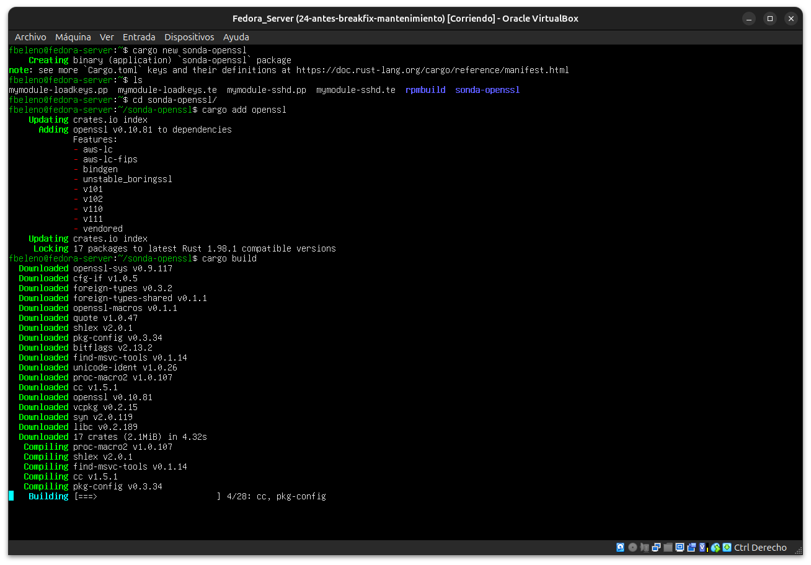
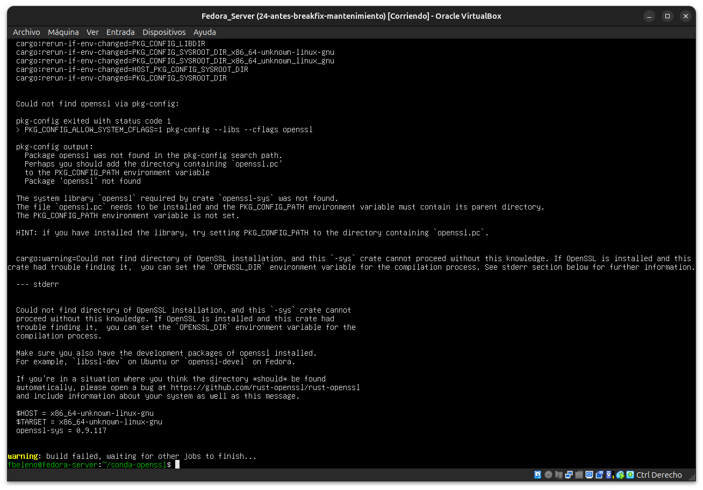
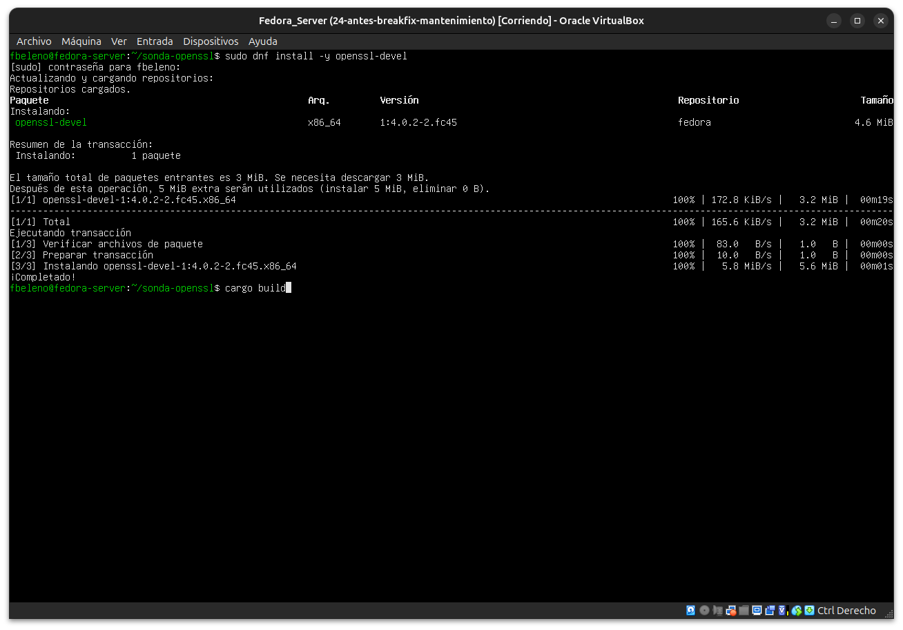
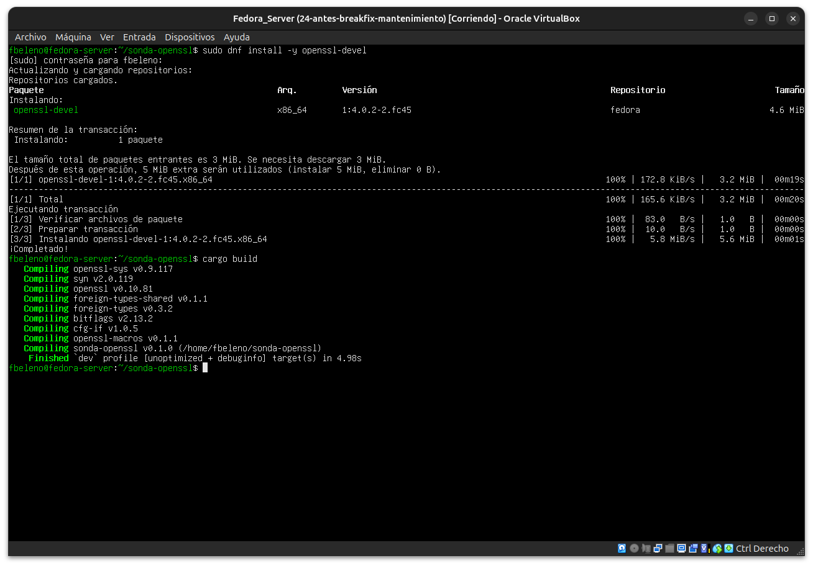
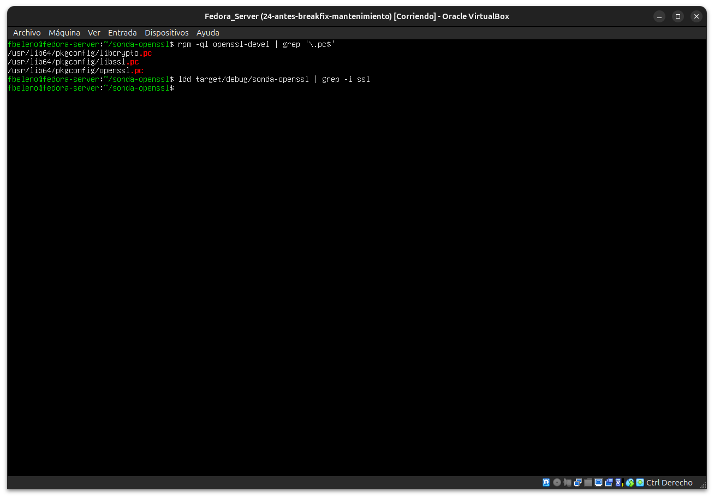
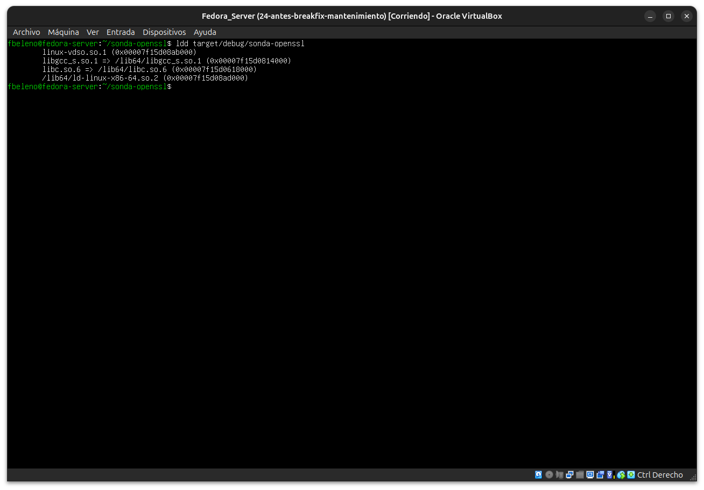
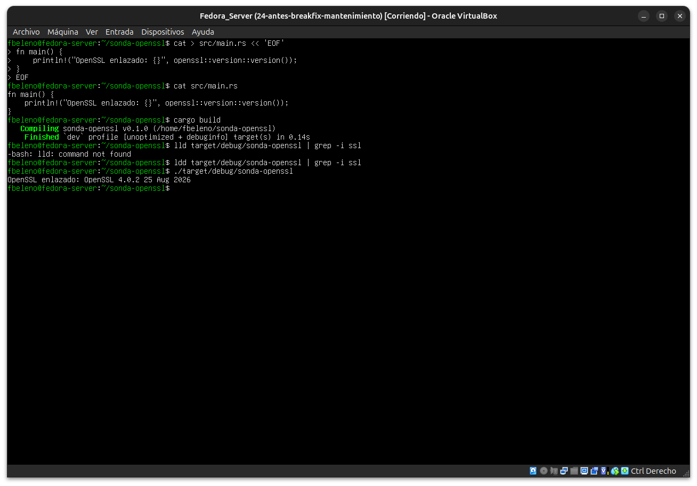
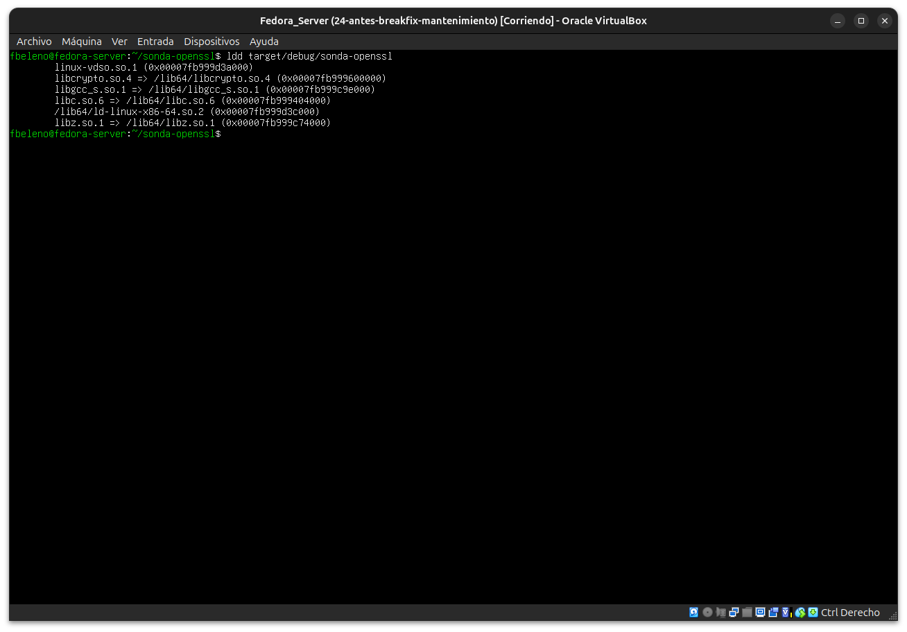

# Módulo 26 — Cargo y bibliotecas del sistema

- Estado: Completado
- Fecha: 2026-09-27
- Versión de Fedora: Fedora Linux 45 (Server Edition)
- Objetivo diferencial frente a Arch: en Arch, una librería nativa
  necesaria para compilar un crate Rust suele resolverse con un único
  paquete de pacman. Fedora separa explícitamente el paquete de
  *runtime* (`openssl-libs`) del paquete `-devel` (`openssl-devel`,
  con los headers `.h` y los archivos `.pc` de `pkg-config`) — sin el
  `-devel`, Cargo descarga y compila el crate sin problema, pero el
  enlazador falla al no encontrar la librería C real.

## Concepto diferencial

`pkg-config` es el mecanismo estándar que usan los crates Rust con
componente nativo (bindings a C) para localizar headers y flags de
compilación de una librería del sistema. Fedora empaqueta ese archivo
`.pc` únicamente dentro del paquete `-devel`, nunca en el paquete de
runtime — una separación deliberada para no forzar el peso de
compilación en instalaciones que solo necesitan ejecutar el software,
no compilarlo.

## Práctica guiada

Crear un proyecto Cargo que dependa de un crate con componente nativo
(`openssl`, el ejemplo más común y pedagógico) y provocar el fallo de
enlazado real antes de instalar el `-devel`:

```bash
cargo new sonda-openssl
cd sonda-openssl
cargo add openssl
cargo build
```

Tras confirmar el fallo real, instalar la dependencia correcta y
recompilar:

```bash
sudo dnf install -y openssl-devel
cargo build
pkg-config --libs --cflags openssl
```

## Hallazgos reales

1. **Fallo real de enlazado confirmado sin `openssl-devel`**: `cargo
   build` descarga y compila 17 crates sin problema (incluye
   `openssl-sys`, `pkg-config`, `cc`), pero el *build script* de
   `openssl-sys` ejecuta `pkg-config` en tiempo de compilación y falla
   con `Could not find openssl via pkg-config` — el propio mensaje de
   error de `openssl-sys` incluso sugiere explícitamente
   `openssl-devel` en Fedora, sin necesidad de buscarlo aparte.
2. **`openssl-devel` es liviano** (1 paquete, 4.6 MiB) — contraste
   directo con el stack pesado de `rust`/`cargo` del módulo 25 (16
   paquetes, ~175 MiB): un `-devel` normalmente solo agrega headers y
   metadatos, no un compilador nuevo.
3. **Confirmado el mecanismo completo de `pkg-config`**: `rpm -ql
   openssl-devel` muestra los tres archivos reales
   (`libcrypto.pc`, `libssl.pc`, `openssl.pc`) en
   `/usr/lib64/pkgconfig/`, y `pkg-config --libs --cflags openssl`
   devuelve exactamente `-lssl -lcrypto` — las flags que el enlazador
   necesitaba y no encontraba antes.
4. **Hallazgo sutil real**: con el `main.rs` de plantilla sin
   modificar, `cargo build` compiló bien pero `ldd` no mostró
   `libssl`/`libcrypto` en absoluto — el crate `openssl` nunca se usó
   en el código, así que el enlazador eliminó por *dead code
   elimination* cualquier símbolo FFI no referenciado. "Compila" no es
   lo mismo que "enlaza de verdad".
5. **Al usar una función real (`openssl::version::version()`)**, el
   binario sí quedó enlazado dinámicamente — pero solo contra
   `libcrypto.so.4` (más `libz.so.1`, que `libcrypto` necesita
   internamente), nunca contra `libssl.so`, porque la función usada
   pertenece a esa parte de la API. Un `grep -i ssl` sobre `ldd` no lo
   detectó por eso (la subcadena "ssl" no aparece en "crypto"), algo
   verificado corriendo `ldd` sin filtrar.
6. **Dos typos reales propios corregidos en vivo**: `lld` en vez de
   `ldd` (comando no encontrado, mismo patrón de letras trocadas ya
   visto en módulos anteriores).

## Evidencias

**01 — `cargo new`/`cargo add openssl`/`cargo build`: descarga de 17 crates**



**02 — Fallo real: `pkg-config` no encuentra `openssl` (sugiere `openssl-devel` en Fedora)**



**03 — `sudo dnf install openssl-devel` (1 paquete, 4.6 MiB) + reintento de `cargo build`**



**04 — `cargo build` exitoso con `openssl-devel` instalado**



**05 — `pkg-config --libs --cflags openssl` → `-lssl -lcrypto`**


**06 — `rpm -ql openssl-devel` (los tres `.pc`) + `ldd | grep ssl` sin resultados (crate sin usar en el código)**



**07 — `ldd` sin filtrar: solo `libc`/`libgcc`/`vdso`, ninguna librería de OpenSSL**



**08 — `main.rs` usa `openssl::version::version()`, typo real `lld`→`ldd`, ejecución real imprime la versión de OpenSSL**



**09 — `ldd` confirma el enlazado dinámico real: `libcrypto.so.4` (+ `libz.so.1`), nunca `libssl.so`**



## Pendientes
