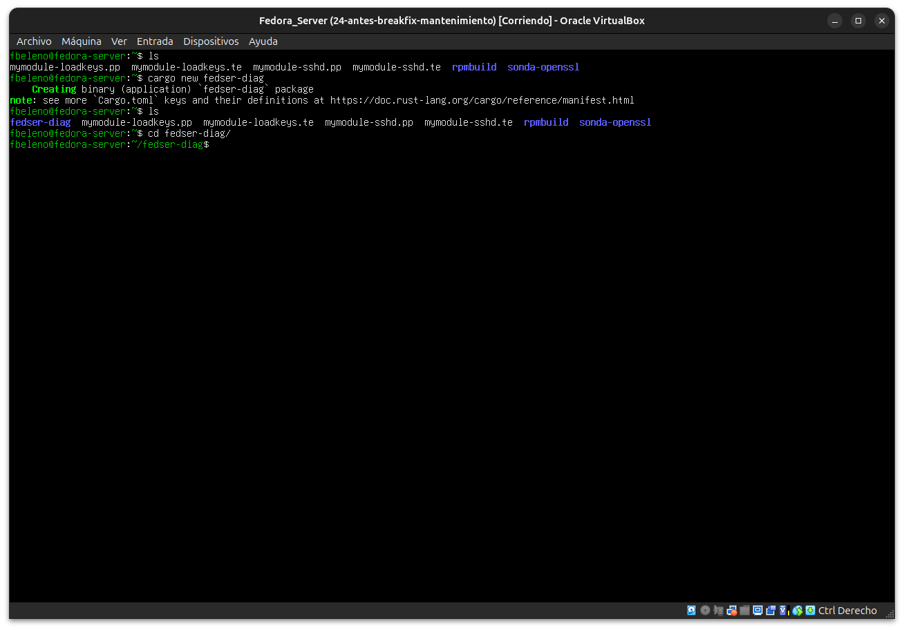
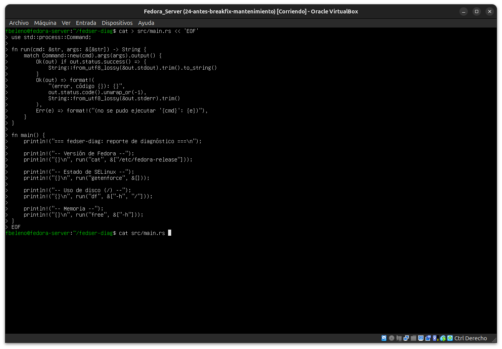
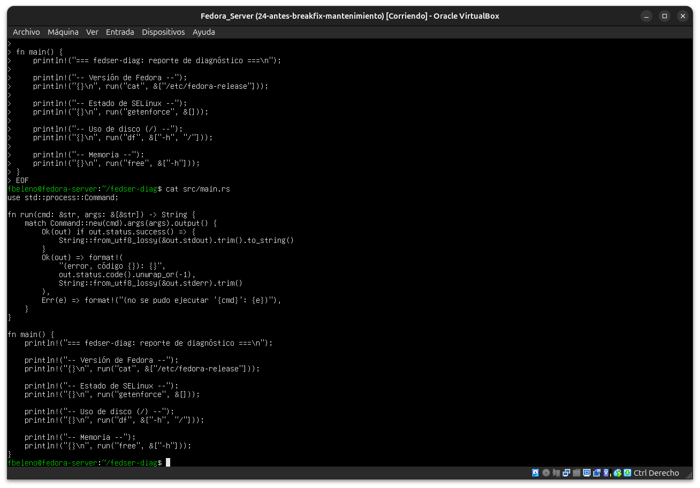
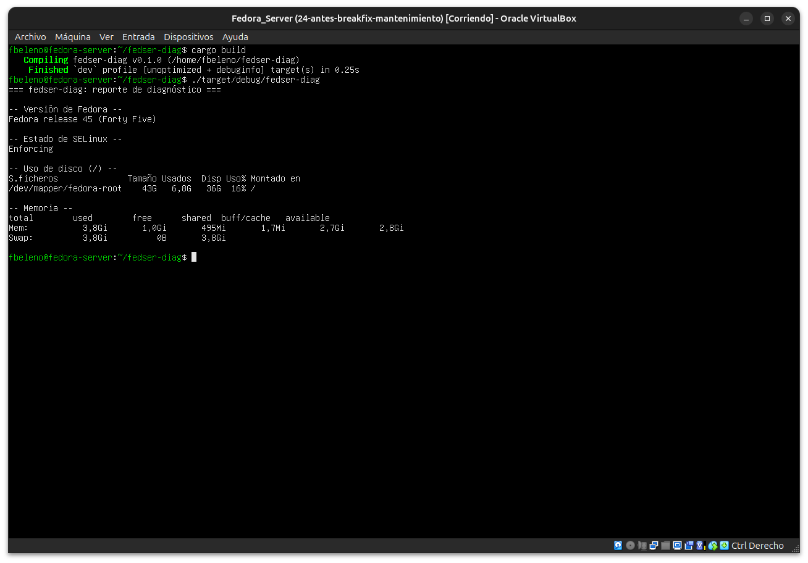
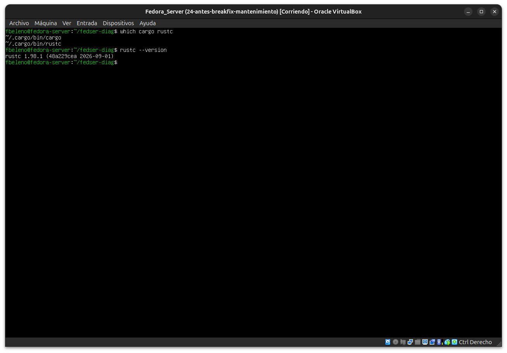

# Módulo 27 — Utilidad Rust para Fedora Server

- Estado: Completado
- Fecha: 2026-09-27
- Versión de Fedora: Fedora Linux 45 (Server Edition)
- Objetivo diferencial frente a Arch: escribir una CLI real en Rust
  que consolide señales de diagnóstico que venimos revisando a mano
  durante todo el curso (versión de Fedora, SELinux, disco, memoria) —
  la pieza que se empaqueta como `.rpm` propio en el módulo 28.

## Concepto diferencial

Una utilidad de diagnóstico de sistema en Rust casi nunca reimplementa
en Rust puro lo que ya hacen herramientas maduras del sistema
(`df`, `free`, `getenforce`) — las envuelve vía `std::process::Command`
y consolida su salida. A diferencia del módulo 26 (enlazado contra una
librería C real, `libcrypto`), aquí no hay dependencia nativa que
declarar: menos superficie para el `.spec` del módulo 28.

**Decisión de toolchain** (heredada del módulo 25): desarrollo
interactivo con `rustup`; el build final que se empaquete en el
módulo 28 se compilará con el `cargo` de DNF.

## Práctica guiada

```bash
cargo new fedser-diag
cd fedser-diag
```

Reemplazar `src/main.rs` con una versión inicial que ejecute
`cat /etc/fedora-release`, `getenforce`, `df -h /`, `free -h` vía
`std::process::Command`, capture su salida y la imprima en un
reporte consolidado.

```bash
cargo build
./target/debug/fedser-diag
```

## Hallazgos reales

1. **El patrón "envolver, no reimplementar" funcionó sin fricción**:
   `fedser-diag` no parsea `/proc/meminfo` ni hace *syscalls* de
   SELinux por su cuenta — ejecuta `cat`, `getenforce`, `df -h`,
   `free -h` vía `std::process::Command` y consolida su salida ya
   formateada. Cero dependencias externas en `Cargo.toml`.
2. **Salida real correlacionada con todo el curso**: el primer run
   confirmó `Fedora release 45 (Forty Five)` (módulo 23),
   `Enforcing` (módulos 14-19), `/dev/mapper/fedora-root` al 16 % de
   uso (43G/6,8G) — coherente con el esquema LVM del módulo 05 — y
   memoria con 2,8Gi disponibles de 3,8Gi totales.
3. **Manejo explícito de fallos por comando**: la función `run()`
   distingue tres casos — éxito (`stdout` limpio), el comando corrió
   pero devolvió código de error (se captura `stderr` con el código
   real), y el comando ni siquiera existe en el `PATH` (`Err` de
   `Command::output()`) — un patrón de manejo de errores más robusto
   que simplemente hacer `.unwrap()` sobre cada llamada.
4. **Toolchain confirmado**: `which cargo rustc` → `~/.cargo/bin/`,
   compilado con `rustup` (`1.98.1`) — se cumplió la decisión del
   módulo 25 de usar `rustup` para el desarrollo interactivo de esta
   fase, dejando pendiente para el módulo 28 recompilar con el
   `cargo` de DNF antes de empaquetar el `.rpm` final.

## Evidencias

**01 — `cargo new fedser-diag`**



**02 — `main.rs` vía heredoc: función `run()` y las cuatro consultas de diagnóstico**



**03 — `cat src/main.rs`: código completo confirmado**



**04 — `cargo build` + ejecución: reporte real (Fedora 45, Enforcing, disco, memoria)**



**05 — `which cargo rustc` confirma compilación con `rustup`**



## Pendientes
