# Módulo 28 — Empaquetado RPM de `fedser-diag`

- Estado: Completado
- Fecha: 2026-09-27
- Versión de Fedora: Fedora Linux 45 (Server Edition)
- Objetivo diferencial frente a Arch: cerrar el ciclo de la Fase 5
  empaquetando el binario Rust del módulo 27 como `.rpm` real, con el
  mismo flujo `rpmbuild`/SPEC del módulo 12 pero aplicado a un binario
  compilado en vez de un script — y resolviendo en la práctica la
  decisión de toolchain pendiente desde el módulo 25.

## Concepto diferencial

Un SPEC que compile con `rustup` funcionaría en esta VM, pero jamás en
un entorno real de build de Fedora (`mock`/Koji): esos entornos están
aislados y sin red, solo tienen lo que se declare en `BuildRequires` e
instale `dnf`. Por eso el `%build` de este módulo usa explícitamente el
`cargo`/`rustc` de DNF (módulo 25), no el de `rustup`.

## Práctica guiada

Preparar el árbol de fuentes (mismo patrón del módulo 12):

```bash
cd ~
cp -r ~/fedser-diag fedser-diag-0.1.0
tar czf ~/rpmbuild/SOURCES/fedser-diag-0.1.0.tar.gz fedser-diag-0.1.0
```

Escribir `~/rpmbuild/SPECS/fedser-diag.spec` con:
- `BuildRequires: cargo rust`
- `%build`: `cargo build --release` (con el `cargo` de DNF, confirmar
  con `which cargo` antes de construir)
- `%install`: instalar el binario en `%{buildroot}%{_bindir}`
- `%files`: `%{_bindir}/fedser-diag`

Construir, instalar y validar:

```bash
rpmbuild -bb ~/rpmbuild/SPECS/fedser-diag.spec
sudo dnf install -y ~/rpmbuild/RPMS/x86_64/fedser-diag-0.1.0-1*.rpm
which fedser-diag
fedser-diag
```

Desinstalar limpiamente:

```bash
sudo dnf remove -y fedser-diag
which fedser-diag
```

## Hallazgos reales

1. **Typo real al preparar el árbol de fuentes**: `cp -r ~/fedser-diag
   fedser-diag-01.1.0` (un `1` de más) — el `tar` posterior falló
   porque el directorio esperado (`fedser-diag-0.1.0`) no existía.
   Corregido verificando con `ls -d fedser-diag*` antes de asumir
   nombres.
2. **El tarball de fuentes incluía `target/` por accidente** (12 MiB
   de artefactos de compilación de `rustup`) — limpiado antes de
   empaquetar; el tarball final de solo fuentes quedó en 1.4 KiB.
3. **Hallazgo central del módulo, y el más importante de toda la Fase
   5**: pese a declarar `cargo build --release` "a secas" en el
   `%build`, el diagnóstico (`which cargo`) reveló que `rpmbuild`
   **heredó el `$PATH` del shell interactivo** (con `~/.cargo/bin` de
   `rustup` primero) y habría compilado con el toolchain equivocado —
   exactamente lo que la decisión del módulo 25 quería evitar. Un
   `rpmbuild` local, sin aislamiento real (sin `mock`/Koji), **no
   garantiza por sí solo** qué toolchain se usa.
4. **Corrección real**: se forzó `/usr/bin/cargo build --release`
   explícito en el `.spec` en vez de confiar en la resolución del
   `PATH` — confirmado en el log de build (`+ /usr/bin/cargo build
   --release`), reconstruyendo el RPM con el toolchain correcto de
   DNF.
5. **Paquete sin firmar, aviso real de DNF**: al instalar desde
   archivo local, DNF mostró explícitamente *"comprobando OpenPGP
   omitido para 1 paquete desde repositorio: @commandline"* — conecta
   directamente con el mecanismo de confianza GPG visto en el módulo
   10, aplicado ahora a un paquete propio sin firmar.
6. **Validación real de instalación y desinstalación**: `which
   fedser-diag` pasó de `/usr/bin/fedser-diag` (el binario del
   paquete, confirmando que no se ejecutó por accidente el de
   `target/release/`) a "no encontrado en ningún directorio del
   `PATH`" tras `dnf remove` — ciclo de vida completo del paquete
   verificado de punta a punta.

## Evidencias

**01 — Typo real: `cp` a `fedser-diag-01.1.0`, `tar` falla por directorio inexistente**

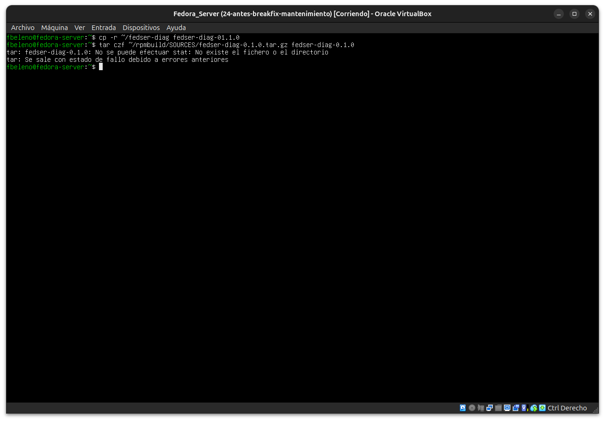

**02 — Tarball de fuentes creado incluyendo `target/` sin querer (3.3 MiB)**

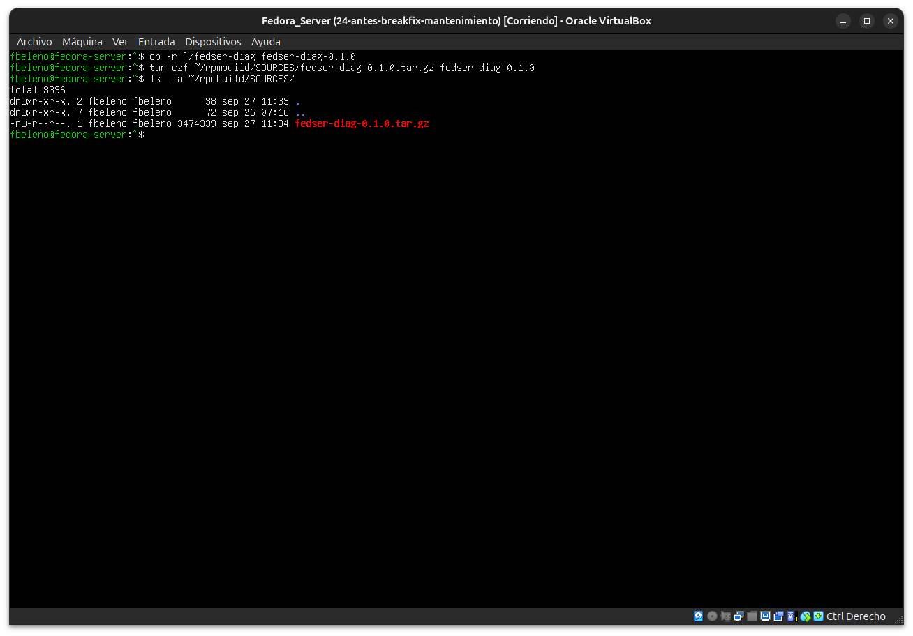

**03 — `ls -d`/`rm -rf` del directorio con el typo (`fedser-diag-01.1.0`)**

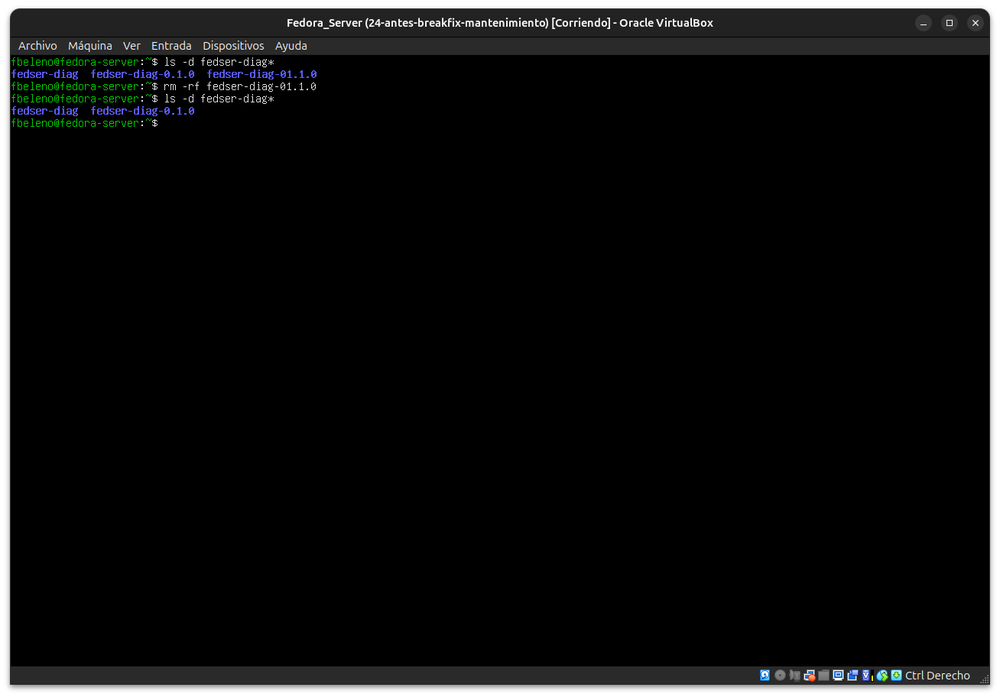

**04 — `du -sh target` (12M) eliminado, tarball final de solo fuentes (1.4K)**

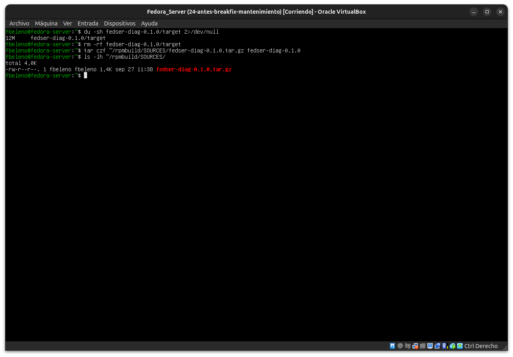

**05 — `.spec` escrito, confirmado con `cat`**

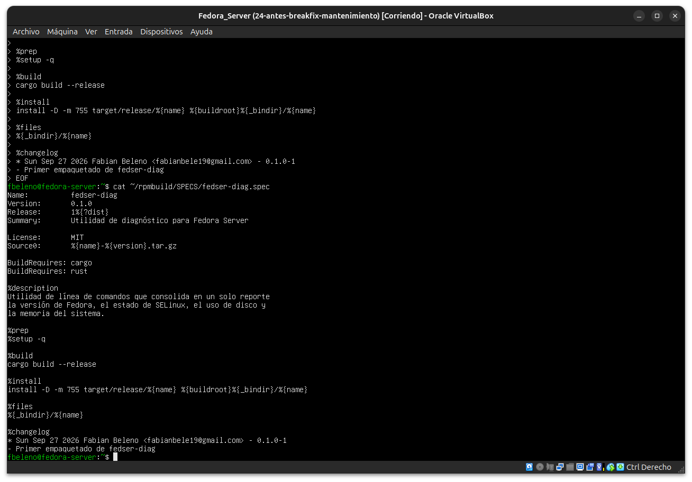

**06 — `sed` agrega diagnóstico `cargo --version`/`which cargo` al `%build`**

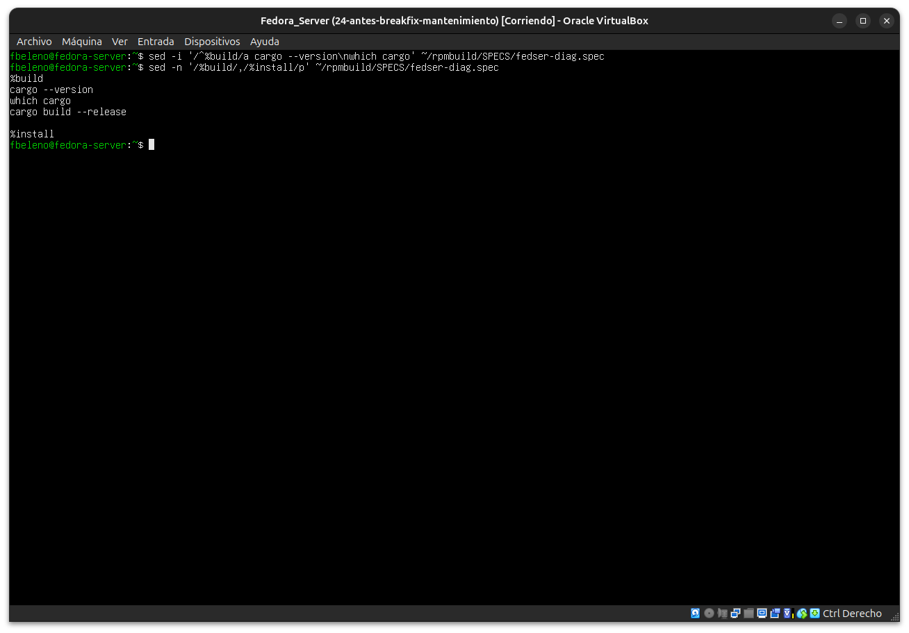

**07 — Primer `rpmbuild -bb`: exitoso, genera los 3 RPMs**


**08 — Log de build: inicio, `%prep`, entorno de `rpmbuild`**

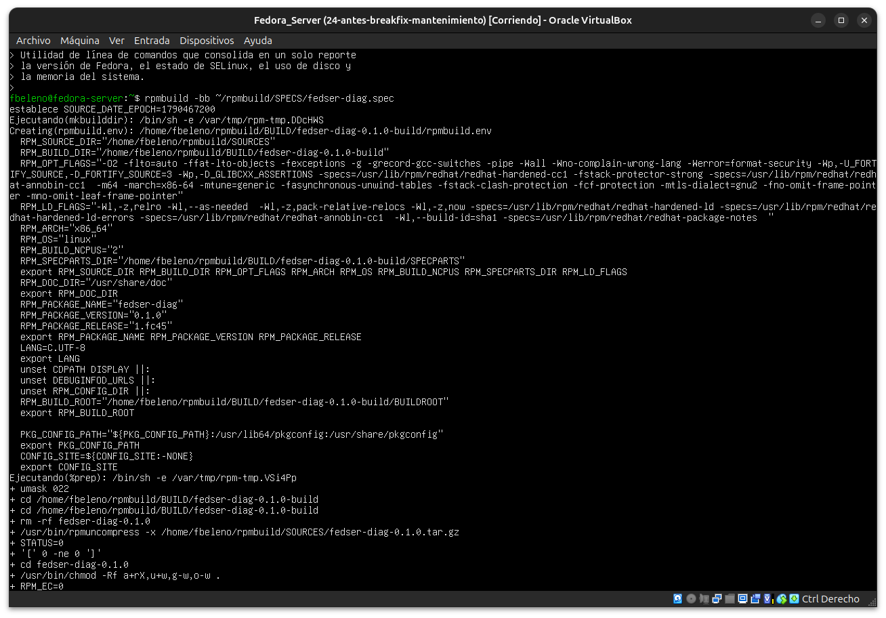

**09 — Hallazgo central: `which cargo` en el `%build` revela `~/.cargo/bin/cargo` (rustup), no el de DNF**

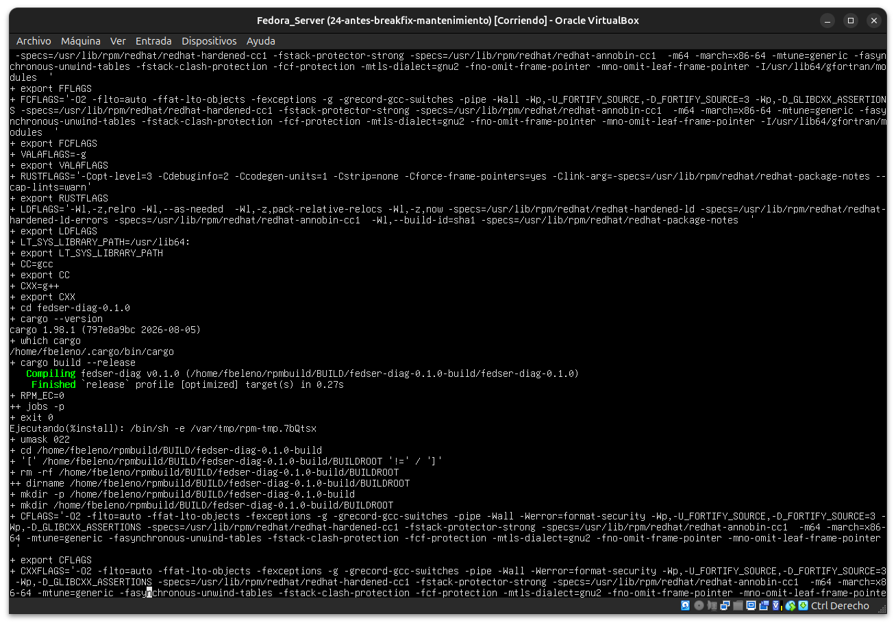

**10 — Segundo `rpmbuild -bb` (con `/usr/bin/cargo` forzado): exitoso**

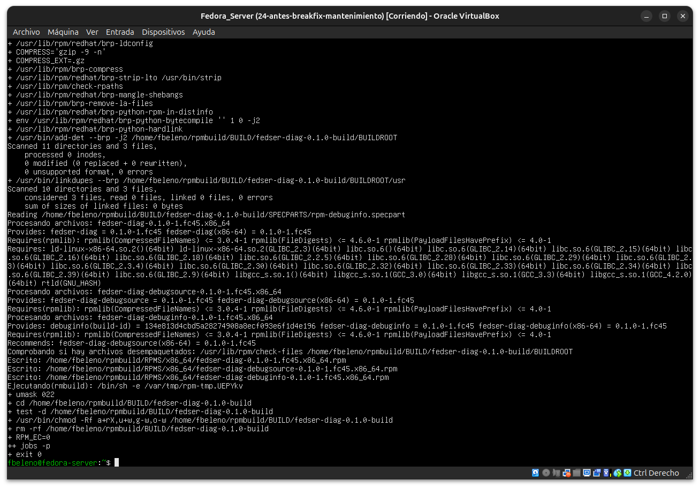

**11 — Log confirmando `+ /usr/bin/cargo build --release` y `Finished release`**

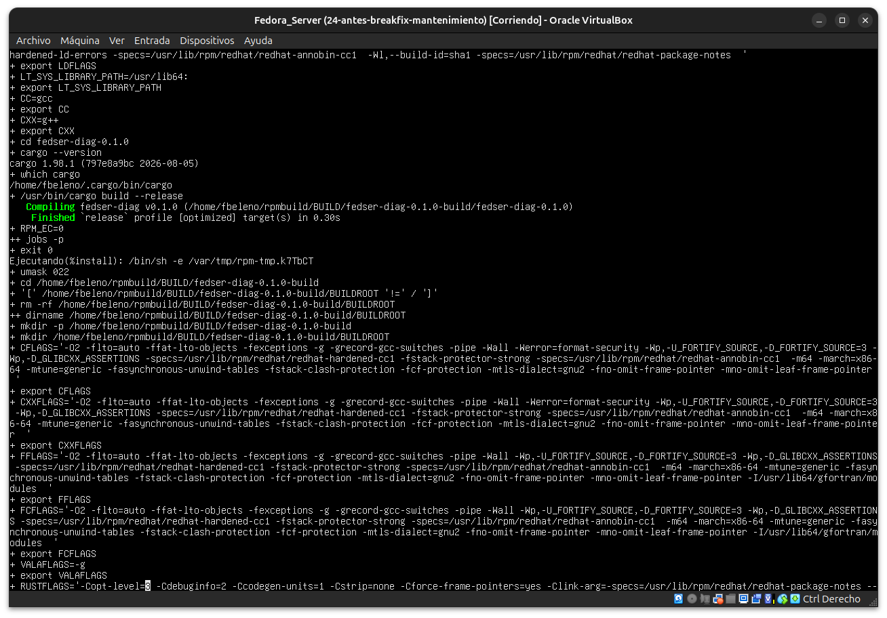

**12 — `dnf install` del `.rpm`, aviso de OpenPGP omitido, `which`/ejecución reales desde el paquete instalado**

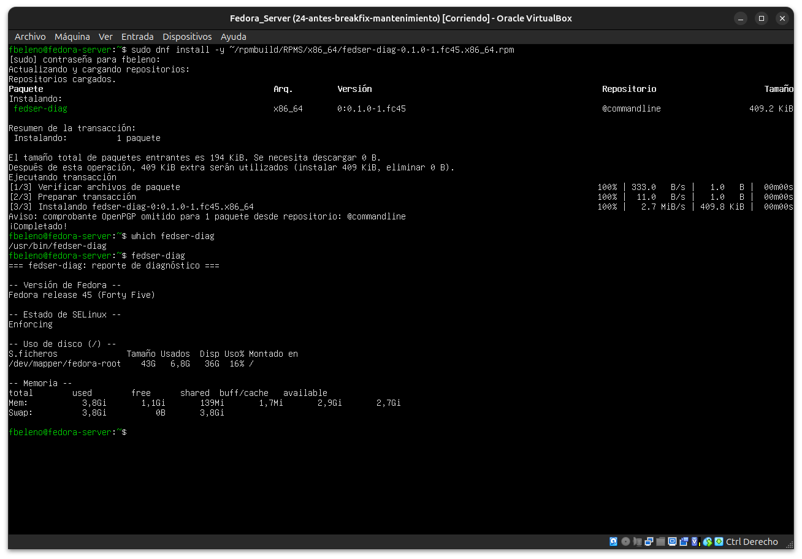

**13 — `dnf remove`: desinstalación limpia, `which fedser-diag` ya no lo encuentra**

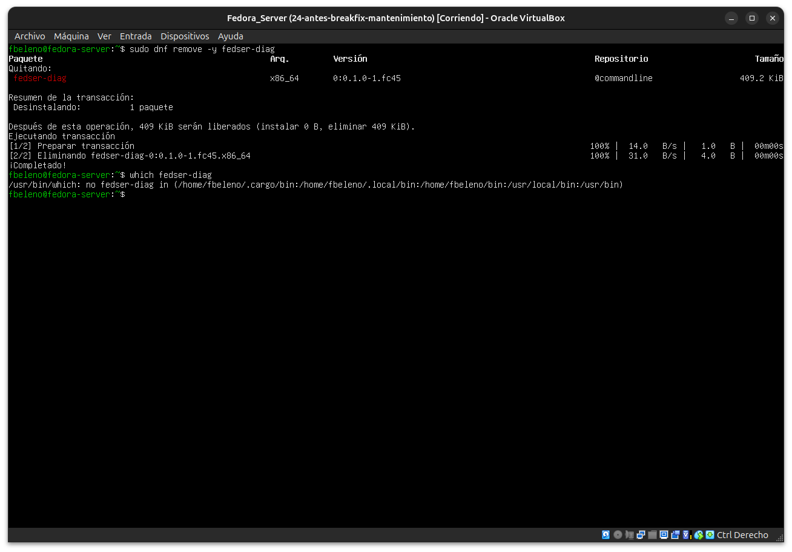

## Pendientes
