# Módulo 29 — Break & Fix de compilación

- Estado: Completado
- Fecha: 2026-09-27
- Versión de Fedora: Fedora Linux 45 (Server Edition)
- Objetivo diferencial frente a Arch: cierra la Fase 5 y el Proyecto 4
  con un incidente de **metadatos RPM incorrectos** — un `%files`
  desalineado con lo que `%install` realmente coloca en el
  `BUILDROOT`, distinto de los incidentes de enlazado nativo (módulo
  26) y toolchain equivocado (módulo 28) ya cubiertos en esta fase.

## Entorno y punto de restauración

Snapshot tomada antes de este módulo: `fedser-diag.spec` funcional del
módulo 28 (compilando con el `cargo` de DNF), sin el paquete instalado
en el sistema.

## Concepto diferencial

Un `.spec` puede tener un `%build`/`%install` perfectamente correctos
y aun así fallar — porque `%files` es la lista de lo que el paquete
final debe contener, y `rpmbuild` la valida contra lo que realmente
existe en el `BUILDROOT` tras `%install`. Un typo ahí no rompe la
compilación de Rust: rompe el empaquetado, con un mensaje de error
propio de `rpmbuild`, no de `cargo`.

## Incidente simulado

Se introduce un typo real en la línea `%files` de
`~/rpmbuild/SPECS/fedser-diag.spec`: `%{_bindir}/fdser-diag` en vez de
`%{_bindir}/fedser-diag` (falta la primera "e").

## Práctica guiada (diagnóstico real)

```bash
rpmbuild -bb ~/rpmbuild/SPECS/fedser-diag.spec
```

Leer el mensaje de error de `rpmbuild` con atención — debería señalar
explícitamente qué archivo esperado no encontró.

## Reparación

Corregir el typo en `%files`, reconstruir, y confirmar que el `.rpm`
se genera con éxito e instala igual que en el módulo 28.

## Hallazgos reales

1. **Error de diseño propio en el primer intento**: el `sed` usado
   para introducir el typo (`s|%{_bindir}/%{name}|%{_bindir}/fdser-diag|`)
   coincidió tanto en `%install` como en `%files` — ambas líneas
   contenían el mismo patrón `%{_bindir}/%{name}`, así que el "typo"
   quedó aplicado de forma consistente en los dos lados y el primer
   `rpmbuild` **compiló exitosamente**, sin el incidente buscado.
   Corregido apuntando el `sed` a una línea específica (`26s|...`)
   para revertir solo `%install`.
2. **Error real de `rpmbuild` una vez sí desalineado**: `error: No se
   encontró el archivo:
   .../BUILDROOT/usr/bin/fdser-diag` — un mensaje explícito y
   específico, muy distinto de un error de compilación de Rust: acá
   `cargo build` había terminado bien, el binario existía en el
   `BUILDROOT` con el nombre correcto (`fedser-diag`), pero `%files`
   pedía un archivo con otro nombre que nunca existió.
3. **`rpmbuild` no genera ningún `.rpm` corrupto cuando `%files` no
   coincide** — falla la build completa antes de escribir el paquete,
   a diferencia de una falla más silenciosa que hubiera generado un
   `.rpm` vacío o roto.
4. **Reparación de una sola línea**: corregir `%files` (línea 29) para
   volver a usar la macro `%{_bindir}/%{name}` en vez del texto fijo
   con el typo fue suficiente — el build, la instalación, la
   ejecución real y la desinstalación quedaron idénticos al ciclo
   validado en el módulo 28.
5. **Cierre de la Fase 5 y el Proyecto 4**: `fedser-diag` quedó
   validado de punta a punta — creado en Rust (módulo 27), compilado
   con el toolchain correcto de DNF (módulo 25/28), empaquetado como
   `.rpm` propio (módulo 28), y ahora con un incidente real de
   metadatos diagnosticado y reparado sin tocar el código ni el
   binario.

## Evidencias

**01 — Snapshot `29-antes-breakfix-compilacion` creada**

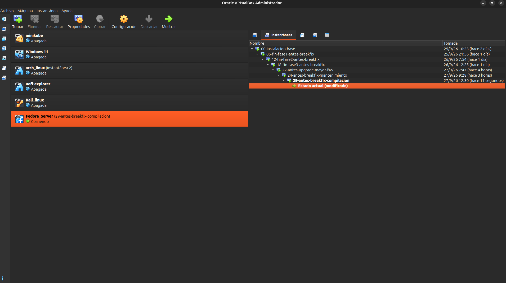

**02 — Estado sano confirmado: `fedser-diag` no instalado**

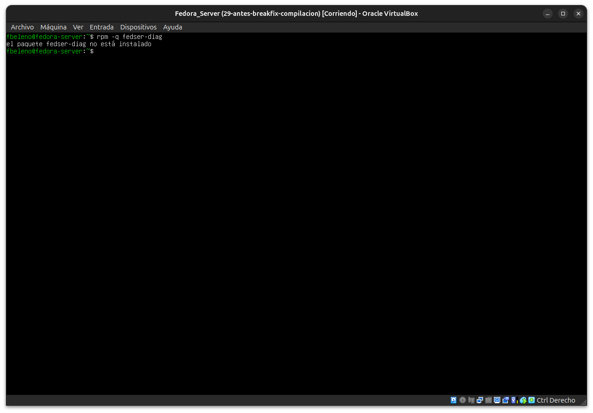

**03 — Primer intento fallido de diseño: el `sed` cambió `%install` y `%files` por igual, build exitoso sin querer**


**04 — Log del primer build: instalando sin error (consistencia accidental)**

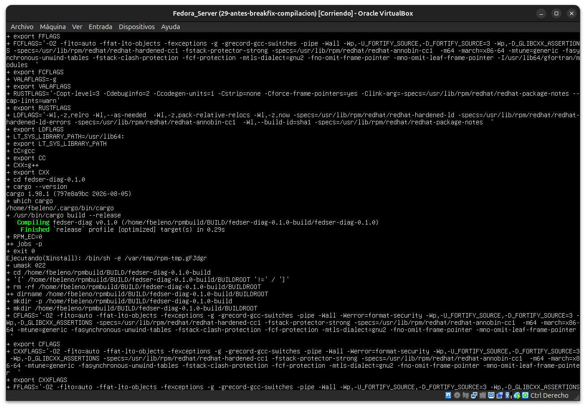

**05 — Corrección del `sed` (línea específica), `%files` con el typo confirmado**

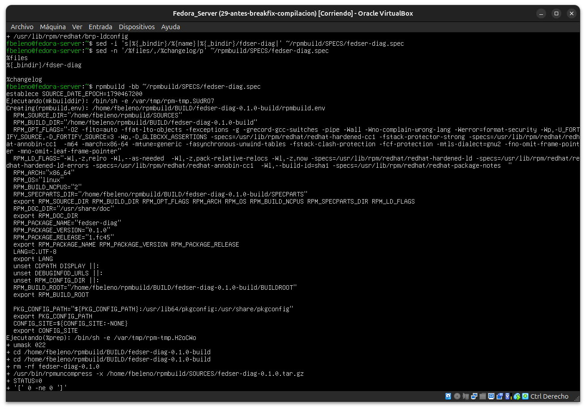

**06-08 — Log del segundo `rpmbuild`: entorno, `%install` coloca el binario como `fedser-diag`, continúa con `find-debuginfo`**

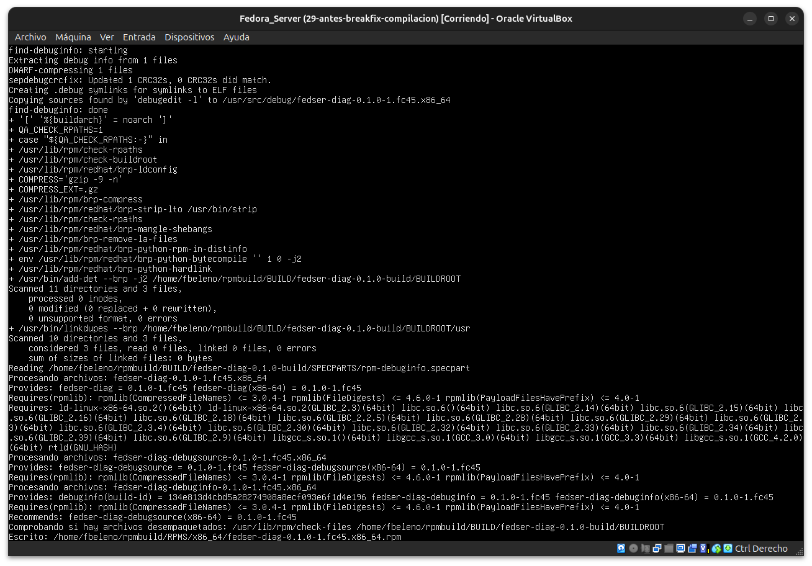
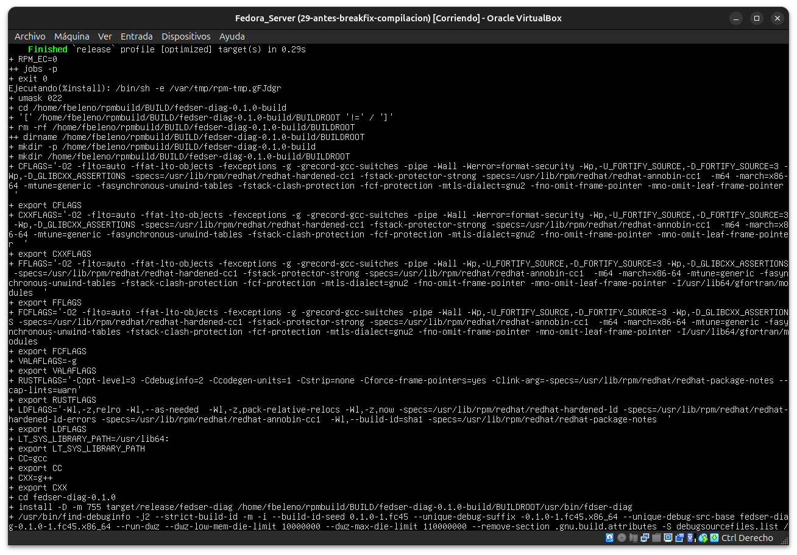
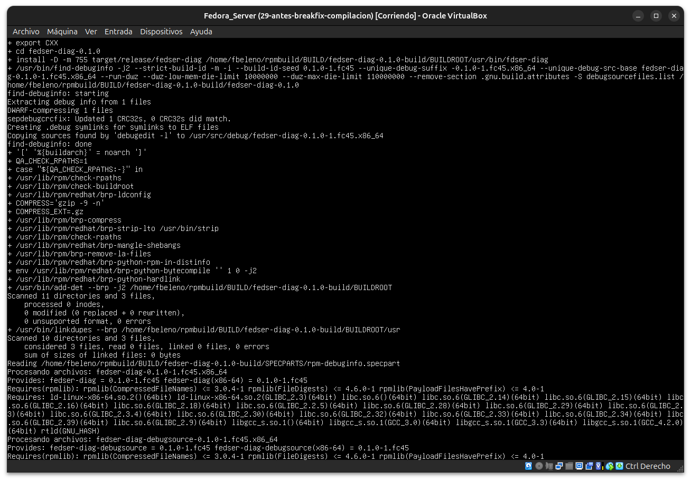

**09 — `.spec` con `%install`/`%files` ya desalineados (líneas 26 y 29)**

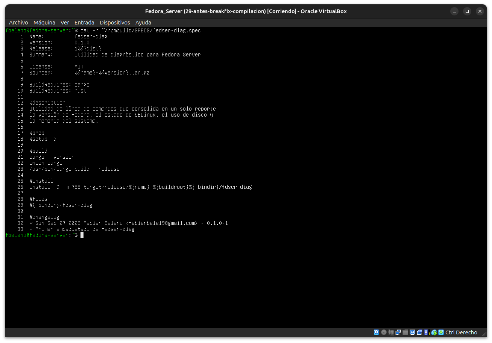

**10 — Error real de `rpmbuild`: "No se encontró el archivo" `.../usr/bin/fdser-diag`**

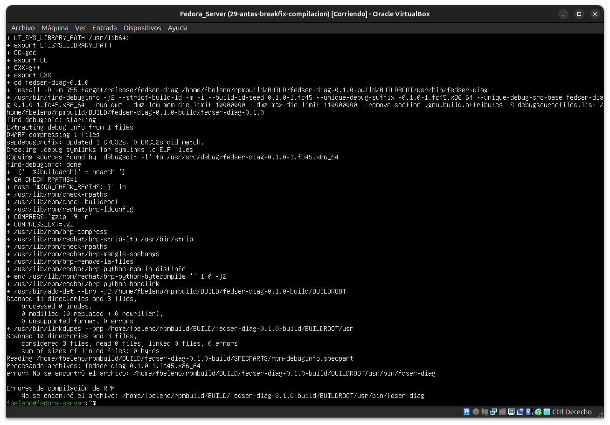

**11 — Reparado: `rpmbuild` exitoso, `fedser-diag-0.1.0-1.fc45.x86_64.rpm` escrito**

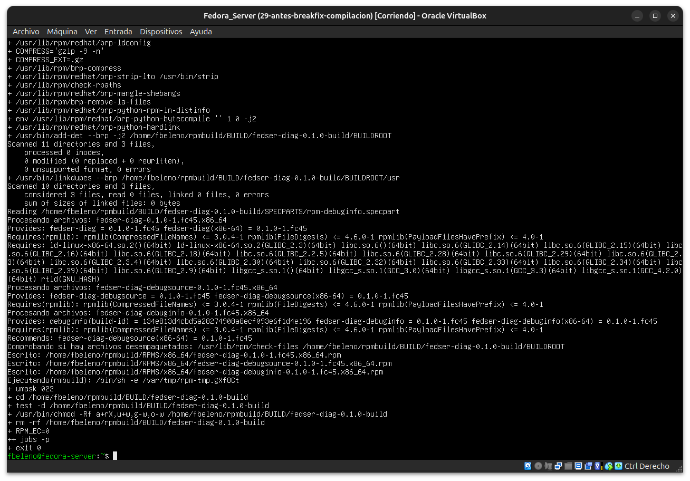

**12 — Validación final: `dnf install`, ejecución real del reporte, `dnf remove` limpio**

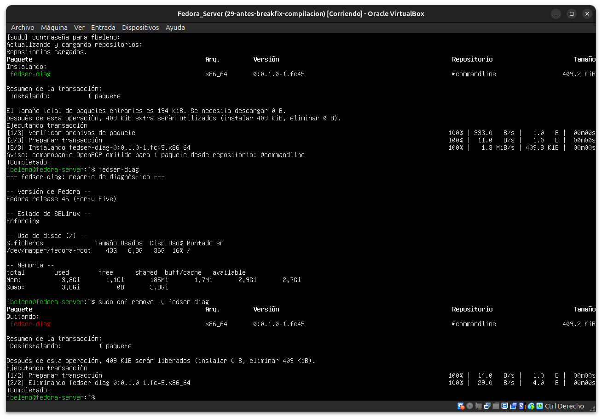

## Pendientes
