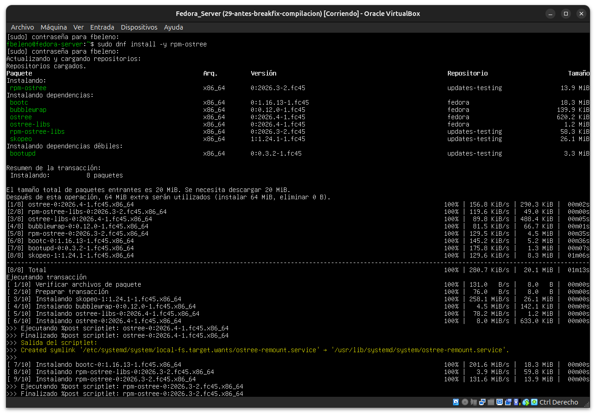
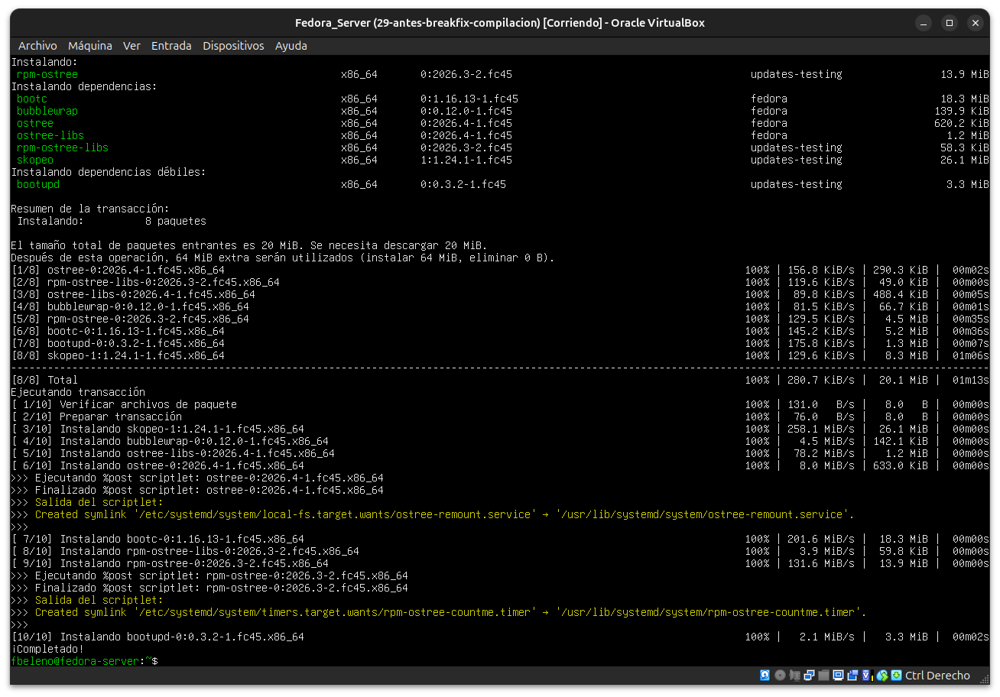
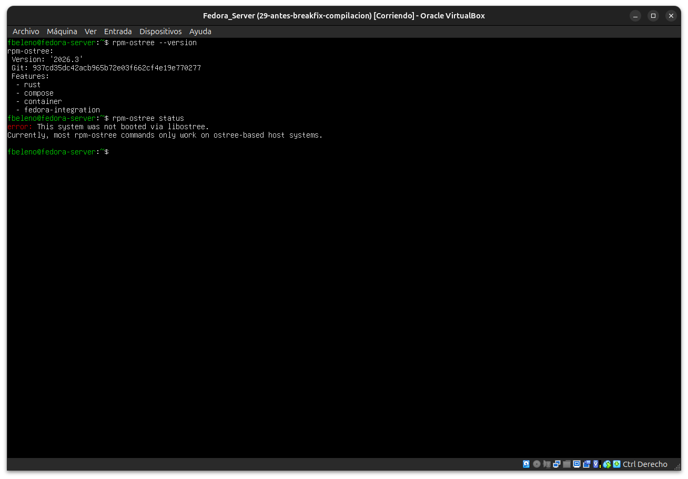

# Módulo 30 — OSTree y rpm-ostree

- Estado: Completado
- Fecha: 2026-09-27
- Versión de Fedora: Fedora Linux 45 (Server Edition)
- Objetivo diferencial frente a Arch: arranca la Fase 6. Arch no tiene
  equivalente a los despliegues basados en imágenes — es rolling
  release sobre un sistema de archivos mutable, igual que el DNF
  tradicional ya visto. Este módulo contrasta ese modelo transaccional
  (vivido en los módulos 08-13, 23-24) contra el modelo de imágenes de
  `rpm-ostree`, antes de crear la VM de Silverblue en el módulo 31.

## Concepto diferencial

- **DNF** (todo el curso hasta ahora): cada transacción modifica el
  sistema de archivos in situ, paquete por paquete. Un rollback real
  requiere reinstalar versiones anteriores una por una (o restaurar un
  snapshot externo, como en los Break & Fix de este curso).
- **rpm-ostree**: el sistema raíz completo es un árbol de commits
  (análogo a Git). Cada actualización crea un **despliegue** nuevo e
  inmutable; el rollback es instantáneo — se reinicia sobre el
  despliegue anterior, no se revierte paquete por paquete.

## Práctica guiada

Instalar el CLI de `rpm-ostree` en esta misma Fedora Server (paquete
DNF normal, disponible fuera de Silverblue/CoreOS) y confirmar su
límite real: sin una raíz basada en OSTree, no hay despliegues que
gestionar.

```bash
sudo dnf install -y rpm-ostree
rpm-ostree --version
rpm-ostree status
```

## Hallazgos reales

1. **`rpm-ostree` trae su propio stack de dependencias pesado** (8
   paquetes, 64 MiB): `ostree`/`ostree-libs` (el motor de commits),
   `bootc` (arranque nativo de contenedores OCI como sistema base),
   `bubblewrap` (sandboxing), `skopeo` (inspección de imágenes de
   contenedor) — todas piezas del ecosistema de despliegues por
   imagen, no solo un CLI aislado.
2. **`rpm-ostree --version` confirma que la propia herramienta está
   escrita en Rust** (`Features: - rust`) — conecta directamente con
   toda la Fase 5 recién cerrada.
3. **Límite real confirmado, exactamente como se anticipó**:
   `rpm-ostree status` en esta Fedora Server (sistema tradicional,
   raíz mutable) devuelve `error: This system was not booted via
   libostree. Currently, most rpm-ostree commands only work on
   ostree-based host systems.` — el CLI se instala igual que cualquier
   paquete DNF, pero es inerte sin una raíz OSTree real detrás.
4. **La feature `container` en `rpm-ostree --version` insinúa el
   camino más nuevo del ecosistema**: `bootc` permite tratar una
   imagen de contenedor OCI como el sistema base arrancable — una
   evolución que iremos rozando en el módulo 34.

## Evidencias

**01 — `dnf install rpm-ostree`: 8 paquetes de dependencias (`ostree`, `bootc`, `bubblewrap`, `skopeo`, etc.)**



**02 — Instalación completada, symlinks de systemd creados por los scriptlets**



**03 — `rpm-ostree --version` (Features: rust, compose, container, fedora-integration) y `rpm-ostree status` con el error real de sistema no-ostree**



## Pendientes
