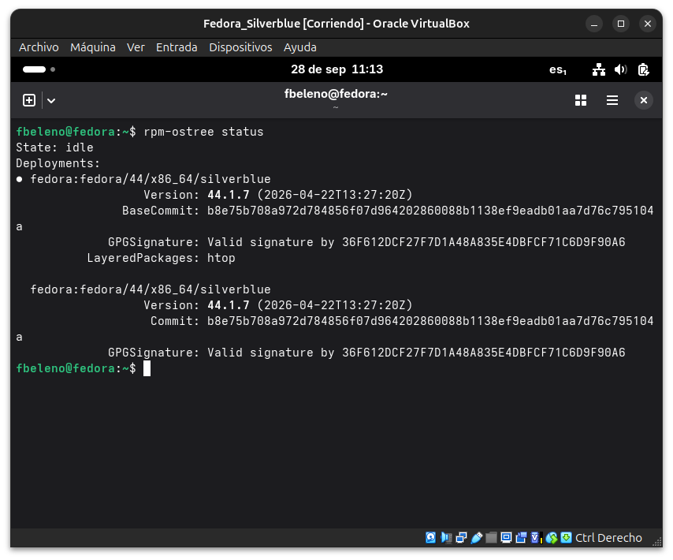
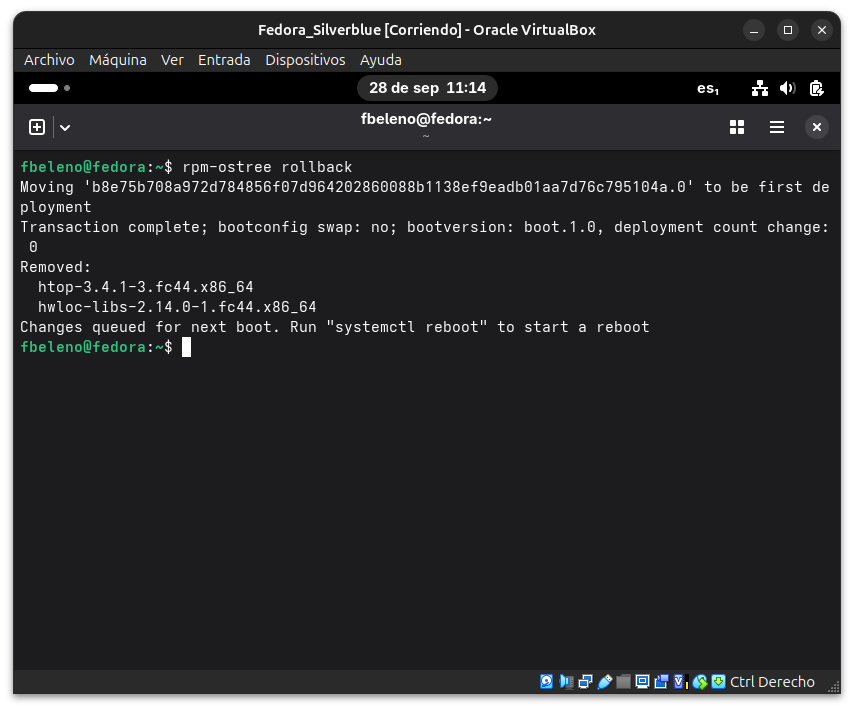
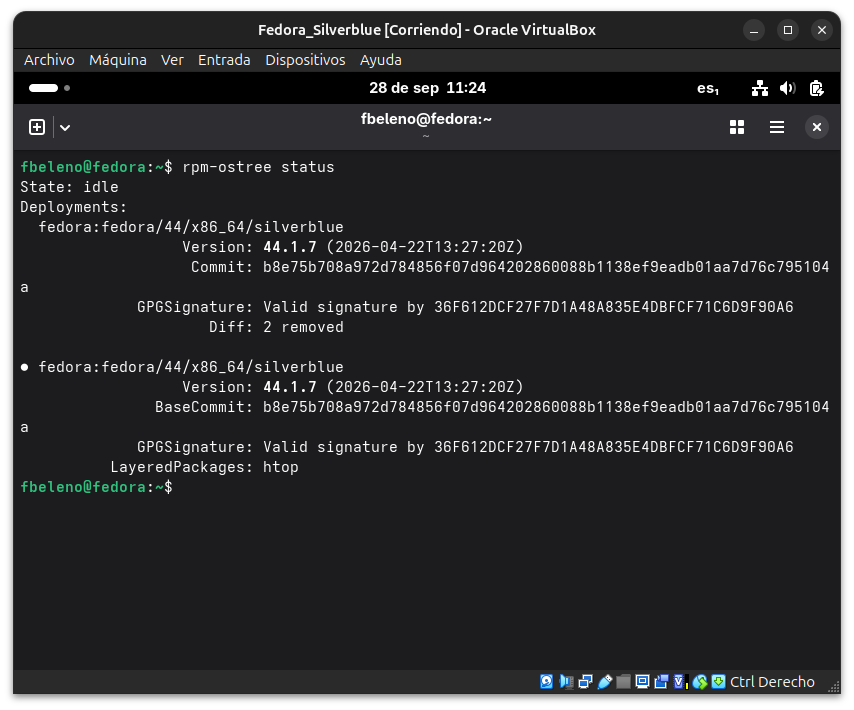
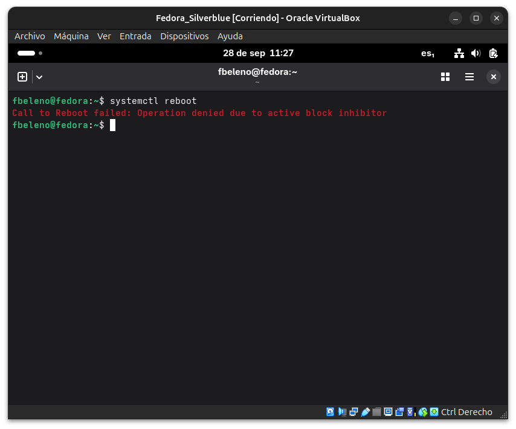
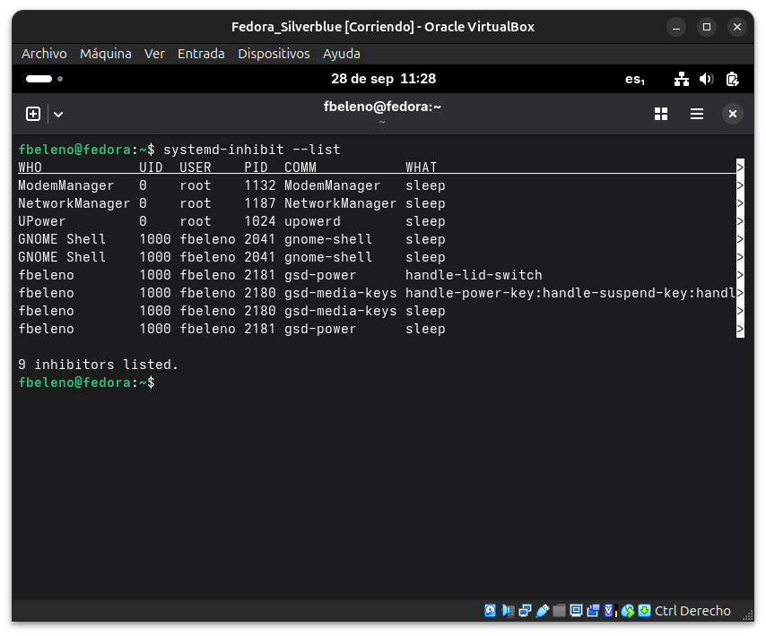
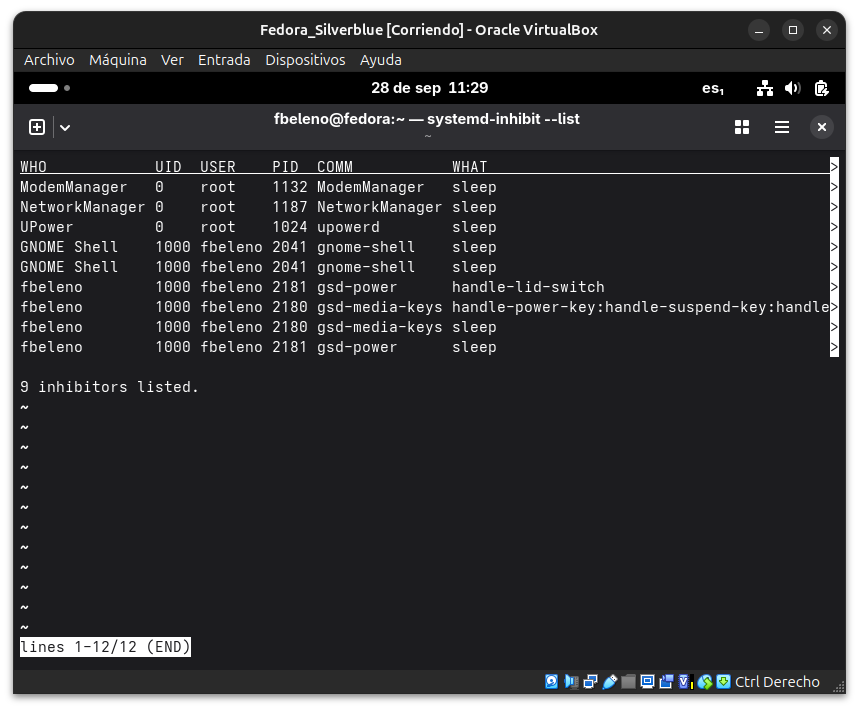
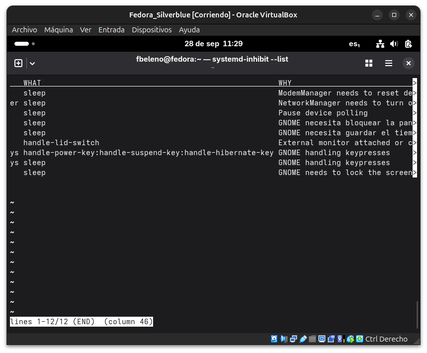
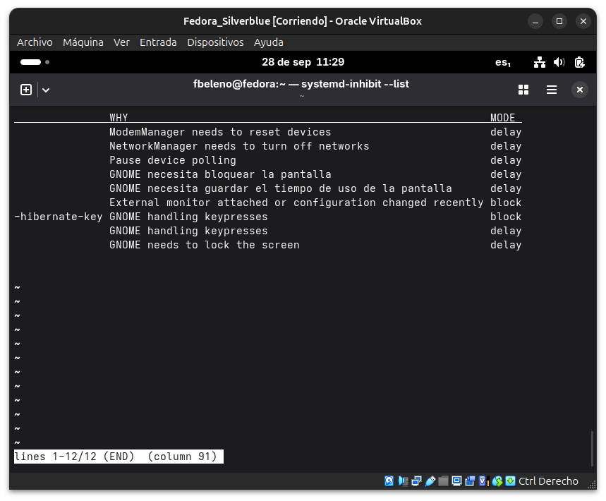
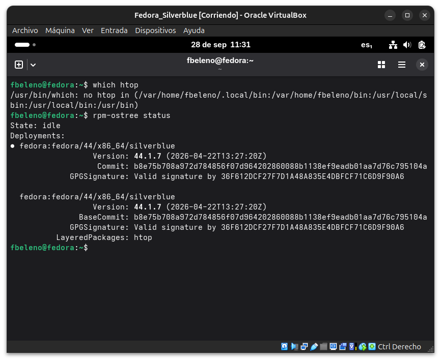
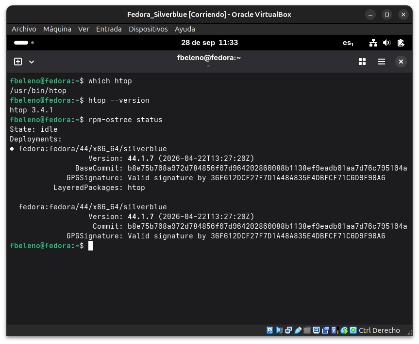

# Módulo 32 — Rollback de despliegues

- Estado: Completado
- Fecha: 2026-09-28
- Versión de Fedora: Fedora Silverblue 44.1.7
- Objetivo diferencial frente a Arch: Arch no tiene un mecanismo de
  rollback a nivel de sistema operativo — revertir un cambio requiere
  reinstalar paquetes uno por uno o restaurar un snapshot externo
  (Btrfs/Timeshift, si el usuario lo configuró aparte). `rpm-ostree`
  trae el rollback como mecanismo nativo del sistema.

## Punto de partida

Desde el módulo 31 la VM ya tiene dos despliegues reales:
- El despliegue activo actual, con `htop` en capas (`LayeredPackages`).
- El despliegue original, sin capas, conservado intacto.

## Concepto diferencial

`rpm-ostree rollback` no reinstala nada ni reconstruye un árbol —
simplemente reordena cuál de los despliegues **ya presentes en el
disco** arranca por defecto en el próximo reinicio. Es instantáneo
porque ambos árboles de commits ya existen; solo cambia un puntero,
muy distinto de:
- Deshacer una transacción de DNF (reinstala paquete por paquete).
- Restaurar un snapshot de VirtualBox (revierte el disco completo,
  incluidos archivos de usuario, no solo el sistema base).

## Práctica guiada

```bash
rpm-ostree status
rpm-ostree rollback
rpm-ostree status
systemctl reboot
```

Tras reiniciar, confirmar que `htop` ya no está disponible:

```bash
which htop
rpm-ostree status
```

Y cerrar el ciclo volviendo al despliegue con `htop` (segundo rollback):

```bash
rpm-ostree rollback
systemctl reboot
```

## Hallazgos reales

1. **`rpm-ostree rollback` confirma su propio mecanismo en el log**:
   *"Moving 'b8e75b7...0' to be first deployment"* y
   *"deployment count change: 0"* — prueba textual de que no se creó
   ni eliminó ningún despliegue, solo se reordenó cuál arranca
   primero. La lista de `Removed:` (`htop`, `hwloc-libs`) es el *diff*
   respecto al despliegue anterior, no una desinstalación en caliente.
2. **Matiz real sobre el `•` en `rpm-ostree status`**: tras el
   rollback pero antes de reiniciar, el orden de la lista ya cambió
   (el nuevo despliegue por defecto queda primero), pero el `•` sigue
   marcando el despliegue **realmente arrancado en la sesión actual**
   — los dos indicadores (orden y `•`) responden preguntas distintas.
3. **Fallo real al reiniciar**: `systemctl reboot` devolvió
   `Operation denied due to active block inhibitor` — no relacionado
   con `rpm-ostree`, sino con `systemd-logind`. `systemd-inhibit
   --list` mostró 9 inhibidores; dos en modo `block` real (no
   `delay`, que es benigno): uno de GNOME Shell por *"External monitor
   attached or configuration changed recently"* (probablemente
   disparado al maximizar la ventana de la VM) y otro por manejo de
   teclas de energía/suspensión.
4. **Resuelto con `systemctl reboot -i`** (ignorar inhibidores) — un
   mecanismo de override real de systemd, no un workaround
   improvisado.
5. **Rollback ida y vuelta validado de punta a punta**: primer
   rollback → `which htop` sin resultados, segundo rollback → `htop`
   de nuevo en `/usr/bin/htop` con la misma versión (`3.4.1`) — cero
   reinstalaciones, cero reconstrucciones, solo el puntero de
   despliegue por defecto moviéndose entre los dos árboles ya
   presentes en el disco.

## Evidencias

**01 — `rpm-ostree status`: estado inicial, despliegue con `htop` activo**



**02 — `rpm-ostree rollback`: "Moving ... to be first deployment", "deployment count change: 0"**



**03 — `rpm-ostree status` tras el rollback: orden cambiado, pero `•` sigue en el despliegue con `htop` (aún no se reinició)**



**04 — Error real: `systemctl reboot` → "Operation denied due to active block inhibitor"**



**05 — `systemd-inhibit --list`: 9 inhibidores, tabla cortada a la derecha**



**06-08 — Terminal maximizada, recorriendo las columnas `WHO`/`WHAT`, `WHY`, y `MODE` (dos inhibidores en modo `block` real)**





**09 — Tras `systemctl reboot -i`: `which htop` vacío, `rpm-ostree status` confirma el despliegue sin `htop` activo**



**10 — Segundo rollback: `htop` restaurado, versión `3.4.1` confirmada, despliegue con `htop` activo de nuevo**



## Pendientes
