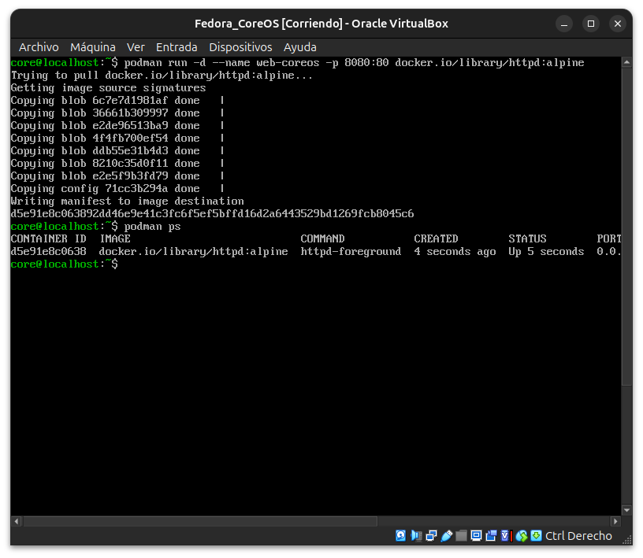
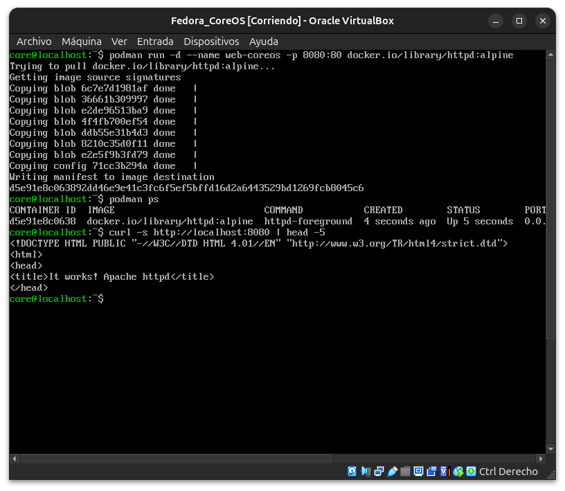
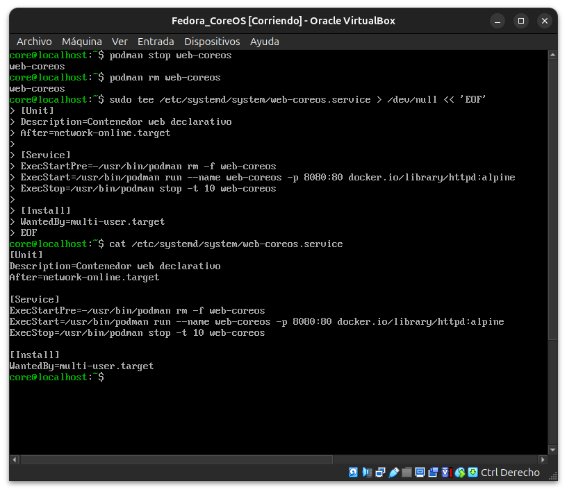
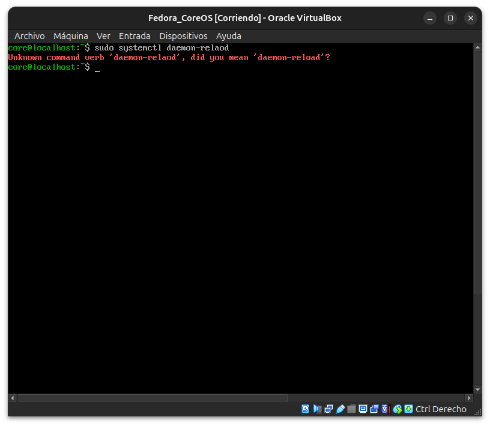
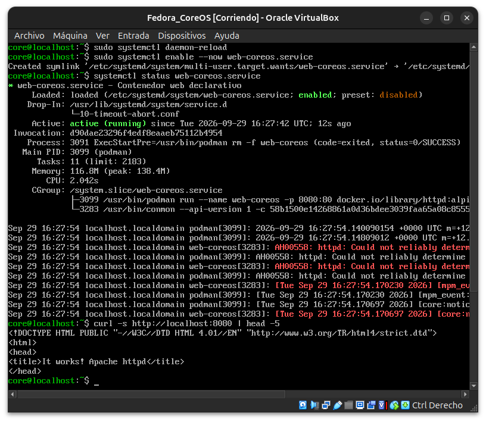
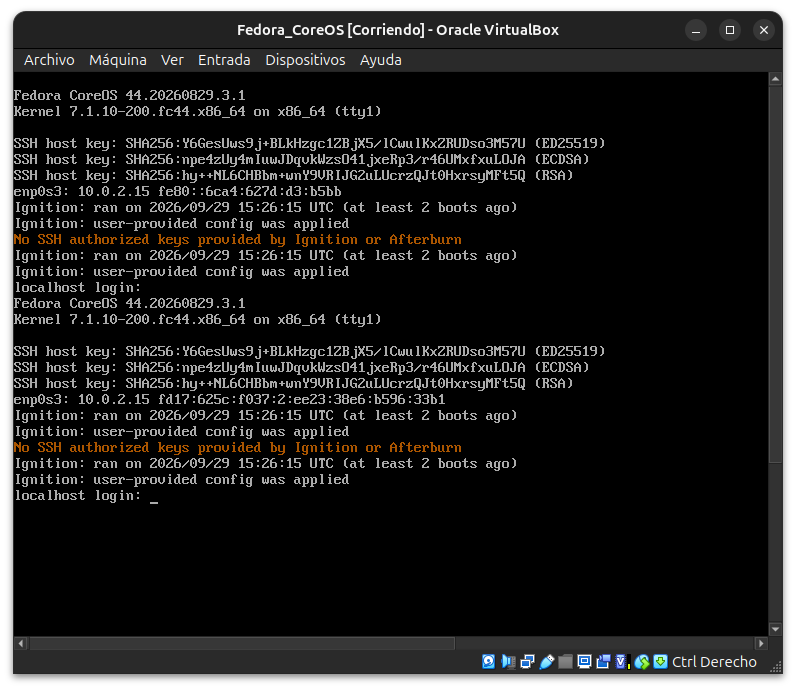
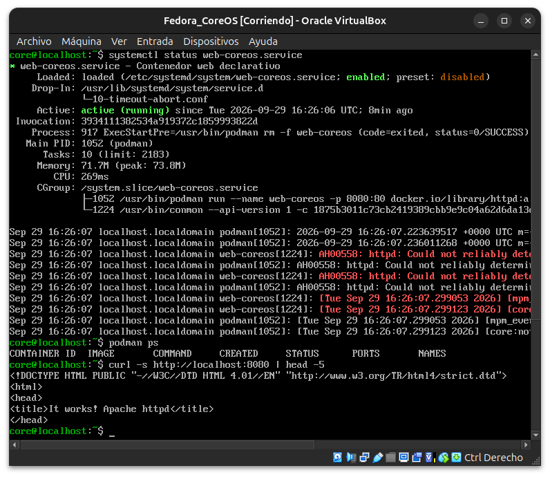
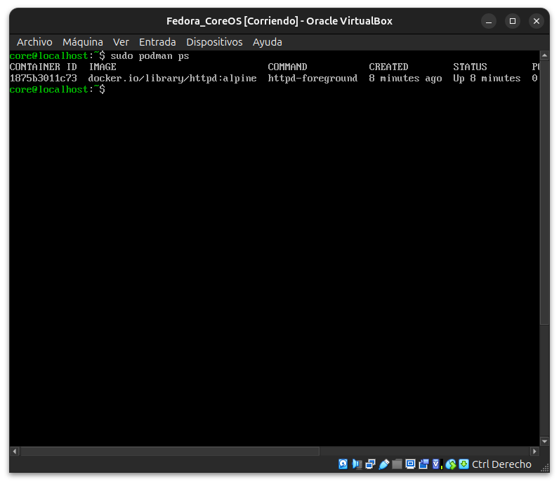

# Módulo 34 — Contenedores en CoreOS

- Estado: Completado
- Fecha: 2026-09-29
- Versión de Fedora: Fedora CoreOS 44.20260829.3.1
- Objetivo diferencial frente a Fedora Server (módulo 21): en Server,
  Podman se instala y se lanza a mano. En CoreOS, el patrón esperado
  es declarar el contenedor **como parte del aprovisionamiento**
  (Ignition genera una unidad `systemd` que arranca el contenedor),
  coherente con su propósito de host de contenedores desatendido.

## Concepto diferencial

Ignition solo corre en el **primer arranque** del disco. No hay forma
de "reaplicar" un Butane nuevo sobre un nodo ya aprovisionado sin
reinstalarlo — el patrón real de CoreOS en producción es **infra
inmutable**: para cambiar la configuración declarativa se aprovisiona
un nodo nuevo, no se edita el existente a mano.

## Práctica guiada

1. Confirmar Podman disponible (ya viene en la imagen base) y correr
   un contenedor ad-hoc, igual que en el módulo 21:
   ```bash
   podman run -d --name web-coreos -p 8080:80 docker.io/library/httpd:alpine
   podman ps
   curl -s http://localhost:8080 | head -5
   ```
2. Crear manualmente la unidad `systemd` que Ignition habría generado
   (para exponer el mecanismo real, con la limitación anotada arriba):
   ```ini
   # /etc/systemd/system/web-coreos.service
   [Unit]
   Description=Contenedor web declarativo
   After=network-online.target

   [Service]
   ExecStartPre=-/usr/bin/podman rm -f web-coreos
   ExecStart=/usr/bin/podman run --name web-coreos -p 8080:80 docker.io/library/httpd:alpine
   ExecStop=/usr/bin/podman stop -t 10 web-coreos

   [Install]
   WantedBy=multi-user.target
   ```
3. Habilitar y arrancar la unidad, confirmar que sobrevive un
   reinicio:
   ```bash
   sudo systemctl daemon-reload
   sudo systemctl enable --now web-coreos.service
   systemctl reboot
   ```
4. Tras el reinicio, validar que el contenedor arrancó solo, sin
   intervención manual:
   ```bash
   systemctl status web-coreos.service
   podman ps
   curl -s http://localhost:8080 | head -5
   ```

## Hallazgos reales

1. **Podman ad-hoc funciona idéntico al módulo 21**: mismo comando,
   misma imagen (`docker.io/library/httpd:alpine`), sin fricción esta
   vez (ya conocíamos la ruta correcta de la imagen desde la primera
   vez).
2. **Typo real, mismo patrón de módulos anteriores**: `daemon-relaod`
   en vez de `daemon-reload` — letras trocadas, corregido con la
   sugerencia explícita de `systemctl` ("did you mean...?").
3. **La unidad quedó gestionada con un drop-in propio del sistema**:
   `Drop-In: /usr/lib/systemd/system/service.d/10-timeout-abort.conf`
   — un ajuste de systemd ya presente en la imagen base, no algo que
   configuramos nosotros.
4. **El mismo aviso benigno de `httpd` reaparece** (`Could not
   reliably determine the server's fully qualified domain name`) —
   visto ya en los módulos 21 y 23, coherente entre distintos sistemas
   Fedora.
5. **Validación real de sobrevivencia al reinicio**: tras
   `systemctl reboot -i`, el MOTD mostró `Ignition: ran on ... (at
   least 2 boots ago)` (en vez de "this boot") — evidencia textual de
   que ya no era el primer arranque. La unidad arrancó el contenedor
   sola, sin intervención manual.
6. **Hallazgo sutil real**: `podman ps` (como usuario `core`, sin
   `sudo`) mostró la tabla **vacía** pese a que `systemctl status`
   confirmaba el servicio `active (running)` y `curl` respondía —
   porque la unidad `systemd` ejecuta `podman run` como **root** (sin
   `User=` en el `.service`), así que el contenedor vive en el
   namespace rootless de *root*, no en el de `core`. Confirmado con
   `sudo podman ps`, que sí lo mostró (`Up 8 minutes`).
7. **Limitación real documentada, no forzada**: no se pudo demostrar
   el camino 100% declarativo (Ignition generando la unidad desde el
   primer arranque) sobre este mismo nodo, porque Ignition solo corre
   una vez — se creó la unidad a mano para exponer el mecanismo, con
   la salvedad explícita de que en producción CoreOS esto se logra
   aprovisionando un nodo nuevo (infra inmutable), no editando el
   existente.

## Evidencias

**01 — `podman run` ad-hoc: descarga de la imagen, `podman ps` confirma el contenedor**



**02 — `curl localhost:8080`: "It works! Apache httpd"**



**03 — `podman stop`/`rm` + unidad `systemd` escrita vía `tee`, confirmada con `cat`**



**04 — Typo real: `daemon-relaod`, `systemctl` sugiere la corrección exacta**



**05 — `daemon-reload` + `enable --now`: `systemctl status` `active (running)`, `curl` responde**



**06 — Tras `systemctl reboot -i`: MOTD confirma "at least 2 boots ago" (ya no es el primer arranque)**



**07 — `systemctl status` activo hace 8 min (arrancó solo), `podman ps` del usuario `core` vacío, `curl` sigue respondiendo**



**08 — `sudo podman ps` confirma el contenedor real (`Up 8 minutes`) en el namespace de root**



## Pendientes
