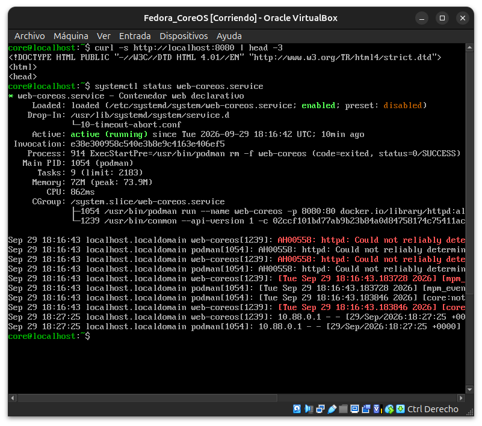
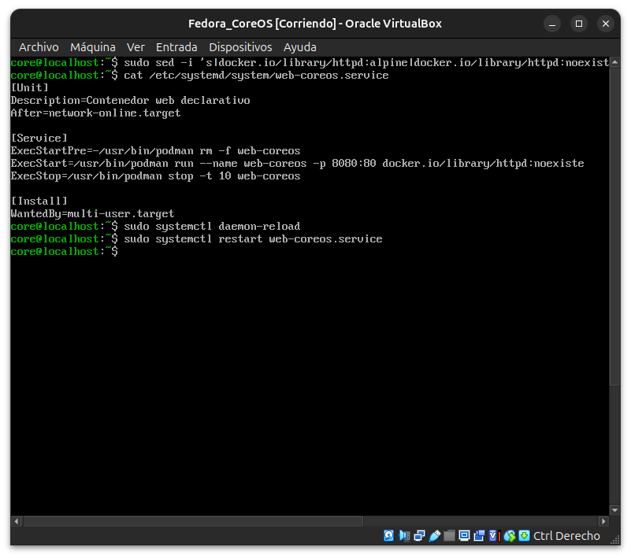
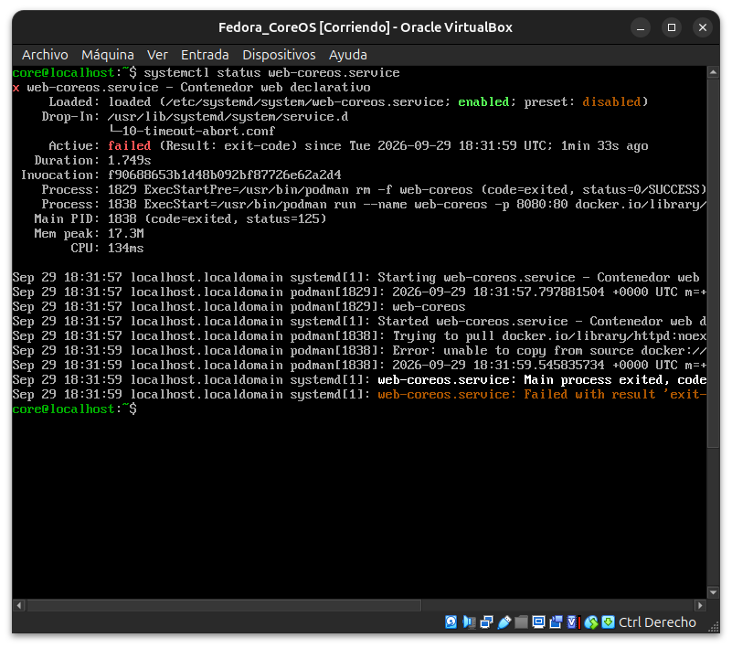
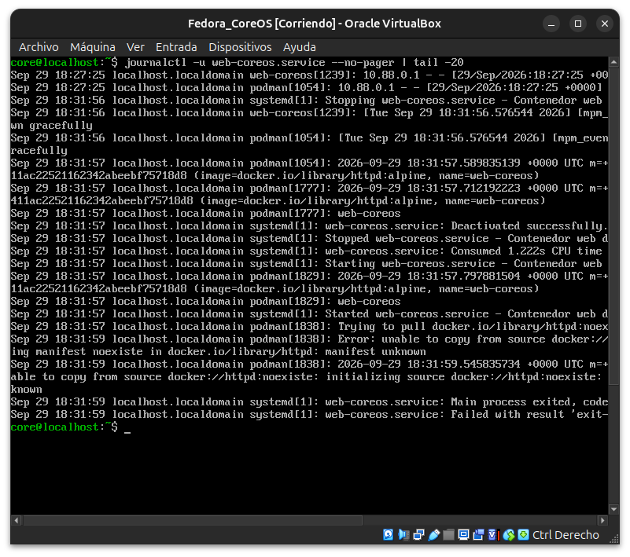
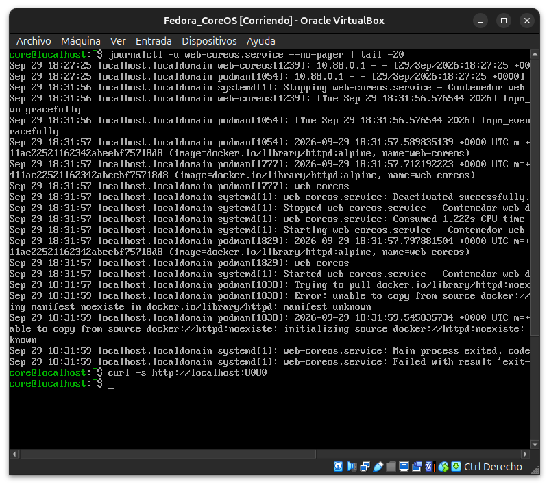
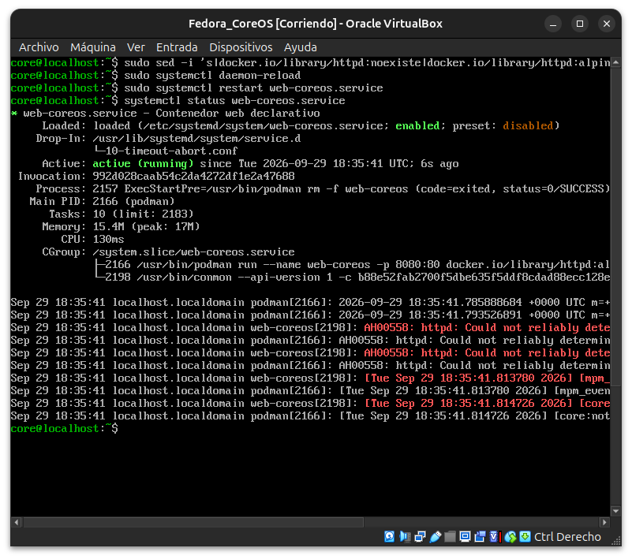
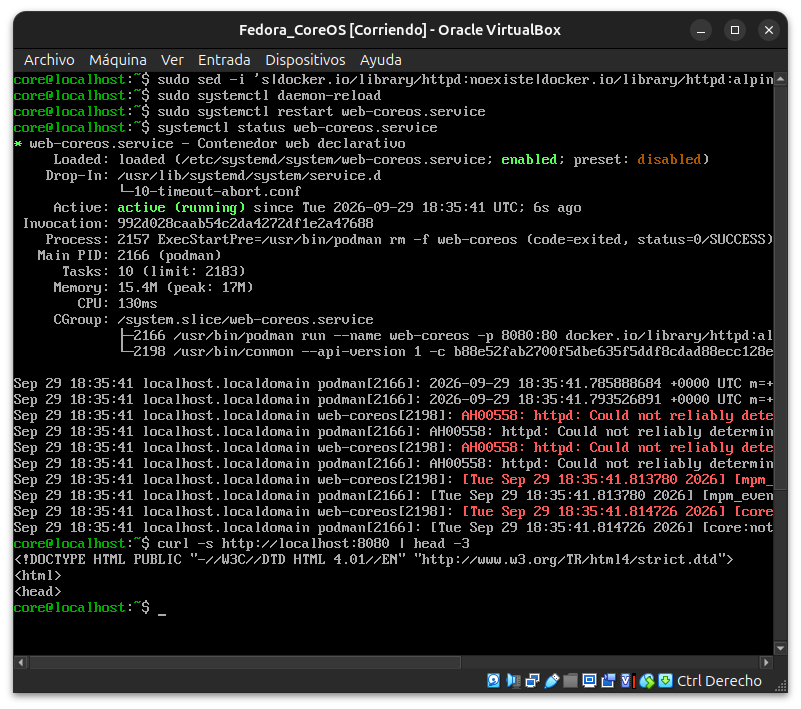

# Módulo 35 — Break & Fix de despliegue

- Estado: Completado
- Fecha: 2026-09-29
- Versión de Fedora: Fedora CoreOS 44.20260829.3.1
- Objetivo diferencial: cierra la Fase 6. A diferencia del Break &
  Fix del módulo 24 (Fedora Server, config de Apache editada a mano),
  acá el incidente ataca la propia definición declarativa del
  servicio contenerizado del módulo 34 — un cambio de "día 2" mal
  hecho sobre la unidad `systemd` que gestiona el contenedor.

## Entorno y punto de partida

VM de Fedora CoreOS del módulo 33/34, con `web-coreos.service`
gestionando un contenedor `httpd` en el puerto 8080, funcionando y
sobreviviendo reinicios.

## Incidente simulado

Se edita `/etc/systemd/system/web-coreos.service` introduciendo un
error real de "configuración de aprovisionamiento": una referencia de
imagen inexistente (simulando que alguien actualizó el Butane/unidad
apuntando a una imagen que no existe en el registro), representando
un error real de día 2 sobre infraestructura declarativa.

## Práctica guiada (diagnóstico real)

```bash
sudo sed -i 's|docker.io/library/httpd:alpine|docker.io/library/httpd:noexiste|' \
  /etc/systemd/system/web-coreos.service
sudo systemctl daemon-reload
sudo systemctl restart web-coreos.service
systemctl status web-coreos.service
journalctl -u web-coreos.service --no-pager | tail -20
curl -s http://localhost:8080
```

## Reparación

Corregir la referencia de imagen en la unidad, recargar, reiniciar el
servicio, y confirmar que vuelve a responder.

## Hallazgos reales

1. **El estado sano de partida ya traía evidencia útil**: `systemctl
   status` mostró en el log el `curl` de acceso real registrado por
   `httpd` (`10.88.0.1 - - [...]`) — confirma que los logs de acceso
   del contenedor quedan capturados por `journald` a través de la
   unidad, igual que cualquier otro servicio del sistema.
2. **El incidente no falló al reiniciar, falló al arrancar el
   contenedor**: `systemctl restart` no mostró ningún error en
   pantalla — el fallo ocurrió *dentro* del proceso gestionado, y solo
   se hizo visible al consultar `systemctl status`/`journalctl`.
3. **Mensaje de error específico y trazable**: `journalctl` mostró
   `Error: unable to copy from source docker://httpd:noexiste:
   initializing source docker://httpd:noexiste: reading manifest
   noexiste in docker.io/library/httpd: manifest unknown` — el mismo
   tipo de error del módulo 21 (imagen inexistente), pero acá con
   todo el contexto de `journald`/`systemd` (PID, timestamp exacto,
   "Main process exited... Failed with result").
4. **`systemctl status` reportó `failed (Result: exit-code)`
   explícitamente** — el estado del servicio refleja con precisión
   que el contenedor nunca llegó a levantarse, no un estado ambiguo.
5. **Reparación de una sola línea, sin tocar el disco ni
   reprovisionar**: revertir la referencia de imagen en la unidad,
   `daemon-reload` + `restart`, y el servicio volvió a `active
   (running)` con `curl` respondiendo — coherente con la promesa de
   una unidad `systemd` bien diseñada: declarativa, pero reparable
   igual que cualquier otro servicio del sistema.
6. **Cierre de la Fase 6**: OSTree/rpm-ostree contrastado con DNF
   (módulo 30), Silverblue instalado y explorado (layering, Toolbox,
   Flatpak — módulo 31), rollback de despliegues real ida y vuelta
   (módulo 32), CoreOS aprovisionado con Butane/Ignition (módulo 33),
   un contenedor gestionado declarativamente por `systemd` (módulo
   34), y ahora un incidente real de configuración de aprovisionamiento
   diagnosticado y reparado sin reinstalar nada.

## Evidencias

**01 — Estado sano: `curl` responde, `systemctl status` `active (running)` con log de acceso real registrado**



**02 — `sed` provoca el incidente (imagen `noexiste`), `cat` confirma, `daemon-reload` + `restart`**



**03 — `systemctl status`: `failed (Result: exit-code)`, "Main process exited"**



**04 — `journalctl`: error específico `manifest noexiste ... manifest unknown`**



**05 — `journalctl` completo + `curl localhost:8080` sin respuesta (servicio caído)**



**06 — Reparado: `sed` restaura `alpine`, `daemon-reload` + `restart`, `systemctl status` `active (running)`**



**07 — `curl localhost:8080` restaurado, HTML real de vuelta**



## Pendientes
